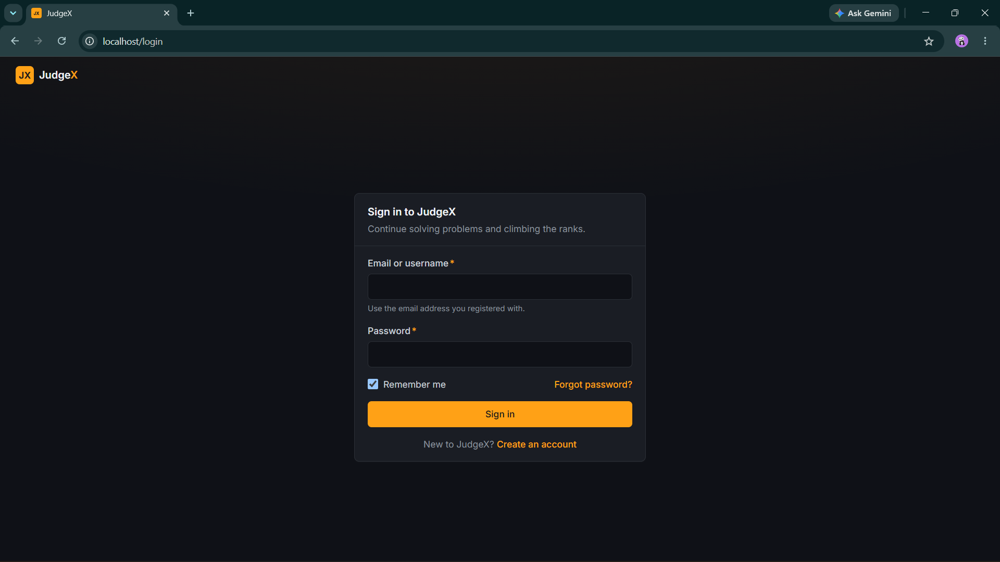
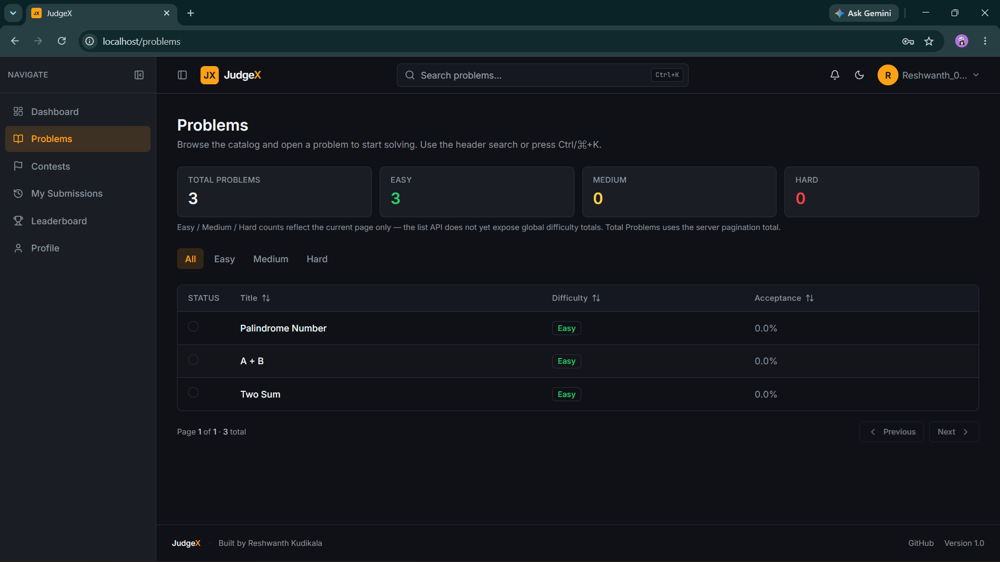
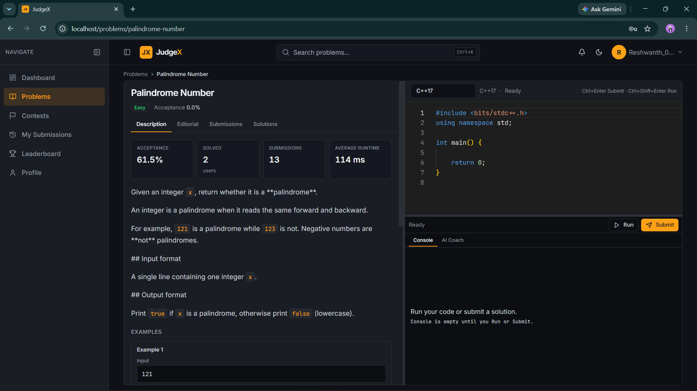
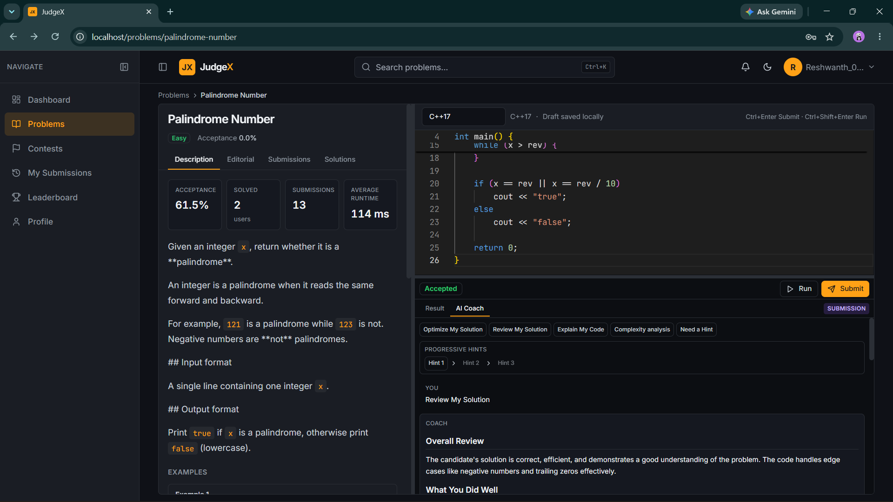
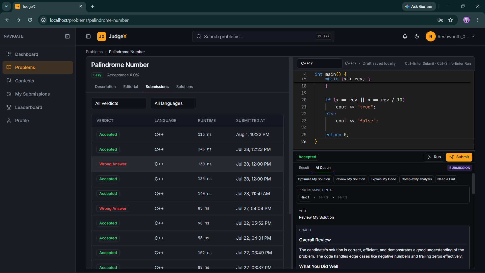
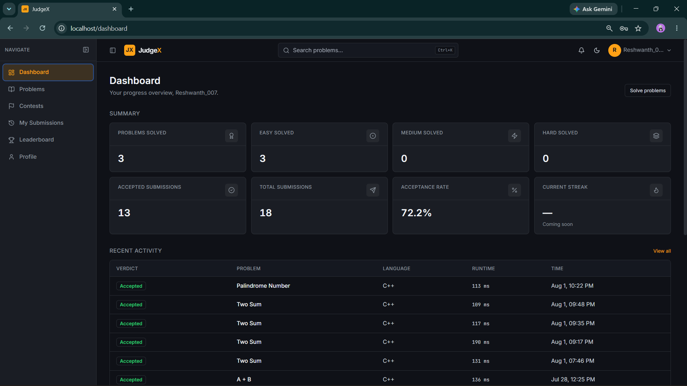
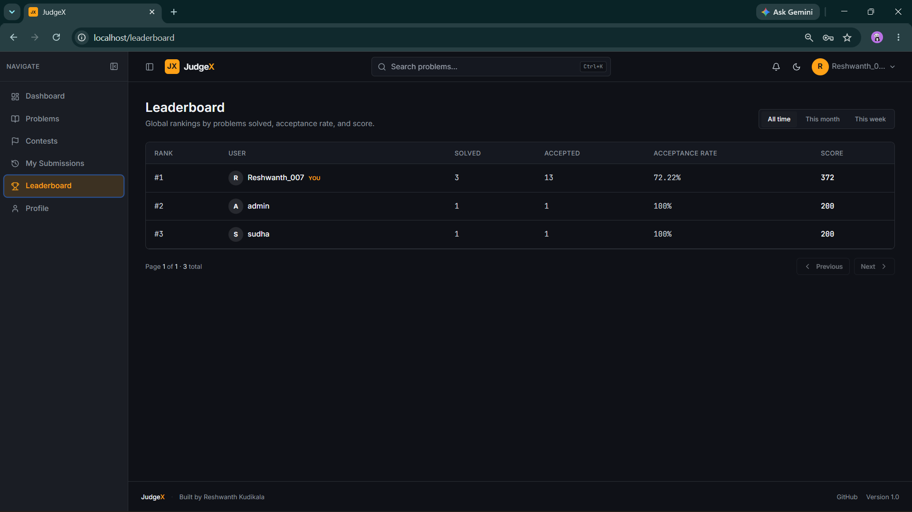
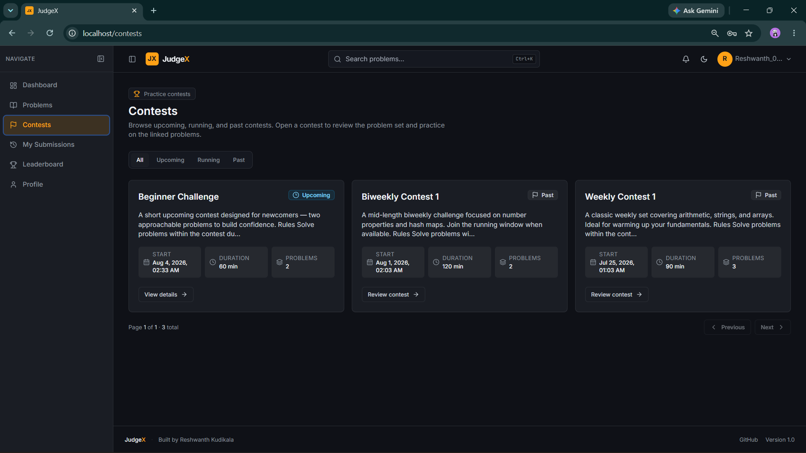
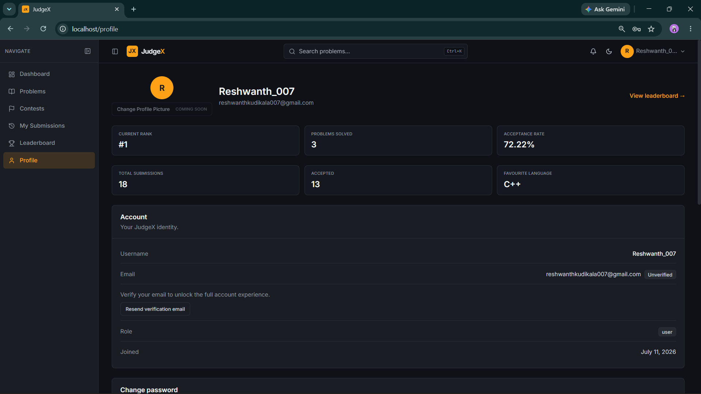
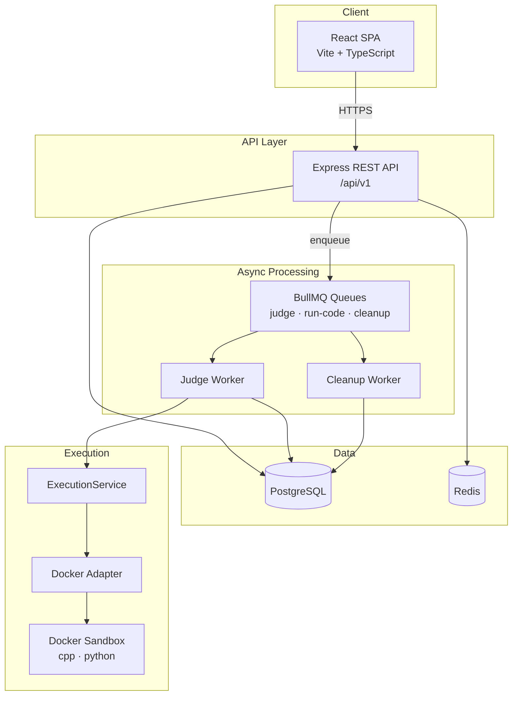

<div align="center">

# JudgeX

**A production-ready online coding judge inspired by LeetCode, HackerRank, and Codeforces.**

Securely compile and execute user code in Docker sandboxes with asynchronous workers, a modular REST API, and a modern React SPA.

[](https://nodejs.org/)
[](https://react.dev/)
[](https://www.postgresql.org/)
[](https://redis.io/)
[](https://docs.bullmq.io/)
[](https://www.docker.com/)
[](LICENSE)
[](.github/workflows/ci.yml)

[Features](#features) · [Architecture](#architecture) · [Getting Started](#getting-started) · [Deployment](#production-deployment) · [Documentation](#documentation)

</div>

---

## Project Overview

JudgeX is an online coding judge platform where users browse problems, write solutions in **C++** or **Python**, run code against public samples, submit for full judging, and track progress on a personal dashboard and global leaderboard. It also includes an integrated **AI Coach** powered by local LLMs through Ollama (or OpenAI).

Unlike a simple CRUD demo, JudgeX is engineered around **secure untrusted code execution** and **horizontally scalable judging**:

- The **API never runs user code** — it validates, persists, and enqueues work.
- **BullMQ workers** pull jobs and invoke a shared **ExecutionService** that talks to **Docker sandboxes**.
- **Hidden judge test cases** stay server-side; clients only see public samples and verdict metadata.

Inspired by the workflows and UX patterns of **LeetCode**, **Codeforces**, and **HackerRank**, with a focus on production architecture and interview-grade system design.

---

## Why JudgeX

| Goal | How JudgeX addresses it |
|------|-------------------------|
| **Secure sandboxing** | Per-run Docker containers with network disabled, read-only rootfs, memory/CPU/PID limits |
| **Distributed workers** | BullMQ-backed judge and cleanup workers; API stays stateless |
| **Docker isolation** | Only the worker process holds the Docker socket |
| **Production architecture** | Postgres source of truth, Redis for queues/cache, health checks, Docker Compose prod stack |
| **Interview preparation** | Real patterns: async pipelines, RBAC, hidden test data, live analytics |

---

## Features

### Authentication

- JWT-based authentication (register, login, email verification, password reset)
- bcrypt password hashing
- Stateless API sessions via Bearer tokens

### Problem Solving

- Problem catalog with difficulty, constraints, and public sample test cases
- Monaco-based code editor with language templates
- Problem discussions and published editorials
- Live problem statistics (acceptance rate, solvers, submissions, average runtime)

### Judge

- **Run Code** — executes **public sample** test cases only (worker-backed)
- **Submit** — judges **all** test cases (public + hidden)
- Verdicts: Accepted, Wrong Answer, TLE, Runtime Error, Compile Error, Memory Limit Exceeded
- Shared `ExecutionService` used by Run and Submit paths
- C++ and Python sandboxes (`judgex-cpp`, `judgex-python` images)

### Submission System

- Paginated submission history with verdict, language, and runtime filters
- Submission detail with read-only source, verdict panels, and owner-only access
- Hidden testcase **metadata only** on failures (index — never I/O leakage)

### Dashboard

- Personal dashboard: solved counts by difficulty, acceptance rate, recent activity
- Charts: problems solved by difficulty, accepted vs failed submissions

### Contests

- Public contest listing and detail pages
- Join / participation while a contest is upcoming or running
- Problem visibility by lifecycle (hidden before start; participants during running; public when ended)
- Live scoreboard from contest-window submissions

### Analytics

- Per-problem live SQL aggregates from submission data
- User progress stats and leaderboard rankings

### Admin

- Admin dashboard, user management, moderation, analytics, queue monitor, audit logs
- Role-based access (`user` / `admin`)

### Infrastructure

- PostgreSQL 17 · Redis 7 · BullMQ · Docker Compose (dev + prod)
- Nginx edge proxy in production · health checks · stuck-submission reaper worker
- Ollama (default) or OpenAI for AI Coach

### Testing

- Unit tests · integration tests · end-to-end judge verdict tests
- GitHub Actions CI (lint, build, tests)

### AI Coach

- Unified endpoint: `POST /api/v1/ai/coach` (Ollama by default, or OpenAI)
- Explain My Code · Review My Solution · Progressive Hints · Wrong Answer Debugger · Optimize My Solution · Compile Error Coach
- Prompt Builder + swappable provider abstraction
- Context-aware coaching from public problem info, user code, and public run/submission signals only
- Hidden testcase input/output is never sent to the model

---

## Screenshots

| Screen | Preview |
|--------|---------|
| Login |  |
| Problem List |  |
| Problem Workspace |  |
| AI Coach |  |
| Submission History |  |
| Dashboard |  |
| Leaderboard |  |
| Contests |  |
| Profile |  |

---

## Architecture



**ASCII overview**

```
┌─────────────┐
│   React     │  Monaco editor · React Query · Tailwind
│   Frontend  │
└──────┬──────┘
       │ REST (JWT)
       ▼
┌─────────────┐     ┌──────────────┐     ┌─────────────┐
│  Express    │────▶│  PostgreSQL  │     │    Redis    │
│  API        │     │  (source of  │     │ BullMQ ·    │
│             │────▶│   truth)     │     │ cache · RL  │
└──────┬──────┘     └──────────────┘     └──────┬──────┘
       │ enqueue                                  │
       ▼                                          │
┌─────────────┐                                   │
│   BullMQ    │◀──────────────────────────────────┘
└──────┬──────┘
       │
       ▼
┌─────────────┐     ┌──────────────────┐     ┌─────────────────┐
│ Judge       │────▶│ ExecutionService │────▶│ Docker Sandbox  │
│ Worker      │     │ compile · run    │     │ network off ·   │
│ (+ cleanup) │     │ compare · verdict│     │ ro rootfs · caps│
└─────────────┘     └──────────────────┘     └─────────────────┘

⚠ The API NEVER executes untrusted code. Only the Judge Worker uses Docker.
```

---

## Judge Pipeline

### Run Code (public samples only)

```
Client → POST /code/run
       → API enqueues run-code job (BullMQ)
       → Worker: executeCodeRun
       → ExecutionService
       → Compile (if needed) → Execute each public sample → Compare stdout
       → Return per-sample pass/fail (no DB submission row)
```

### Submit (full judging)

```
Client → POST /submissions
       → API persists submission (queued) → enqueue judge job
       → Worker: judge pipeline
       → ExecutionService
       → Load ALL test cases (public + hidden)
       → Compile → Execute each case → Compare → Aggregate verdict
       → Persist result (verdict, runtime, failed index, compile/stderr)
```

### Hidden testcase protection

- Run endpoints and public problem APIs expose **only** `is_hidden = false` samples.
- Submit judges hidden cases server-side; API responses never include hidden input, expected output, or actual output.
- Wrong Answer detail exposes **failed testcase index** only.

---

## Key Engineering Decisions

| Decision | Rationale |
|----------|-----------|
| **API never executes Docker** | Shrinks attack surface; API containers need no `docker.sock` |
| **Worker owns Docker** | Single privileged execution path, easier to harden and scale |
| **Shared ExecutionService** | One compile/run/compare implementation for Run and Submit |
| **BullMQ** | Reliable async judging, back-pressure, job deduplication by submission ID |
| **Hidden testcase security** | Server-side-only hidden rows; viewer DTOs strip sensitive I/O |
| **Owner-only submission access** | `getSubmissionForViewer` enforces user ownership (or admin) |
| **Live SQL analytics** | Problem stats and dashboard aggregates read `submissions` directly — always fresh |
| **Docker sandbox isolation** | `NetworkDisabled`, `ReadonlyRootfs`, memory swap disabled, CPU/PID caps |

---

## Technology Stack

| Layer | Technologies |
|-------|----------------|
| **Frontend** | React 19, TypeScript, Vite, Tailwind CSS, TanStack Query, Zustand, Monaco Editor, Recharts, React Router |
| **Backend** | Node.js 20+, Express, modular monolith (`src/modules/*`) |
| **Database** | PostgreSQL 17 |
| **Queue / cache** | Redis 7, BullMQ, ioredis |
| **Sandbox** | Docker, dockerode, `judgex-cpp` / `judgex-python` images |
| **Authentication** | JWT (`jsonwebtoken`), bcrypt |
| **Validation** | Zod (API), express middleware |
| **Testing** | Node test runner, integration + E2E suites |
| **Deployment** | Docker Compose, Nginx, multi-stage builds |

---

## Repository Structure

```
judgex/
├── backend/
│   ├── src/
│   │   ├── modules/          # auth, problems, submissions, code, judge, dashboard, …
│   │   ├── workers/            # judge.worker.js, cleanup.worker.js
│   │   ├── infrastructure/     # database, queue, docker, cache, ai-provider
│   │   ├── middlewares/        # authenticate, authorize, validate, rate-limit
│   │   └── bootstrap/          # module-registry, app wiring
│   ├── scripts/                # migrations, demo seed, benchmarks
│   └── tests/                  # unit, integration, e2e
├── frontend/
│   ├── src/
│   │   ├── api/                # typed API clients
│   │   ├── features/           # editor, submissions, problems, dashboard, …
│   │   ├── pages/              # route-level views
│   │   ├── routes/             # React Router config
│   │   └── components/         # shared UI primitives
│   └── public/
├── docker/
│   ├── images/                 # python & cpp sandbox Dockerfile
│   └── nginx/                  # prod reverse proxy config
├── docs/                       # architecture, API, DB design, deployment
├── docker-compose.yml          # dev: postgres, redis, ollama
├── docker-compose.prod.yml     # prod: nginx, api, worker, cleanup, data stores
├── .github/workflows/ci.yml
└── README.md
```

---

## Getting Started

### Prerequisites

- **Node.js** ≥ 20
- **Docker** & Docker Compose
- **npm** (or compatible package manager)

### 1. Clone

```bash
git clone https://github.com/ReshwanthKudikala/JudgeX.git
cd JudgeX
```

### 2. Start backing services (development)

```bash
docker compose up -d
```

This starts PostgreSQL, Redis, and Ollama (for AI Coach). See [`docker/README.md`](docker/README.md).

### 3. Build sandbox images

```bash
docker build -t judgex-python ./docker/images/python
docker build -t judgex-cpp ./docker/images/cpp
```

### 4. Backend

```bash
cd backend
cp .env.example .env          # edit JWT_SECRET, URLs as needed
npm ci
npm run db:migrate
npm run db:seed:demo          # optional demo problems
npm run dev                   # API on :4000
```

### 5. Judge worker (separate terminal)

```bash
cd backend
npm run worker:judge:dev
```

### 6. Cleanup worker (optional, recommended)

```bash
cd backend
npm run worker:cleanup
```

### 7. Frontend

```bash
cd frontend
npm ci
npm run dev                   # Vite on :5173
```

Open **http://localhost:5173**. API defaults to **http://localhost:4000/api/v1**.

(Production Compose serves the built SPA at **http://localhost** via Nginx.)

### AI Coach Setup

1. Start Ollama (included in `docker compose up -d`, or install locally).
2. Pull the model: `ollama pull qwen2.5-coder:7b` (or `docker exec -it judgex-ollama ollama pull qwen2.5-coder:7b`).
3. In `backend/.env` (or `.env.production`): set `AI_PROVIDER=ollama`, `OLLAMA_MODEL=qwen2.5-coder:7b`, and `OLLAMA_BASE_URL` to a reachable Ollama URL.
4. Raise `AI_TIMEOUT_MS` for local inference if needed (e.g. `120000`).

See [`docker/README.md`](docker/README.md) for container details.

---

## Production Deployment

Production runs the full stack via **`docker-compose.prod.yml`**:

| Service | Role |
|---------|------|
| `nginx` | Edge TLS/proxy, static SPA, API upstream |
| `frontend` | Built React assets |
| `api` | Express API (runs migrations on start) |
| `worker` | Judge worker (`docker.sock` + workspace mount) |
| `cleanup-worker` | Stuck-submission reaper |
| `postgres` | Persistent data |
| `redis` | BullMQ + cache (AOF) |

```bash
cp .env.production.example .env.production   # set secrets
docker compose -f docker-compose.prod.yml --env-file .env.production up -d --build
```

Build sandbox images on the host (or CI) before judging:

```bash
docker build -t judgex-python ./docker/images/python
docker build -t judgex-cpp ./docker/images/cpp
```

Full guide: [`docs/DEPLOYMENT.md`](docs/DEPLOYMENT.md).

---

## Environment Variables

| Variable | Description |
|----------|-------------|
| `NODE_ENV` | `development` or `production` |
| `PORT` | API listen port (default `4000`) |
| `DATABASE_URL` | PostgreSQL connection string |
| `POSTGRES_USER` / `POSTGRES_PASSWORD` / `POSTGRES_DB` | Compose bootstrap credentials |
| `REDIS_URL` | Redis connection string |
| `JWT_SECRET` | Signing secret (≥ 32 chars in production) |
| `JWT_EXPIRES_IN` | Token TTL (e.g. `7d`, `15m`) |
| `CORS_ORIGIN` | Allowed frontend origin(s) |
| `FRONTEND_URL` | Base URL for email verification / reset links |
| `BCRYPT_SALT_ROUNDS` | Password hashing cost |
| `AI_PROVIDER` | `ollama` (default) or `openai` |
| `OLLAMA_BASE_URL` | Ollama API base URL |
| `OLLAMA_MODEL` | Model name (e.g. `qwen2.5-coder:7b`) |
| `AI_TIMEOUT_MS` | AI provider request timeout (raise for local 7B models, e.g. `120000`) |
| `FEATURE_AI_ADVANCED` | Enable AI Coach actions |
| `FEATURE_AI_COMPILE_EXPLANATION` | Compile-error coaching related flag (see `.env.example`) |
| `OPENAI_API_KEY` | OpenAI key when `AI_PROVIDER=openai` |
| `OPENAI_MODEL` | OpenAI model (e.g. `gpt-4o-mini`) |
| `JUDGE_TIME_LIMIT_MS` | Per-run CPU time cap |
| `JUDGE_MEMORY_LIMIT_MB` | Sandbox memory limit |
| `JUDGE_PID_LIMIT` | Max PIDs per sandbox |
| `JUDGE_WORKER_CONCURRENCY` | Parallel jobs per worker |
| `JUDGE_WORKSPACE_DIR` | In-container workspace path |
| `JUDGE_WORKSPACE_HOST_DIR` | Host path for sandbox bind mounts |
| `EMAIL_PROVIDER` | `console` or `smtp` |
| `SMTP_HOST` / `SMTP_USER` / `SMTP_PASS` | SMTP credentials |
| `LOG_LEVEL` | Logging verbosity |
| `REAPER_*` | Stuck-queue sweeper tuning |

See [`backend/.env.example`](backend/.env.example) and [`.env.production.example`](.env.production.example).

---

## API Modules

Base path: **`/api/v1`**

| Module | Prefix | Highlights |
|--------|--------|------------|
| **Authentication** | `/auth` | Register, login, verify email, password reset |
| **Problems** | `/problems` | Catalog, detail, statistics, discussions, editorials |
| **Submissions** | `/submissions` | Submit, history, detail, user stats |
| **Code** | `/code` | Run code (public samples, worker-backed) |
| **Dashboard** | `/dashboard` | User summary, charts, recent activity |
| **Leaderboard** | `/leaderboard` | Global rankings, user rank |
| **Contests** | `/contests` | Contest listing, participation, scoreboard |
| **Discussions** | `/discussions`, `/comments` | Threads and replies |
| **AI** | `/ai` | AI Coach (`POST /ai/coach`) — explain, review, hints, wrong-answer debugging, optimization, compile-error coaching |
| **Admin** | `/admin` | Dashboard, users, moderation, analytics, queue, audit |

Specification: [`docs/API_SPECIFICATION.md`](docs/API_SPECIFICATION.md).

---

## Security Features

- JWT authentication with configurable expiry
- RBAC (`user` / `admin`) on protected routes
- Docker isolation per execution (ephemeral containers)
- Read-only root filesystem in sandboxes
- Memory and CPU limits per run
- PID limits (fork-bomb mitigation)
- Network disabled in sandboxes
- Hidden testcase I/O never exposed to clients
- Owner (or admin) authorization on submission detail
- Helmet, CORS, Redis-backed rate limiting
- bcrypt password hashing

Details: [`docs/SECURITY.md`](docs/SECURITY.md).

---

## Testing

```bash
# Backend — from backend/
npm run test:unit
npm run test:integration    # requires Postgres + Redis
npm run test:e2e            # judge verdict E2E

# Frontend — from frontend/
npm run lint
npm run build
```

CI runs on every push and pull request via [`.github/workflows/ci.yml`](.github/workflows/ci.yml).

---

## Documentation

| Document | Description |
|----------|-------------|
| [`docs/ARCHITECTURE.md`](docs/ARCHITECTURE.md) | System design and component boundaries |
| [`docs/DATABASE_DESIGN.md`](docs/DATABASE_DESIGN.md) | Schema, indexes, enums |
| [`docs/API_SPECIFICATION.md`](docs/API_SPECIFICATION.md) | REST API reference |
| [`docs/JUDGE_PIPELINE.md`](docs/JUDGE_PIPELINE.md) | Judging flow and queue contracts |
| [`docs/PRD.md`](docs/PRD.md) | Product requirements |
| [`docs/DEPLOYMENT.md`](docs/DEPLOYMENT.md) | Production deployment guide |
| [`docs/BACKEND_STRUCTURE.md`](docs/BACKEND_STRUCTURE.md) | Backend module layout |
| [`docs/SECURITY.md`](docs/SECURITY.md) | Security model |
| [`docs/OBSERVABILITY.md`](docs/OBSERVABILITY.md) | Health, metrics, logging |
| [`docs/PERFORMANCE.md`](docs/PERFORMANCE.md) | Performance notes |
| [`docker/README.md`](docker/README.md) | Local Docker infrastructure |

---

## ✅ Implemented Features

### Complete

- [x] JWT authentication & email flows
- [x] RBAC (user / admin)
- [x] React frontend with Monaco editor
- [x] Run code (public samples, worker-backed)
- [x] Submit code (full judge pipeline)
- [x] Public sample & hidden judge test cases
- [x] Worker-based Docker execution
- [x] BullMQ queues & cleanup reaper
- [x] Shared ExecutionService
- [x] Submission history & detail pages
- [x] Problem statistics (live SQL)
- [x] User dashboard with charts
- [x] Global leaderboard
- [x] Contests (join, problem visibility, scoreboard)
- [x] Discussions
- [x] Editorials
- [x] AI Coach (Explain, Review, Hints, Wrong Answer Debugger, Optimize, Compile Error)
- [x] PostgreSQL & Redis
- [x] Docker Compose dev & prod stacks
- [x] Health checks
- [x] Unit, integration, and E2E tests
- [x] GitHub Actions CI

---

## Contributing

Contributions are welcome. Please open an issue to discuss significant changes before submitting a pull request.

1. Fork the repository
2. Create a feature branch (`git checkout -b feature/amazing-feature`)
3. Commit your changes (`git commit -m 'Add amazing feature'`)
4. Push to the branch (`git push origin feature/amazing-feature`)
5. Open a Pull Request

Ensure `npm run lint` and tests pass locally before opening a PR.

---

## License

This project is licensed under the **MIT License**. See the `LICENSE` file for details.

---

## Author

Reshwanth Kudikala

GitHub: https://github.com/ReshwanthKudikala

LinkedIn: https://www.linkedin.com/in/reshwanth-kudikala/

Email: reshwanthkudikala007@gmail.com

---

<div align="center">

Built with care for secure, scalable competitive programming infrastructure.

**JudgeX** — practice hard, judge fairly, ship confidently.

</div>
