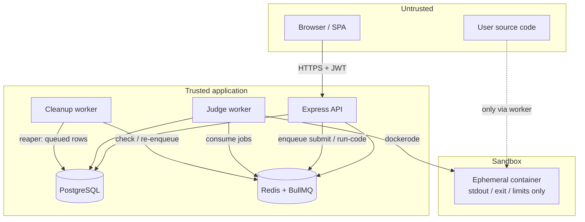
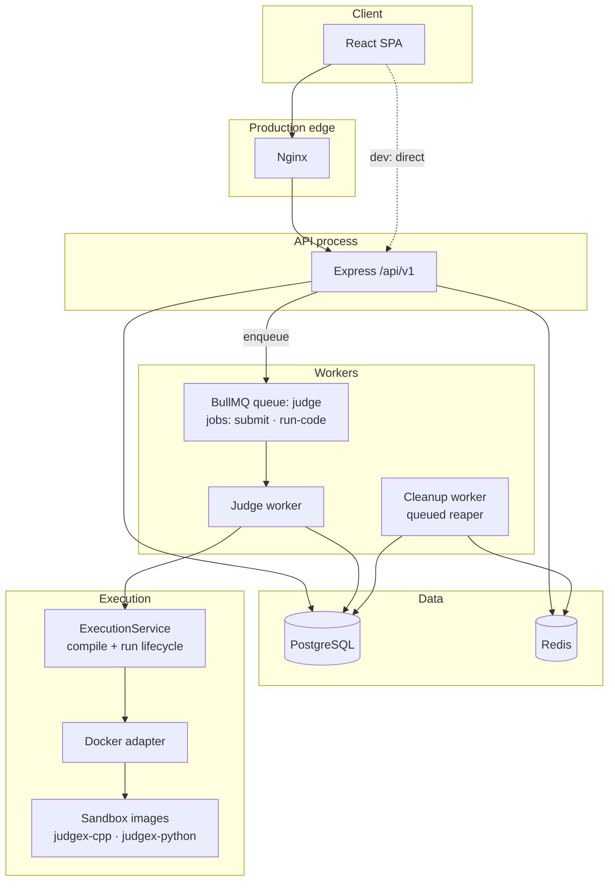
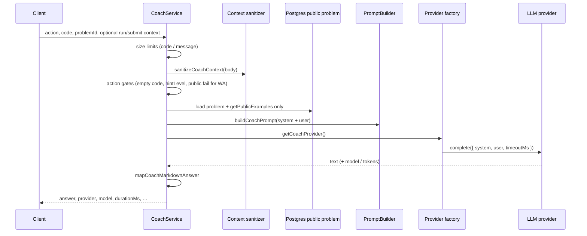
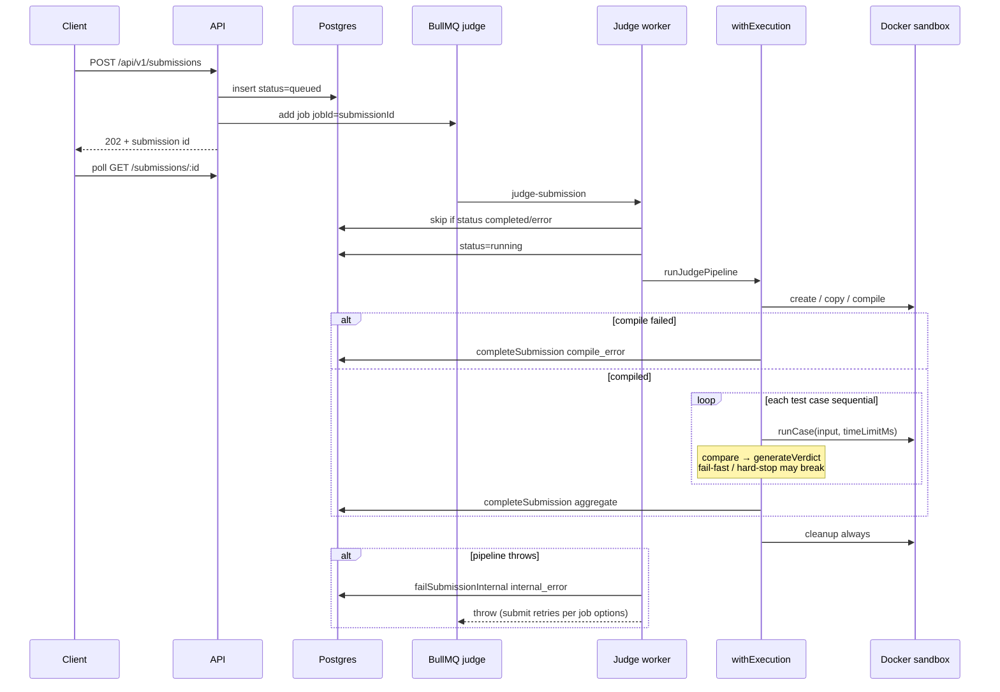
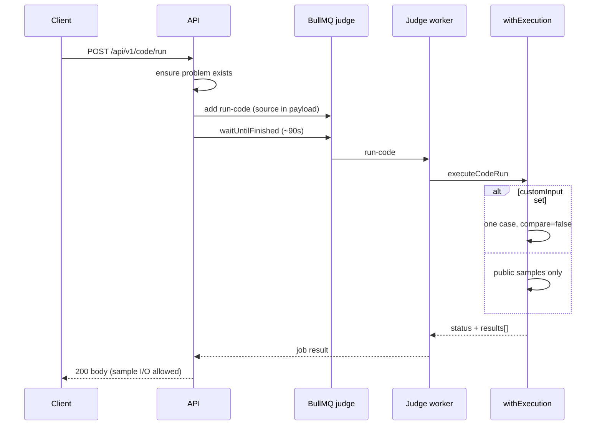

<div align="center">

# JudgeX

**A self-hosted online coding judge inspired by LeetCode, HackerRank, and Codeforces.**

Securely compile and execute user code in Docker sandboxes with asynchronous workers, a modular REST API, and a modern React SPA.

[](https://nodejs.org/)
[](https://react.dev/)
[](https://www.postgresql.org/)
[](https://redis.io/)
[](https://docs.bullmq.io/)
[](https://www.docker.com/)
[](LICENSE)
[](.github/workflows/ci.yml)

[Features](#features) · [Architecture](#architecture) · [Getting Started](#getting-started) · [Deployment](#deployment) · [Documentation](#documentation)

</div>

---

## Project Overview

JudgeX is an online coding judge platform where users browse problems, write solutions in **C++** or **Python**, run code against public samples, submit for full judging, and track progress on a personal dashboard and global leaderboard. It also includes an integrated **AI Coach** powered by local LLMs through **Ollama** (provider interface abstracted for future backends).

Unlike a simple CRUD demo, JudgeX is engineered around **secure untrusted code execution** and **horizontally scalable judging**:

- The **API never runs user code** — it validates, persists, and enqueues work.
- **BullMQ workers** pull jobs and invoke a shared **ExecutionService** that talks to **Docker sandboxes**.
- **Hidden judge test cases** stay server-side; clients only see public samples and verdict metadata.

Inspired by the workflows and UX patterns of **LeetCode**, **Codeforces**, and **HackerRank**, with a focus on production architecture and interview-grade system design.

---

## Why JudgeX

| Goal | How JudgeX addresses it |
|------|-------------------------|
| **Secure sandboxing** | Per-job Docker sandboxes with network disabled, read-only rootfs, memory/CPU/PID limits |
| **Distributed workers** | BullMQ-backed judge worker and cleanup worker; API stays stateless |
| **Docker isolation** | Only the worker process holds the Docker socket |
| **Production architecture** | Postgres source of truth, Redis for queues/cache, health checks, Docker Compose prod stack |
| **Interview preparation** | Real patterns: async pipelines, RBAC, hidden test data, live analytics |

---

## Features

### Authentication

- JWT-based authentication (register, login, email verification, password reset)
- bcrypt password hashing
- Stateless API sessions via Bearer tokens

### Problem Solving

- Problem catalog with difficulty, constraints, and public sample test cases
- Monaco-based code editor with language templates
- Problem discussions and published editorials
- Live problem statistics (acceptance rate, solvers, submissions, average runtime)

### Judge

- **Run Code** — executes **public sample** test cases only (worker-backed)
- **Submit** — judges **all** test cases (public + hidden)
- Verdicts: Accepted, Wrong Answer, TLE, Runtime Error, Compile Error, Memory Limit Exceeded
- Shared `ExecutionService` used by **Run Code** and **Submit** paths
- C++ and Python sandboxes (`judgex-cpp`, `judgex-python` images)

### Submission System

- Paginated submission history with verdict, language, and runtime filters
- Submission detail with read-only source, verdict panels, and owner-only access
- Hidden testcase **metadata only** on failures (index — never I/O leakage)

### Dashboard

- Personal dashboard: solved counts by difficulty, acceptance rate, recent activity
- Charts: problems solved by difficulty, accepted vs failed submissions

### Contests

- Public contest listing and detail pages
- Join / participation while a contest is upcoming or running
- Problem visibility by lifecycle (hidden before start; participants during running; public when ended)
- Live scoreboard from contest-window submissions

### Analytics

- Per-problem live SQL aggregates from submission data
- User progress stats and leaderboard rankings

### Admin

- Admin dashboard, user management, moderation, analytics, queue monitor, audit logs
- Role-based access (`user` / `admin`)

### Infrastructure

- PostgreSQL 17 · Redis 7 · BullMQ · Docker Compose (dev + prod)
- Nginx edge proxy in the self-hosted Compose stack · health checks · cleanup worker (stuck-queued reaper)
- AI Coach via **Ollama** (local LLM)

### Testing

- Unit tests · integration tests · end-to-end judge verdict tests (local Docker)
- GitHub Actions CI (lint, build, unit + integration)

### AI Coach

- Unified endpoint: `POST /api/v1/ai/coach` (**Ollama** today)
- Explain My Code · Review My Solution · Progressive Hints · Wrong Answer Debugger · Optimize My Solution · Compile Error Coach
- Prompt Builder + provider abstraction (`complete()` port; Ollama wired now, other backends intended as future implementations)
- Context-aware coaching from public problem info, user code, and public run/submission signals only
- Hidden testcase input/output is never sent to the model

---

## Screenshots

| Screen | Preview |
|--------|---------|
| Login |  |
| Problem List |  |
| Problem Workspace |  |
| AI Coach |  |
| Submission History |  |
| Dashboard |  |
| Leaderboard |  |
| Contests |  |
| Profile |  |

---

## Architecture

JudgeX is a **modular monolith** API plus **separate worker processes**. PostgreSQL is the source of truth for users, problems, submissions, and related domain data. Redis backs BullMQ, response caching, and rate-limit counters. Untrusted code runs only inside disposable Docker sandboxes owned by the judge worker.

The central constraint: **the API never executes user code and does not mount the Docker socket.** It authenticates requests, validates input, persists durable state, and enqueues work. The judge worker is the only process that creates sandboxes. That split keeps the HTTP surface smaller, lets workers scale independently of the API, and matches the production Compose layout (`api` vs `worker` with `/var/run/docker.sock`).

AI Coach is intentionally **off** this path: coaching calls the LLM provider directly from the API process (no BullMQ, no Docker). See [AI Coach Architecture](#ai-coach-architecture).

### Components

| Component | Responsibility | Touches Docker? |
|-----------|----------------|-----------------|
| **React SPA** | UI, Monaco editor, JWT Bearer calls to `/api/v1` | No |
| **Express API** | Modular REST monolith (`src/modules/*` wired in `module-registry.js`). Stateless; Postgres + Redis only | No |
| **PostgreSQL** | Durable truth: submissions, problems, test cases, users, contests, … | No |
| **Redis** | BullMQ backing store; caches (e.g. leaderboard); rate-limit windows | No |
| **BullMQ `judge` queue** | One queue; job names distinguish **submit** vs **run-code** | No |
| **Judge worker** | Consumes `judge` jobs; loads submission/problem from Postgres; runs `ExecutionService` / pipelines; writes verdicts | **Yes** |
| **Cleanup worker** | Separate process: stuck-**queued** submission reaper (re-enqueue safety net). Not a BullMQ consumer for judging | No |
| **ExecutionService** | Shared sandbox lifecycle: create → copy source → compile → expose `runCase` → cleanup. **No** compare, verdict, or DB writes | Yes (via worker) |
| **Docker sandboxes** | `judgex-cpp` / `judgex-python`; network disabled, non-root, capability drop, read-only rootfs, memory/CPU/PID limits | — |

Feature modules (auth, problems, submissions, code, judge, contests, AI, admin, …) stay inside the monolith and mount under `/api/v1`. Cross-cutting concerns (Helmet, CORS, correlation IDs, rate limits, error handling) wrap the app in `app.js`. Production adds **Nginx** as the edge proxy in front of the SPA and API (`docker-compose.prod.yml`).

### Trust boundaries



- **Untrusted:** browser clients and all user-supplied source (and run/submit payloads derived from them).
- **Trusted application:** API, workers, Postgres, Redis. Treat sandbox output as untrusted data that must still pass comparison and DTO filtering before clients see it.
- **Sandbox:** hostile code execution environment. Network is disabled; privileges and resource caps are set by the Docker adapter. Only the judge worker holds `docker.sock` in production Compose.

### Request paths (high level)

**Submit (async judge)**

1. `POST /api/v1/submissions` → persist submission as `queued` in Postgres → enqueue BullMQ job (`jobId = submissionId`, payload is the id — not the source).
2. API returns immediately (HTTP 202); the client polls submission detail.
3. Judge worker marks `running`, runs the judge pipeline (all public + hidden cases), persists the terminal verdict.
4. If enqueue fails after persist, the row stays `queued` for the cleanup worker’s reaper to retry.

**Run Code (worker-backed, API waits)**

1. `POST /api/v1/code/run` → enqueue a `run-code` job on the **same** `judge` queue (payload includes source; attempts = 1).
2. API **waits** for the worker result (default ~90s) and returns per-sample (or custom-input) output.
3. No submission row; public samples only (or one custom stdin). Hidden cases are never loaded.

Orchestration details (verdict precedence, fail-fast, comparator, sandbox lifecycle) are in [Judge Pipeline](#judge-pipeline).



**ASCII overview**

```
┌─────────────┐
│   React     │  Monaco · React Query · Tailwind
│   Frontend  │
└──────┬──────┘
       │ REST (JWT Bearer)
       ▼
┌─────────────┐     ┌──────────────┐     ┌─────────────────────┐
│  Express    │────▶│  PostgreSQL  │     │  Redis              │
│  API        │     │  source of   │     │  BullMQ · cache · RL│
│  (no Docker)│────▶│  truth       │     └──────────┬──────────┘
└──────┬──────┘     └──────────────┘                │
       │ enqueue                                      │
       ▼                                              ▼
┌─────────────────┐                          ┌────────────────┐
│  BullMQ queue   │◀─────────────────────────│  judge worker  │
│  name: judge    │                          │  (+ Docker)    │
│  submit|run-code│                          └───────┬────────┘
└─────────────────┘                                  │
                                                     ▼
                     ┌──────────────────┐     ┌─────────────────┐
                     │ ExecutionService │────▶│ Docker sandbox  │
                     │ create→compile   │     │ network off ·   │
                     │ →runCase→cleanup │     │ ro rootfs · caps│
                     └──────────────────┘     └─────────────────┘

Cleanup worker (separate): reaps stuck queued submissions — not on the judge path.
⚠ API never executes untrusted code. Only the judge worker uses Docker.
```

### Design choices (architecture-level)

| Choice | Why |
|--------|-----|
| Modular monolith + workers | One deployable API and clear module boundaries without Kafka/microservices overhead; judging still scales by adding judge workers |
| Postgres as SoT for submits | Persist-before-enqueue: a successful HTTP accept always has a recoverable row if Redis/enqueue fails |
| Single `judge` queue, two job names | Shared concurrency and worker pool; submit vs run dispatched in `judge.worker.js` without a second Redis queue |
| ExecutionService shared by Run & Submit | One Docker lifecycle implementation; compare/verdict/persist stay in pipeline / code modules |
| Cleanup worker separate from judge | Reaper can run without `docker.sock`; judge hosts stay focused on execution |

Tradeoffs accepted at this layer: Run holds an API request open until the worker finishes (simpler UX, ties up a request slot); Submit is poll-based (better under load). Compare, verdict aggregation, and AI provider details are deliberately out of this section.

## AI Coach Architecture

Prerequisite reading: [Architecture](#architecture) (AI is off the judge path), [Key Engineering Decisions](#key-engineering-decisions) (hidden-test / viewer posture), [Judge Pipeline](#judge-pipeline) (what Run/Submit actually return). This section covers **only** the Learning Coach: request lifecycle, context assembly, prompts, providers, and AI-specific trust boundaries.

The coach never compiles or executes user code, never enqueues BullMQ jobs, and never opens Docker. It is an authenticated, rate-limited **LLM tutoring** path on the API process.

### Why it is isolated from execution

Judging must stay deterministic, sandboxable, and recoverable. Coaching is probabilistic, latency-variable, and optional. Mixing them would couple verdict integrity to model availability and would tempt “send the failing hidden case to the LLM.” Isolation means:

- Failures in Ollama degrade coaching (`AIError`) without blocking submit/run workers.
- The only code the model sees is what the coach deliberately assembles—not live sandbox streams from the judge worker.
- Extension of prompts/providers does not require changes to `ExecutionService` or the Docker adapter.

### Request lifecycle

**Endpoint:** `POST /api/v1/ai/coach` — `authenticate` → `aiRateLimit` → Zod (`coachRequestSchema`) → `CoachService.coach`.



**Actions** (`coach.actions.js`): `EXPLAIN_CODE`, `REVIEW`, `COMPLEXITY`, `COMPILE_ERROR`, `WRONG_ANSWER`, `OPTIMIZE`, `HINT`, `UNKNOWN` (plus legacy string aliases). Action selects the prompt template and which optional context sections are included.

**Action gates (before the model call):**

| Gate | Behavior |
|------|----------|
| Size | Reject if `code` / `message` exceed `AI_MAX_*` config |
| Code required | `EXPLAIN_CODE`, `REVIEW`, `WRONG_ANSWER`, `OPTIMIZE` reject empty code |
| `HINT` | `hintLevel` must be integer **1–3** |
| `WRONG_ANSWER` | Requires a **public** failing case in sanitized `lastRunResult` |

### Context gathering (trusted vs client-supplied)

| Source | Origin | Role |
|--------|--------|------|
| Problem statement, difficulty, constraints | **Server** `findById` | Authoritative public statement |
| Public examples | **Server** `getPublicExamples` + `resolveTestCase` + `sanitizePublicExamples` | Sample I/O only |
| `code`, `language`, `message`, `action`, `hintLevel` | **Client** (after sanitize) | Learner intent |
| `lastRunResult` | **Client** (sanitized) | Optional public sample outcomes / compile stderr |
| `lastSubmission` | **Client** (sanitized summary) | Verdict/metrics/index—**no** per-case I/O |

The model never receives a worker-side dump of hidden judge cases. Problem examples are re-loaded on the server so the client cannot inject “examples” that are actually hidden tests via the problem field.

**Limitation (honest):** `lastRunResult.results` is still **client-attested**. The sanitizer drops rows marked hidden and strips forbidden keys; it cannot cryptographically prove a client-invented “public” I/O pair came from a real Run. Treat Run-shaped context as coaching signal, not as a substitute for server-side judge confidentiality.

### Context sanitization

`sanitizeCoachContext` builds a narrow object: `problemId`, `language`, `code`, `action`, `message`, `hintLevel`, `lastRunResult`, `lastSubmission`.

**`sanitizeLastRunResult`:** keep status, compile success/stderr (compile **stdout forced null**), public `results` via `sanitizePublicResults` (drops `isHidden` / `visibility: hidden|private`), passed/total counts.

**`sanitizeLastSubmission`:** id, status, verdict, compileOutput, stderr, executionError, runtime/memory, passed/total, `failedTestIndex` only—explicitly **no** per-case I/O arrays.

**`deepSanitize` / forbidden key regex** exist for nested stripping of `hidden*` / `judge*` / `secret*` shaped keys; the coach hot path uses the structured sanitizers above (not a blind deep walk of the whole body). Do not assume every nested client field is recursively scrubbed beyond what those functions keep.

### Prompt construction

`buildCoachPrompt`:

1. **System:** `prompts/system.prompt.md` + action file (e.g. `explain-code.prompt.md`, `hint.prompt.md`, …).
2. **User:** sections for problem, public examples, language, source (truncated), and—unless the action is code-focused (`EXPLAIN_CODE`, `HINT`)—optional latest Run JSON, WA failure slice, optimize perf summary, submit summary, compile/runtime snippets.
3. Always appends a **security note**: hidden tests not included; must not invent them; no editorials.
4. Truncation uses `AI_MAX_CODE_CHARS`, `AI_MAX_STATEMENT_CHARS`, `AI_MAX_MESSAGE_CHARS`.

**System prompt posture (implemented text):** coach reasoning; **never** invent hidden tests; prefer short Markdown; **do not** provide a complete copy-paste solution **unless the user explicitly asks**. That is **prompt policy**, not an output redaction filter—there is no post-processor that strips solutions from the model reply before return.

Response shaping: `mapCoachMarkdownAnswer` normalizes Markdown structure for the UI; it is not a security gate.

### Provider abstraction

Coach business logic depends on a small port:

```text
{ id: string, complete({ system, user, timeoutMs }) → { text, provider, model?, tokensUsed? } }
```

`modules/ai/providers/provider.factory.js` selects the implementation from `AI_PROVIDER`. **Today only `ollama` is wired** for the coach; anything else throws (`Supported for coach foundation: ollama.`). Controllers never import Ollama directly.

There is a separate `infrastructure/ai-provider` stack (including an OpenAI adapter) used for a different interface (`generateCompletion`). **It is not on the coach hot path.** Do not read env `AI_PROVIDER=openai` as “coach works with OpenAI” until a coach provider implementing `complete()` is registered in the coach factory.

**Extend providers by:** implement `{ id, complete }`, `assertCoachProvider`, add a `case` in `createCoachProvider`, keep `CoachService` unchanged. Prompt templates stay provider-agnostic.

### Security boundaries (AI-specific)

| Boundary | Mechanism |
|----------|-----------|
| Auth / abuse | JWT required; Redis `ai` rate-limit tier (fail-open if Redis is down so judging isn’t coupled—see rate-limit middleware) |
| Hidden judge data | Server public examples only; submission summary without case I/O; run results filtered |
| Prompt injection of “hidden” keys | Forbidden key set + public-results filter on client run payloads |
| Size DoS toward the model | Configurable max code/message/statement chars |
| Error leakage | Provider errors mapped to short `AIError` / friendly Ollama messages (no stacks) |

**Not guaranteed by code today:** feature flags `FEATURE_AI_*` are parsed into config but **not consulted** by `CoachService`; output filtering / `wasBlocked`-style gates; multi-provider coach swap beyond Ollama.

### Failure handling

| Condition | Outcome |
|-----------|---------|
| Validation / gates | `ValidationError` (4xx) — no provider call |
| Problem missing | `NotFoundError` |
| Provider timeout / empty / HTTP / connection | `AIError` with codes such as `AI_TIMEOUT` / provider messages (“Model not found”, “Connection to Ollama refused”, …) |
| Unknown `AI_PROVIDER` for coach | Factory throws at provider creation |

Judging and queue workers are unaffected: coaching is best-effort relative to the core OJ loop.

### Extension points

1. **New coach action:** add to `COACH_ACTIONS`, prompt markdown under `prompts/`, wire `ACTION_PROMPT_FILES`, any gate in `CoachService`, optional context builder (pattern used by wrong-answer / optimize helpers).
2. **New LLM backend:** coach provider with `complete()` + factory case (preferred over calling `infrastructure/ai-provider` from the coach until interfaces are unified).
3. **Stricter trust:** server-load last Run/Submit by id instead of trusting client JSON; or add an output policy layer if product requires hard no-solution guarantees.
4. **Feature flags:** wire `config.featureFlags` into `CoachService` if progressive rollout is required—flags alone do nothing today.

---

## Judge Pipeline

This section is the **execution lifecycle**: how a job becomes a sandbox run, a verdict (or Run status), and a client-visible result. Queue ownership, persist-before-enqueue, and “API never mounts Docker” are covered in [Architecture](#architecture) and [Key Engineering Decisions](#key-engineering-decisions)—this section assumes those contracts and follows the code through compile → run → compare → finalize.

Two entry points share one sandbox lifecycle (`withExecution`) but **different orchestration**:

| | **Submit** | **Run Code** |
|---|------------|--------------|
| Worker entry | `runJudgePipeline(submissionId)` | `executeCodeRun({ problemId, language, sourceCode, … })` |
| Test sources | All cases via `getJudgeTestCases` (public + hidden) | `getPublicExamples` only, or one `customInput` (no compare) |
| Policy | Verdict engine + fail-fast / hard-stop | Per-sample cards + `aggregateStatus` (no `generateVerdict`) |
| Durability | Persist terminal fields on the submission row | Return payload to the waiting API (no submission row) |

### Stage modules (contracts)

Judging is staged so each module stays pure or narrowly scoped:

| Stage | Module | Responsibility | Does not |
|-------|--------|----------------|----------|
| Sandbox lifecycle | `execution.service` → `withExecution` | create → copy `main.cpp` / `main.py` → compile → expose `runCase` → **always** `cleanup` in `finally` | Compare, verdict, DB, queue |
| Compile | `compiler.js` | C++: `g++ -std=c++17 -O2`; Python: `py_compile` (syntax only, does not execute top-level code). Default compile budget **10s** | Map failure to a verdict |
| Run | `runner.js` | One case: `./main` or `python3 main.py` with stdin + per-case `problem.timeLimitMs` | Compare or verdict |
| Compare | `comparator.js` | Normalize then exact equality | Inspect exit codes / timeouts |
| Verdict | `verdict-engine.js` | Collapse stage signals → one verdict (fixed precedence) | I/O, Docker, DB |
| Orchestrate + persist | `judge.pipeline.js` | Sequential cases, fail-fast / hard-stop, `completeSubmission` | Own Docker flags (adapter does) |

Images: `judgex-cpp` / `judgex-python` (`LANGUAGE_IMAGES`). Memory limit for the container comes from **problem** `memoryLimitMb` at `withExecution` time.

### Shared sandbox lifecycle

Both paths use **one keepalive container per job** (not one container per test case):

1. `createSandbox` (network off, non-root, capability drop, read-only rootfs, mem/CPU/PID caps—see Docker adapter).
2. Copy source into the bind-mounted workspace; `assertWorkspaceFile` fails fast if the bind is wrong (e.g. DinD path mismatch).
3. Compile once.
4. For each case, `runCase(input, timeoutMs)` → adapter writes stdin to workspace file `.judgex_stdin` and runs via shell redirect (avoids fragile hijacked-stdin attach behavior).
5. `finally`: force-remove container + delete workspace (cleanup must not throw into the caller).

**Lifecycle implication:** on TLE the adapter **SIGKILLs the whole container**. Further cases on that sandbox are unsafe—hence **hard-stop** on `tle` and `memory_limit_exceeded` (and compile error already skips runs) regardless of `JUDGE_FAIL_FAST`.

### Submit lifecycle



**Status contract:** `queued` → `running` → `completed` (with a verdict) or `error` (`verdict = internal_error` on unexpected pipeline failure). Worker skips jobs whose submission is already `completed` or `error`.

**Per-case loop (after successful compile):**

1. Run with problem time limit; track max `runtimeMs` / `memoryKb` across executed cases.
2. `compareOutputs(stdout, expected)` → `generateVerdict({ compileResult, runResult, comparisonResult })`.
3. On first failure, record `failedTestIndex` and that case’s verdict as the final outcome. Later failures do **not** “upgrade” severity when fail-fast is off—first failure still wins.
4. Stop early if `JUDGE_FAIL_FAST` (default true) **or** the verdict is in `{ compile_error, tle, memory_limit_exceeded }`.
5. Persist: verdict, compile output (CE only path), aggregates (`passedTests` / `totalTests`), `failedTestIndex`, last stdout/stderr on the row (for internals). Clients still see stripped fields via the viewer DTO (index-only on WA—see Key Engineering Decisions).

Empty judge test lists throw `JudgeError` (no silent AC).

### Verdict precedence (Submit)

`generateVerdict` is a pure function; **first matching rule wins**:

1. `compile_error` — compile `success === false`
2. `tle` — `runResult.timedOut`
3. `memory_limit_exceeded` — `runResult.oomKilled`
4. `runtime_error` — concrete non-zero `exitCode` (null/undefined exit is not treated as RE)
5. `wrong_answer` — comparison `matches === false`
6. `accepted` — otherwise

`internal_error` is **not** produced by the verdict engine; the worker sets it via `failSubmissionInternal` when the pipeline throws.

### Comparator (shared by Submit and Run sample mode)

Normalization before equality:

- CRLF / lone CR → LF  
- Strip trailing whitespace per line  
- Drop trailing blank lines at EOF  
- Preserve meaningful leading / internal whitespace  

Then exact string equality on normalized forms. No float tolerance, no token judges.

### Run Code lifecycle



**Worker orchestration differences vs Submit:**

- Hidden cases are never loaded (`getPublicExamples` filters `is_hidden = false`).
- On compile failure, returns `status: compile_error` with compile stdout/stderr—**no** sample cards.
- On success, runs **all** selected cases sequentially (no submit fail-fast). Each public sample result may include `input`, `expectedOutput`, `actualOutput`, `passed`, timing, stderr, timeout/exit.
- `customInput`: single case, `passed: null` (no expected output).
- No public samples and no `customInput` → `ValidationError` (job fails; API surfaces the queue error).
- Aggregate `status` vocabulary is **Run-specific**: `ok` | `time_limit` | `runtime_error` | `failed` | `compile_error`—not the submission verdict enum (`tle` vs `time_limit`, etc.).

### Failure handling (pipeline-level)

| Failure | Submit behavior | Run behavior |
|---------|-----------------|--------------|
| Compile failure | Persist `compile_error`; no cases run | Return compile_error payload |
| WA / RE with fail-fast | Stop; persist first failure + index | Continue remaining samples; aggregate status |
| TLE / MLE | Hard-stop; container already killed on TLE | Case marked timedOut / exit; aggregate may be `time_limit` or `runtime_error` (Run does not emit `memory_limit_exceeded` as a top-level status today) |
| No tests / no public samples | `JudgeError` → worker `internal_error` + rethrow | `ValidationError` → job fails |
| Unexpected throw after `running` | `failSubmissionInternal` + rethrow (BullMQ submit retries) | Rethrow to fail the wait |
| Missing language image | `JudgeError` before useful work | Same via `withExecution` |

External (non-inline) test payloads currently resolve through storage as **not implemented** and propagate—never swallowed as WA.

### Trust boundary inside the pipeline

- **Worker trust:** may load hidden expected I/O and see sandbox stdout/stderr.
- **Client trust (Submit):** viewer path must not return hidden I/O; failed **index** is the WA hint.
- **Client trust (Run):** public sample (or custom) I/O in the response is intentional—never use Run as a channel for hidden cases.
- **Sandbox trust:** stdout/exit/oom/timeout are signals for the verdict engine, not trusted program output beyond comparison.

### Extending the pipeline

- **New language:** image in `LANGUAGE_IMAGES`, source filename in `compiler.SOURCE_FILES`, compile + run commands, rebuild sandbox image—keep HTTP controllers queue-only.
- **New verdict signal:** extend runner/adapter metrics, then `generateVerdict` precedence—do not bury policy in `docker.adapter`.
- **Alternate compare mode:** new comparator used by the pipeline/Run; do not fork sandbox lifecycle.
- **Diagnostics mode:** `JUDGE_FAIL_FAST=false` still keeps first-failure verdict; it only continues after soft failures (WA/RE), not after hard-stops.

---

## Key Engineering Decisions

These are the load-bearing choices in the codebase—not a feature list. Each row below is something another engineer will trip over when extending the system. Deeper execution mechanics live in [Judge Pipeline](#judge-pipeline); trust zones live in [Architecture](#architecture).

### 1. The API never runs Docker; only the judge worker does

**Why.** Untrusted code is the highest-risk input in an online judge. Keeping `docker.sock` off the API process shrinks the blast radius of a compromised HTTP handler and matches production Compose: `api` has no socket mount; `worker` does.

**What it buys.** The API stays a normal Node service (auth, validation, Postgres, Redis). Scaling HTTP and scaling judging are independent. Incident response can treat the worker host as the privileged plane.

**Tradeoff.** Every Run and Submit pays a queue hop. Local “call ExecutionService from the controller” would be simpler and is intentionally forbidden.

**Extend by.** Adding languages or sandbox flags in the worker/Docker adapter—not in Express controllers. New HTTP features that need execution must enqueue work (`queue.service.js`), never import `docker.adapter` into the API process.

### 2. Persist-before-enqueue for submissions

**Why.** A judge accept must be recoverable. `SubmissionService.createSubmission` writes a `queued` row in Postgres inside a transaction, **then** enqueues. If Redis/BullMQ fails, the row remains `queued` for the cleanup worker’s reaper to retry. The job payload is `{ submissionId, schemaVersion, … }` with `jobId = submissionId`—Postgres holds the source; Redis does not.

**What it buys.** “HTTP 202 but nothing to judge” becomes an operational recovery problem, not silent data loss. Deduplication is natural: BullMQ rejects a duplicate `jobId`.

**Tradeoff.** Temporary `queued` orphans are expected under Redis outages; you need the reaper (and monitoring), not just retries in the request path. Run Code does **not** use this pattern (no durable row; see below).

**Extend by.** Never enqueue submit work without a durable id. Keep worker logic keyed by `submissionId` so retries and reaper re-enqueues stay idempotent at the job identity layer (terminal rows are skipped in `judge.worker.js`).

### 3. One BullMQ queue (`judge`), two job kinds

**Why.** Submit (`judge-submission`) and Run (`run-code`) share the same worker pool and concurrency (`JUDGE_WORKER_CONCURRENCY`). `queues.js` documents this explicitly: one Redis queue, distinct job names for dispatch in `judge.worker.js`.

**Submit vs Run contracts.**

| | Submit | Run Code |
|---|--------|----------|
| Durability | Postgres row | None |
| Queue payload | Id only | Includes `sourceCode` (+ optional custom input) |
| API behavior | 202 + client poll | `waitUntilFinished` (~90s default) |
| Attempts | 3, exponential backoff | 1 |
| Tests loaded | All (public + hidden) | Public samples only (or custom stdin) |

**Tradeoff.** Run holds an API request open (simpler UX, occupies a connection/slot under load). Submit scales better but needs polling UX. Run puts source in Redis briefly; Submit does not. Shared concurrency means a burst of Runs can contend with Submits for the same workers.

**Extend by.** Prefer a new job name on `judge` (or a documented second queue if isolation is required) over calling Docker from the API. Do not assume Run and Submit share retry or payload shape.

### 4. Shared `ExecutionService` (lifecycle only)

**Why.** Run and Submit both need create → copy source → compile → run cases → cleanup. Duplicating dockerode orchestration invites divergent security flags and leaked containers. `withExecution` owns that lifecycle and is intentionally **verdict-free and DB-free**.

**What it does *not* own.** Output comparison (`comparator.js`), verdict aggregation (`verdict-engine.js`), fail-fast policy (`judge.pipeline.js`), or HTTP/DTO shaping (`code.service.js` / `submissions.service.js`). Those stay in their pipelines so a Run can return sample cards while Submit persists AC/WA/TLE/…

**Tradeoff.** Callers must compose stages correctly; ExecutionService alone is not “the judge.”

**Extend by.** New execution modes should call `withExecution` and supply a worker callback. Inject docker/compile/run in tests the same way the unit suite does—avoid hitting a real daemon for pure policy tests.

### 5. Docker sandbox defaults are defensive, not ornamental

**Why.** User code is treated as hostile. The Docker adapter creates ephemeral containers with network disabled (`NetworkDisabled` + `NetworkMode: 'none'`), non-root `1000:1000`, `CapDrop: ALL`, `no-new-privileges`, read-only rootfs, capped `/tmp` tmpfs, memory with swap disabled (memory = swap limit), CPU and PID caps.

**Tradeoff.** A long-lived keepalive container with bind-mounted workspace (`:rw` for the job) is used so compile + many execs share one sandbox—simpler and faster than create/destroy per test case, but the workspace is writable for that job. Resource limits are cgroup-level; they are not a formal proof against every escape. Peak memory reporting depends on what the adapter observes (e.g. OOM kill → MLE path); do not assume precise `memoryKb` telemetry without verifying the adapter returns it.

**Extend by.** Change isolation flags in `docker.adapter.js` in one place. Language images (`judgex-cpp`, `judgex-python`) stay thin; do not bake secrets or judge logic into images.

### 6. Hidden tests: server-side truth + viewer DTOs

**Why.** Public APIs and Run load `is_hidden = false` samples only. Submit loads all cases inside the worker. Even if the pipeline stores stdout/stderr on the submission row for internals, `toSubmissionDetailForViewer` always nulls `stdout` and only exposes compile stderr on CE, runtime stderr on RE/internal, and **failed test index** on WA—never hidden input/expected/actual to the client.

**Tradeoff.** Authors debugging WA get less information than on some commercial platforms; that is intentional. Relying only on “don’t SELECT hidden columns” is insufficient if raw submission rows were ever returned—DTO stripping is a second line.

**Extend by.** Any new “show me the failing case” API must go through the viewer/DTO path (or an explicit admin-only surface). AI Coach must keep loading problem/examples server-side and sanitizing client context (see AI section later)—do not pass hidden I/O into prompts.

### 7. Modular monolith + ports at the edges

**Why.** The product needs clear module boundaries (auth, problems, submissions, judge, contests, AI, admin) without a microservices mesh. Feature routers mount in one place (`module-registry.js`). Infrastructure is reached through adapters (queue, docker, cache, storage, email) so workers and tests can substitute fakes.

**Tradeoff.** One deployable API means shared failure domains for non-judge features; judging isolation is process-level (workers), not a separate “judge microservice” network. Team scale is one codebase.

**Extend by.** New domains: add `src/modules/<name>`, mount in `module-registry.js`, keep Docker/queue I/O behind infrastructure ports. Do not create a new service until there is an operational reason the worker split does not already cover.

### 8. Live SQL for problem stats (not a denormalized write path on complete)

**Why.** Problem statistics endpoints aggregate from `submissions` at read time (counts, acceptance-related metrics). That keeps numbers correct when verdicts change and avoids a second write path that can drift from the judge’s `completeSubmission` updates.

**Tradeoff.** Heavier reads under load versus counter columns updated in the judge transaction. Indexes and caching elsewhere (e.g. leaderboard Redis cache invalidated on AC) are the complementary pattern—stats freshness vs write complexity is a deliberate split.

**Extend by.** If you add counter columns later, update them in the same completion path as the verdict and backfill carefully; until then, prefer query aggregates for user-facing problem stats.

### 9. Cleanup worker = queued reaper, not a Docker janitor

**Why.** Persist-before-enqueue creates a class of stranded `queued` rows when enqueue fails or workers die before pickup. The cleanup process runs `startReaperScheduler`: find old `queued` rows, skip if a BullMQ job already exists for that `jobId`, otherwise re-enqueue. It does not need `docker.sock`.

**Tradeoff.** Stuck `running` submissions and orphan containers are **out of scope** of this worker today (see comments in `cleanup.worker.js`). Documenting it as a general “cleanup queue” would oversell the implementation.

**Extend by.** New janitors (orphan containers, stuck `running`) should be explicit new responsibilities—likely still off the request path—rather than silently assumed.

### Decision summary

| Decision | Primary problem solved |
|----------|-------------------------|
| API ≠ Docker | Limit privilege and attack surface on HTTP nodes |
| Persist-before-enqueue + `jobId = submissionId` | Recoverable accepts; deduped jobs |
| One queue, two job names | Shared workers; different durability/wait semantics |
| Shared ExecutionService | One sandbox lifecycle for Run and Submit |
| Hardened sandboxes | Contain hostile code with defense-in-depth defaults |
| Hidden tests + viewer DTO | Prevent I/O leakage on failure |
| Modular monolith + adapters | Ship fast with clear extension points |
| Live SQL problem stats | Avoid denormalized counter drift |
| Separate reaper process | Repair stranded `queued` rows without Docker |

---

## Technology Stack

| Layer | Technologies |
|-------|----------------|
| **Frontend** | React 19, TypeScript, Vite, Tailwind CSS, TanStack Query, Zustand, Monaco Editor, Recharts, React Router |
| **Backend** | Node.js 20+, Express, modular monolith (`src/modules/*`) |
| **Database** | PostgreSQL 17 |
| **Queue / cache** | Redis 7, BullMQ, ioredis |
| **Sandbox** | Docker, dockerode, `judgex-cpp` / `judgex-python` images |
| **Authentication** | JWT (`jsonwebtoken`), bcrypt |
| **Validation** | Zod (API), express middleware |
| **Testing** | Node test runner; unit, integration, local e2e judge suites |
| **Deployment** | Docker Compose, Nginx, multi-stage builds |

---

## Repository Structure

```
judgex/
├── backend/
│   ├── src/
│   │   ├── modules/          # auth, problems, submissions, code, judge, dashboard, …
│   │   ├── workers/            # judge.worker.js, cleanup.worker.js
│   │   ├── infrastructure/     # database, queue, docker, cache, ai-provider
│   │   ├── middlewares/        # authenticate, authorize, validate, rate-limit
│   │   └── bootstrap/          # module-registry, app wiring
│   ├── scripts/                # migrations, demo seed, benchmarks
│   └── tests/                  # unit, integration, e2e
├── frontend/
│   ├── src/
│   │   ├── api/                # typed API clients
│   │   ├── features/           # editor, submissions, problems, dashboard, …
│   │   ├── pages/              # route-level views
│   │   ├── routes/             # React Router config
│   │   └── components/         # shared UI primitives
│   └── public/
├── docker/
│   ├── images/                 # python & cpp sandbox Dockerfile
│   └── nginx/                  # prod reverse proxy config
├── docs/                       # architecture, API, DB design, deployment
├── docker-compose.yml          # dev: postgres, redis, ollama
├── docker-compose.prod.yml     # prod: nginx, api, worker, cleanup, data stores
├── .github/workflows/ci.yml
└── README.md
```

---

## Getting Started

### Prerequisites

- **Node.js** ≥ 20
- **Docker** & Docker Compose
- **npm** (or compatible package manager)

### 1. Clone

```bash
git clone https://github.com/ReshwanthKudikala/JudgeX.git
cd JudgeX
```

### 2. Start backing services (development)

```bash
docker compose up -d
```

This starts PostgreSQL, Redis, and Ollama (for AI Coach). See [`docker/README.md`](docker/README.md).

### 3. Build sandbox images

```bash
docker build -t judgex-python ./docker/images/python
docker build -t judgex-cpp ./docker/images/cpp
```

### 4. Backend

```bash
cd backend
cp .env.example .env          # edit JWT_SECRET, URLs as needed
npm ci
npm run db:migrate
npm run db:seed:demo          # optional demo problems
npm run dev                   # API on :4000
```

### 5. Judge worker (separate terminal)

```bash
cd backend
npm run worker:judge:dev
```

### 6. Cleanup worker (optional, recommended)

```bash
cd backend
npm run worker:cleanup
```

### 7. Frontend

```bash
cd frontend
npm ci
npm run dev                   # Vite on :5173
```

Open **http://localhost:5173**. API defaults to **http://localhost:4000/api/v1**.

(Production Compose serves the built SPA at **http://localhost** via Nginx.)

### AI Coach Setup

1. Start Ollama (included in `docker compose up -d`, or install locally).
2. Pull the model: `ollama pull qwen2.5-coder:7b` (or `docker exec -it judgex-ollama ollama pull qwen2.5-coder:7b`).
3. In `backend/.env` (or `.env.production`): set `AI_PROVIDER=ollama`, `OLLAMA_MODEL=qwen2.5-coder:7b`, and `OLLAMA_BASE_URL` to a reachable Ollama URL.
4. Raise `AI_TIMEOUT_MS` for local inference if needed (e.g. `120000`).

See [`docker/README.md`](docker/README.md) for container details.

---

## Deployment

This section documents the **self-hosted** stack defined by **`docker-compose.prod.yml`**. That Compose file is the repository’s production-*oriented* topology for running JudgeX on your own host (or lab VM)—not a claim that a public JudgeX instance is live, scaled, or under production load.

Dev-only Postgres/Redis/Ollama for host-run apps remains in **`docker-compose.yml`**. Prefer [`docs/DEPLOYMENT.md`](docs/DEPLOYMENT.md) for backups, TLS setup details, and troubleshooting.

### Topology

Bring up the full app with Compose. The stack consists of:

| Service | Responsibility |
|---------|----------------|
| `nginx` | Edge reverse proxy: SPA + `/api` upstream. Publishes host ports `80` (and optionally `443`). |
| `frontend` | Multi-stage Vite production build served as static assets (consumed via nginx). |
| `api` | Express API (`Dockerfile.api`). **No Docker socket.** On start: run SQL migrations, then serve HTTP (`scripts/docker-entrypoint-api.sh`). |
| `worker` | Judge worker (`Dockerfile.judge`). Consumes the BullMQ `judge` queue; **only** this service mounts `/var/run/docker.sock` and the sandbox workspace bind. |
| `cleanup-worker` | Separate process: reaps stuck **`queued`** submissions (re-enqueue safety net). No Docker socket. |
| `postgres` | Durable source of truth (`judgex_pgdata` volume). |
| `redis` | BullMQ, caches, rate-limit counters; AOF enabled (`--appendonly yes`). |

**Why `worker` is separate from `api`:** untrusted code execution requires the Docker socket. Keeping the socket off the API process shrinks the HTTP attack surface and matches the architectural invariant that controllers enqueue work rather than compile/run user programs. Scale judging by adding worker replicas; the API stays a normal Node service.

### Startup requirements

Before a useful self-hosted deploy:

1. **Secrets / env** — copy and edit the root template (at minimum strong `POSTGRES_PASSWORD`, `JWT_SECRET`, and a real `CORS_ORIGIN` for your site origin). Production boot asserts reject weak/misconfigured values (`assertProductionReady`).
2. **Sandbox images on the Docker host** — prod Compose does **not** build `judgex-cpp` / `judgex-python`. Build (or load) them on the same daemon the worker uses **before** expecting Run/Submit to succeed:
   ```bash
   docker build -t judgex-python ./docker/images/python
   docker build -t judgex-cpp ./docker/images/cpp
   ```
3. **Host Docker for the worker** — the judge worker talks to the host engine via `docker.sock` and writes workspaces under `.judge-workspaces` (mapped to `JUDGE_WORKSPACE_DIR` in the container).

### Bring up the stack

```bash
cp .env.production.example .env.production   # set secrets
docker compose -f docker-compose.prod.yml --env-file .env.production up -d --build
```

Compose wires `DATABASE_URL` / `REDIS_URL` to the `postgres` and `redis` services, waits on healthchecks where defined, and starts `api` → workers after dependencies are healthy. Point browsers at the nginx-published HTTP port (default host **80**).

### Operational assumptions (implemented)

What this Compose file actually encodes:

- **API ≠ Docker** — only `worker` mounts the socket and workspace volume.
- **Migrations before serve** — API container entrypoint runs `node scripts/migrate.js` then `node src/server.js`.
- **Redis required in this mode** — `REDIS_REQUIRED=true` for API and workers in the prod compose env.
- **Persistence** — Postgres and Redis data volumes survive container recreation.
- **Healthchecks** — service-level health probes for postgres, redis, api, frontend, and nginx (as defined in the compose file).
- **Cleanup worker** — stuck-`queued` reaper only; not an orphan-container janitor.

### TLS (optional)

By default the checked-in nginx config serves **HTTP**. Compose maps host port **443** and mounts `${NGINX_CERTS_DIR:-./docker/nginx/certs}` for convenience; enabling TLS requires providing certificates and uncommenting/configuring the SSL server block as described in [`docs/DEPLOYMENT.md`](docs/DEPLOYMENT.md). Do not treat HTTPS as automatically configured out of the box.

---

## Environment Variables

| Variable | Description |
|----------|-------------|
| `NODE_ENV` | `development` or `production` |
| `PORT` | API listen port (default `4000`) |
| `DATABASE_URL` | PostgreSQL connection string |
| `POSTGRES_USER` / `POSTGRES_PASSWORD` / `POSTGRES_DB` | Compose bootstrap credentials |
| `REDIS_URL` | Redis connection string |
| `JWT_SECRET` | Signing secret (≥ 32 chars in production) |
| `JWT_EXPIRES_IN` | Token TTL (default in `.env.example`: `15m`) |
| `CORS_ORIGIN` | Allowed frontend origin(s) |
| `FRONTEND_URL` | Base URL for email verification / reset links |
| `BCRYPT_SALT_ROUNDS` | Password hashing cost |
| `AI_PROVIDER` | Coach factory reads this today: set **`ollama`**. Other values are not wired on the coach path (`complete()` factory). |
| `OLLAMA_BASE_URL` | Ollama API base URL |
| `OLLAMA_MODEL` | Model name (e.g. `qwen2.5-coder:7b`) |
| `AI_TIMEOUT_MS` | AI provider request timeout (raise for local 7B models, e.g. `120000`) |
| `FEATURE_AI_ADVANCED` | Parsed into `config.featureFlags`; **not consulted** by `CoachService` today |
| `FEATURE_AI_COMPILE_EXPLANATION` | Parsed into `config.featureFlags`; **not consulted** by `CoachService` today |
| `OPENAI_API_KEY` | Used by the separate `infrastructure/ai-provider` OpenAI adapter — **not** the current coach hot path |
| `OPENAI_MODEL` | Same as above (alternate / future infrastructure; not coach `complete()` today) |
| `JUDGE_TIME_LIMIT_MS` | Per-run CPU time cap |
| `JUDGE_MEMORY_LIMIT_MB` | Sandbox memory limit |
| `JUDGE_PID_LIMIT` | Max PIDs per sandbox |
| `JUDGE_WORKER_CONCURRENCY` | Parallel jobs per worker |
| `JUDGE_WORKSPACE_DIR` | In-container workspace path |
| `JUDGE_WORKSPACE_HOST_DIR` | Host path for sandbox bind mounts |
| `EMAIL_PROVIDER` | `console` or `smtp` |
| `SMTP_HOST` / `SMTP_USER` / `SMTP_PASS` | SMTP credentials |
| `LOG_LEVEL` | Logging verbosity |
| `REAPER_*` | Stuck-queue sweeper tuning |

See [`backend/.env.example`](backend/.env.example) and [`.env.production.example`](.env.production.example).

---

## API Modules

Base path: **`/api/v1`**

| Module | Prefix | Highlights |
|--------|--------|------------|
| **Authentication** | `/auth` | Register, login, verify email, password reset |
| **Problems** | `/problems` | Catalog, detail, statistics, discussions, editorials |
| **Submissions** | `/submissions` | Submit, history, detail, user stats |
| **Code** | `/code` | Run code (public samples, worker-backed) |
| **Dashboard** | `/dashboard` | User summary, charts, recent activity |
| **Leaderboard** | `/leaderboard` | Global rankings, user rank |
| **Contests** | `/contests` | Contest listing, participation, scoreboard |
| **Discussions** | `/discussions`, `/comments` | Threads and replies |
| **AI** | `/ai` | AI Coach (`POST /ai/coach`) — explain, review, hints, wrong-answer debugging, optimization, compile-error coaching |
| **Admin** | `/admin` | Dashboard, users, moderation, analytics, queue, audit |

Specification: [`docs/API_SPECIFICATION.md`](docs/API_SPECIFICATION.md).

---

## Security Features

Prerequisite: sandbox lifecycle and hidden-test viewer rules are detailed in [Judge Pipeline](#judge-pipeline) and [Key Engineering Decisions](#key-engineering-decisions); AI input boundaries in [AI Coach Architecture](#ai-coach-architecture). This section lists **controls that exist in code**, in Threat → Mitigation → Implementation → Residual form. It is not a generic hardening checklist. More ops notes: [`docs/SECURITY.md`](docs/SECURITY.md).

### Untrusted code execution on the API host

**Threat.** A compromised or buggy HTTP handler runs attacker code (or an API process with `docker.sock` becomes a trivial host pivot).

**Mitigation.** User programs never execute in the API process; only the judge worker creates sandboxes.

**Implementation.** Controllers enqueue work via `queue.service.js`. `docker.adapter` / `ExecutionService` run on the judge worker. Production Compose mounts `/var/run/docker.sock` on `worker` only—not on `api` (`docker-compose.prod.yml`).

**Residual.** Worker hosts that hold the socket remain high-value. Compromise of the worker is outside the API’s isolation story.

### Escape / abuse inside a sandbox run

**Threat.** Submitted code probes the network, writes the root filesystem, forks unboundedly, or exhausts memory/CPU on the worker host.

**Mitigation.** Ephemeral, locked-down containers with resource caps.

**Implementation.** `docker.adapter.createSandbox`: `NetworkDisabled` + `NetworkMode: 'none'`, user `1000:1000`, `CapDrop: ['ALL']`, `SecurityOpt: ['no-new-privileges']`, `ReadonlyRootfs: true`, size-capped `/tmp` tmpfs, memory with swap equal to limit, `NanoCpus`, `PidsLimit` (`JUDGE_PID_LIMIT`). Per-case wall timeout; overrun **SIGKILLs the container**. Workspace cleaned in `withExecution` `finally`.

**Residual.** This is defense-in-depth for common abuse, not a certified isolation proof. The job workspace bind is writable for that run; stdin is written to `.judgex_stdin` on that mount. Peak memory telemetry depends on adapter signals (e.g. `OOMKilled` → MLE); do not assume precise `memoryKb` accounting.

### Stolen or stale Bearer tokens

**Threat.** Attacker replays a JWT after password change/reset, or uses a token for a deleted/suspended account.

**Mitigation.** Verify signature/expiry, then re-check the live user row; invalidate tokens when credentials change.

**Implementation.** `authenticate`: Bearer JWT → `verifyAccessToken` → load user by `sub` → reject missing/suspended users → require `claims.tv === user.token_version`. Password reset/change increments `token_version` in the auth repository. Claims include `tv` at issue time (`jwt.service.js`).

**Residual.** Access tokens remain bearer secrets until expiry or `tv` bump—no refresh-token rotation in the MVP auth model (`docs/SECURITY.md`). Email verification does **not** gate login or protected routes.

### Password theft at rest / online guessing

**Threat.** DB leak exposes credentials; login endpoints enable user enumeration or cheap password spraying.

**Mitigation.** Slow hashes; constant-ish login work; tight auth rate limits.

**Implementation.** `bcrypt` with `BCRYPT_SALT_ROUNDS` (default 12). Login compares against a cached dummy hash when the user is missing (`auth.service.js`) before failing. Auth routes use the Redis `auth` rate-limit tier (IP, fail-closed). Forgot-password / resend-verification use stricter IP tiers (`forgotPassword`, `resendVerification`). Email/password-reset tokens: `crypto.randomBytes` raw, **SHA-256** stored (`auth-token.repository.js`); single-use flows in auth service.

**Residual.** Password rules are length-bounded (Zod), not complexity-scored. Generic messaging reduces but does not eliminate all enumeration via timing/secondary channels.

### Privilege escalation to admin APIs

**Threat.** A normal user calls `/api/v1/admin/*` or relies on a stale JWT `role` claim.

**Mitigation.** Admin routes require authenticated identity whose **database** role is `admin`.

**Implementation.** `admin.routes.js`: `authenticate` + `authorize('admin')` (+ `adminRateLimit`). `authorize` reads `req.user.role` from the DB-backed public user attached by `authenticate`, not from the JWT alone.

**Residual.** `authorize` is not applied on every mutating route outside `/admin`. Ownership checks for submissions/discussions live in services. **`POST /api/v1/problems` has no auth** (explicit deferral in `problems.routes.js`) while admin problem CRUD under `/admin/problems` is gated—catalog writes on the public router are an open control gap.

### Cross-user submission / source leakage

**Threat.** User A reads User B’s source or verdict detail; hidden case I/O leaks through submission APIs.

**Mitigation.** Owner-or-admin on detail; viewer DTO strips sensitive streams.

**Implementation.** `getSubmissionForViewer` / ownership `ForbiddenError` in `submissions.service.js`. `toSubmissionDetailForViewer`: always `stdout: null`; compile stderr only on CE; runtime stderr on RE/internal; WA exposes `failedTestIndex` without hidden I/O. Public problem/Run paths load `is_hidden = false` only.

**Residual.** Pipeline may still persist last stdout/stderr on the row for internals—protection is the viewer/DTO boundary. Clients must not be given raw repository rows.

### Cross-origin browser abuse of the API

**Threat.** A malicious site triggers credentialed browser calls to the API, or injects hostile framing.

**Mitigation.** Explicit CORS allow-list; Helmet hardening on API responses; Bearer tokens in `Authorization` (not cookies) for the MVP session model.

**Implementation.** `buildCorsOptions` (`CORS_ORIGIN` allow-list; credentials enabled). `buildHelmetOptions`: CSP `default-src 'none'`, `frame-ancestors 'none'`, `X-Frame-Options` deny, no-referrer, CORP `cross-origin`, HSTS in production, permissions policy emptying powerful features. Production boot rejects empty CORS and localhost origins unless `ALLOW_LOCALHOST_CORS_IN_PRODUCTION` (`production.js`).

**Residual.** Requests with **no** `Origin` header are allowed (curl/server clients). CSRF guidance assumes Bearer-in-header MVP; cookie sessions would need additional CSRF controls (noted in `docs/SECURITY.md`, not implemented as cookie auth today).

### Request flooding (auth, submit, AI, admin)

**Threat.** Brute-force login, submission spam, AI cost/latency abuse, admin scraping.

**Mitigation.** Redis fixed-window counters per tier.

**Implementation.** `middlewares/rate-limit.js` + `rate-limit.store.js`. Mounted tiers include auth, submission (**also applied to `POST /code/run`**), ai, admin, contestJoin, problems, forgotPassword, resendVerification. Headers: `X-RateLimit-*`, `Retry-After` on 429. Auth/admin/forgot/resend **fail closed** if Redis is unavailable; submission/ai/problems/contestJoin **fail open** so core judge UX is not wedged by Redis.

**Residual.** A `global` preset exists but is **not** mounted as app-wide middleware. CI/tests often set `RATE_LIMIT_ENABLED=false`. Limits are not a WAF.

### Oversized or malformed input

**Threat.** Huge JSON bodies or unconstrained fields DoS the API or blow model prompts.

**Mitigation.** Body parser limit; Zod at route boundaries; AI size caps.

**Implementation.** `express.json` / `urlencoded` use `JSON_BODY_LIMIT` (default `1mb`). `validate` middleware + per-module Zod schemas (UUIDs, pagination, language enums, source size on submit, etc.). Coach rejects oversize `code`/`message` via `AI_MAX_*` before provider calls.

**Residual.** Validation is schema-level, not a full content-security sandbox for markdown/HTML beyond what the SPA does when rendering.

### Misconfiguration in production

**Threat.** Weak JWT secrets, rate limits off, default DB/Redis URLs, open CORS.

**Mitigation.** Fail boot when production invariants are violated.

**Implementation.** Zod `env.schema.js` plus `assertProductionReady`: JWT secret length, DB/Redis required and non-default URLs, `RATE_LIMIT_ENABLED` must stay on, CORS non-empty / no localhost without opt-in.

**Residual.** Correctness still depends on operators setting secrets in `.env.production` and not mounting `docker.sock` on the API image.

### Observability endpoints

**Threat.** Unauthenticated scrapers read process metrics.

**Mitigation.** None beyond network placement today.

**Implementation.** `GET /metrics` is registered on the API without `authenticate` (`app.js`). Health/ready probes are also public by design for orchestrators.

**Residual.** Treat metrics as sensitive operational data; protect at the network/edge if exposure matters in your deployment.

---

## Testing

How confidence is built for JudgeX: **what runs where**, what each layer actually proves, and what a green CI check does **not** prove. Runner: Node’s built-in `node --test` (backend) + Supertest for HTTP. Frontend has **no** automated test script—only lint and production build.

### Commands

```bash
# Backend — from backend/
npm run test:unit            # no Docker/Postgres required
npm run test:integration     # alias: npm test — Postgres required; Redis optional (REDIS_REQUIRED=false by default)
npm run test:e2e             # Postgres + Redis + Docker daemon + sandbox images

# Frontend — from frontend/
npm run lint
npm run build                # tsc -b && vite build
```

Benchmarks (`npm run benchmark:security|load|queue|explain`) are **manual scripts**, not CI gates and not part of the test runners.

### Pyramid (what exists)

| Layer | Location | Role |
|-------|----------|------|
| **Unit** | `backend/tests/unit/` | Pure/policy logic with mocks—no Docker judge |
| **Integration** | `backend/tests/integration/` | Real HTTP app + Postgres (migrations, truncate between tests) |
| **E2E judge** | `backend/tests/e2e/` | Submit → BullMQ → in-process worker → Docker → Postgres verdicts |
| **Frontend** | — | ESLint + typecheck/build only |

### Unit — what is covered

Anchors under `backend/tests/unit/` (non-exhaustive but representative of intent):

- **Judge:** `verdict-engine` precedence; `pipeline` fail-fast / continue / compile short-circuit (**mocked** Docker).
- **Run orchestration:** `code.service` DTO mapping and enqueue-and-wait behavior with **mocked** execution/queue edges.
- **AI Coach:** action routing, sanitizer (strips hidden-shaped context), PromptBuilder shapes, provider factory, per-action suites (explain/review/hint/WA/optimize/CE) with **mocked** providers—no live Ollama.
- **Reaper:** stuck `queued` re-enqueue, duplicate `jobId`, Redis-down stop.
- **Security helpers:** rate-limit 429 headers; Helmet/CORS helpers; production config asserts.
- **Other:** migrator ordering, observability metrics naming, admin platform mapping, discussion helpers.

**Does not prove:** real sandbox isolation, live LLM behavior, or end-to-end HTTP+Docker judging.

### Integration — what is covered

Supertest against `createApp()` with real Postgres (`tests/integration/helpers/`). Notable suites:

- Auth register/login; email verify / forgot-reset / change-password (`auth`, `auth-email`)
- Admin RBAC 401/403/200 (`rbac`)
- Problems list/detail; **hidden samples excluded** from public detail; admin problem/testcase CRUD (`problems`, `testcases`)
- Submissions create **202 queued**, ownership, list/filters/stats—**does not wait for a verdict** (`submissions`)
- Persist-before-enqueue and enqueue-failure leaving `queued` (`queue-enqueue`, often with mocked queue)
- Contests visibility/join/scoreboard; discussions; editorials; leaderboard; admin dashboard/moderation/queue; health/ready/metrics; basic Helmet/UUID validation (`security`)

**Prerequisites:** Postgres (required). Redis defaults to **not** required for integration bootstrap; CI still provides Redis 7. Rate limiting is typically **disabled** in CI (`RATE_LIMIT_ENABLED=false`).

**Does not prove:** Docker judging, Run Code HTTP→worker path, live AI `/ai/coach`, or rate-limit behavior under load.

### E2E — what is covered

`judge-verdicts.test.js`: full submit path with real Postgres, Redis, BullMQ worker (`processJob`), and Docker sandboxes.

Asserted **Python** verdicts: **AC, WA** (incl. `failed_test_index`), **CE** (compile output), **RE**, **TLE**.

**Prerequisites:** Docker daemon; ability to use/build `judgex-python` / `judgex-cpp` images (`e2e/helpers/harness.js` can build missing images). Redis **required** (`e2e/bootstrap.js`). If Docker/infra is unavailable, the harness **skips** rather than failing the suite as a hard red locally without Docker.

**Does not prove:** C++ e2e verdicts, MLE e2e, Run Code end-to-end, cleanup-worker process, or sandbox flag proofs (network-off etc. are config/adapter concerns, not asserted by exec probes in this suite).

### CI matrix (source of truth: `.github/workflows/ci.yml`)

| Job | Runs | Does not run |
|-----|------|--------------|
| Frontend | `lint`, `build` | Any UI/browser tests |
| Backend lint | `npm run lint` (syntax) | dependency-cruiser / full ESLint ecosystem |
| Backend unit | `npm run test:unit` | — |
| Backend integration | `npm test` + Postgres 17 + Redis 7 services | E2E, benchmarks, `npm audit` |

**Merge-green does not mean the Docker judge still works**—e2e is local/optional relative to CI.

### Frontend / Playwright

`playwright` appears as a frontend **devDependency**, but there is **no** `test` script and no Playwright test suite wired into npm or CI. Treat it as unused for automated product testing unless you add tests later.

### Confidence (honest)

| Area | Signal |
|------|--------|
| Auth, RBAC, problem/hidden API boundary, contests, queue persist-before-enqueue | **Strong** via integration |
| Verdict policy, fail-fast, AI sanitize/prompt routing, reaper edges | **Strong** via unit |
| Real judge (Python AC/WA/CE/RE/TLE) | **Good locally** when Docker e2e runs; **absent from CI** |
| UI regressions | **Weak** (build/lint only) |
| Production sandbox escape properties | **Not proven by tests** |

For contributors: run **unit + integration** before a typical PR; run **e2e** when changing judge/worker/Docker/adapter code.

---

## Documentation

| Document | Description |
|----------|-------------|
| [`docs/ARCHITECTURE.md`](docs/ARCHITECTURE.md) | System design and component boundaries |
| [`docs/DATABASE_DESIGN.md`](docs/DATABASE_DESIGN.md) | Schema, indexes, enums |
| [`docs/API_SPECIFICATION.md`](docs/API_SPECIFICATION.md) | REST API reference |
| [`docs/JUDGE_PIPELINE.md`](docs/JUDGE_PIPELINE.md) | Judging flow and queue contracts |
| [`docs/PRD.md`](docs/PRD.md) | Product requirements |
| [`docs/DEPLOYMENT.md`](docs/DEPLOYMENT.md) | Production deployment guide |
| [`docs/BACKEND_STRUCTURE.md`](docs/BACKEND_STRUCTURE.md) | Backend module layout |
| [`docs/SECURITY.md`](docs/SECURITY.md) | Security model |
| [`docs/OBSERVABILITY.md`](docs/OBSERVABILITY.md) | Health, metrics, logging |
| [`docs/PERFORMANCE.md`](docs/PERFORMANCE.md) | Performance notes |
| [`docker/README.md`](docker/README.md) | Local Docker infrastructure |

---

## Project status

- Core online-judge loop shipped: auth, problems, **Run Code**, **Submit**, contests, discussions, editorials, dashboard, leaderboard, admin.
- Judge path: **judge worker** + shared **ExecutionService** + Docker sandboxes (`judgex-cpp` / `judgex-python`); **cleanup worker** reaps stuck queued submissions.
- AI Coach actions available over `POST /api/v1/ai/coach` with **Ollama**; provider port is abstracted for future backends (OpenAI is not on the coach path today).
- Self-hosted Compose stacks for development and deployment; CI runs lint, build, unit, and integration (judge **e2e** is local/Docker).

---

## Contributing

Contributions are welcome. Please open an issue to discuss significant changes before submitting a pull request.

1. Fork the repository
2. Create a feature branch (`git checkout -b feature/amazing-feature`)
3. Commit your changes (`git commit -m 'Add amazing feature'`)
4. Push to the branch (`git push origin feature/amazing-feature`)
5. Open a Pull Request

Ensure `npm run lint` and tests pass locally before opening a PR.

---

## License

This project is licensed under the **MIT License**. See the `LICENSE` file for details.

---

## Author

Reshwanth Kudikala

GitHub: https://github.com/ReshwanthKudikala

LinkedIn: https://www.linkedin.com/in/reshwanth-kudikala/

Email: reshwanthkudikala007@gmail.com

---

<div align="center">

Built with care for secure, scalable competitive programming infrastructure.

**JudgeX** — practice hard, judge fairly, ship confidently.

</div>
