# JudgeX — Software Architecture

> **Companion to:** `docs/PRD.md` (the single source of truth)
> **Document Type:** System Architecture / Design (the "HOW")
> **Status:** Draft v1.0
> **Architecture Style:** Modular Monolith + Separate Judge Workers
> **Last Updated:** 2026-07-08

> **Scope of this document:** This explains *how the system works internally*. It contains **no implementation code, no SQL, and no API specifications** — those live in later documents. Tables, entities, and endpoints are referred to by name/role only.

> **Deliberate constraints (from the PRD):** modular monolith, no Kubernetes, no Kafka, no microservices, no event sourcing. We optimize for a system that is impressive, defensible in interviews, and *not* over-engineered.

---

## Table of Contents

1. [High-Level System Architecture](#1-high-level-system-architecture)
2. [Request Lifecycle](#2-request-lifecycle)
3. [Submission Lifecycle](#3-submission-lifecycle)
4. [Judge Engine Architecture](#4-judge-engine-architecture)
5. [Docker Architecture](#5-docker-architecture)
6. [Redis & BullMQ](#6-redis--bullmq)
7. [Authentication Flow](#7-authentication-flow)
8. [Database Interaction Flow](#8-database-interaction-flow)
9. [AI Architecture](#9-ai-architecture)
10. [Security Architecture](#10-security-architecture)
11. [Scalability](#11-scalability)
12. [Failure Handling](#12-failure-handling)
13. [Sequence Diagrams](#13-sequence-diagrams)
14. [Component Diagrams](#14-component-diagrams)
15. [Design Decisions](#15-design-decisions)

---

## 1. High-Level System Architecture

JudgeX is a **modular monolith API server** plus a **fleet of separate judge worker processes**, backed by PostgreSQL and Redis, executing untrusted code inside disposable Docker containers, with an AI service accessed through a thin **provider-pattern** abstraction (**Ollama local by default, optional OpenAI**) so the platform runs end-to-end with no paid services.

The critical architectural insight: **the API server never runs untrusted code and never blocks on judging.** It accepts work, persists it, and enqueues it. Judge workers — which are the only components that touch Docker — consume that work asynchronously. This single decision drives security, performance, and scalability.

### 1.1 The Components

| Component | Runtime | Responsibility | Touches Docker? |
|-----------|---------|----------------|-----------------|
| **Frontend** | Browser (React SPA) | UI, Monaco editor, calls API over HTTPS. | No |
| **Backend API** | Node.js + Express (modular monolith) | Auth, problems, submissions intake, leaderboard, AI proxy, admin. Stateless. | No |
| **PostgreSQL** | Managed/containerized DB | Durable source of truth: users, problems, test cases, submissions, results. | No |
| **Redis** | In-memory store | BullMQ backing store, cache (problem lists, leaderboard), rate-limit counters. | No |
| **BullMQ** | Library over Redis | Job queue abstraction: enqueue, retry, backoff, dead-letter, concurrency. | No |
| **Judge Worker** | Node.js process(es) | Consume judge jobs, orchestrate Docker execution, produce verdicts. | **Yes (only this)** |
| **Docker** | Container runtime | Ephemeral, locked-down sandbox for compiling and running user code. | — |
| **AI Service** | Local **Ollama** by default (free, no key); optional **OpenAI** via config | Compilation-error explanation (MVP), advanced hints (future). Accessed only through `AIService` behind a provider interface. | No |

### 1.2 Trust Boundaries

There are three trust zones:

- **Untrusted zone:** the user's browser and, above all, the **user-submitted code**. Code is treated as actively hostile.
- **Trusted application zone:** API server, workers, Postgres, Redis. Internal network only; not directly exposed except the API.
- **Sandbox zone:** the Docker container that runs untrusted code. It sits *inside* the worker host but is stripped of privileges, network, and persistence. It is a trust boundary of its own — nothing it produces is trusted except the captured stdout/exit-code/metrics.

### 1.3 Text Overview Diagram

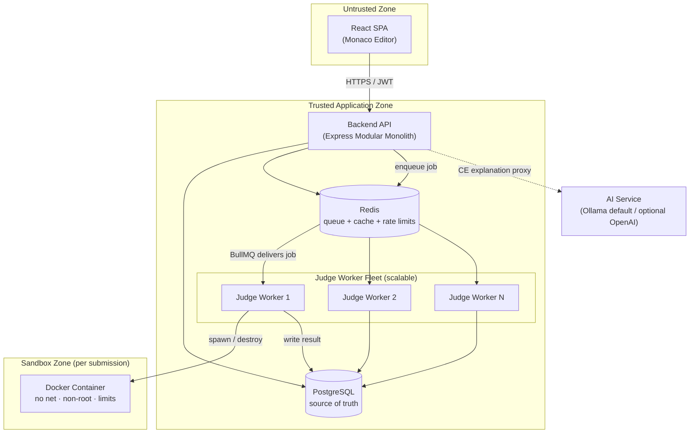

### 1.4 Why This Shape

- **Stateless API** → horizontally scalable behind a load balancer; all state is in Postgres/Redis.
- **Separate workers** → judging load (CPU-heavy, Docker-heavy, risky) is physically isolated from request handling.
- **Redis in the middle** → decouples producers (API) from consumers (workers), enabling backpressure and independent scaling.
- **Docker at the edge of the worker only** → the blast radius of malicious code is a single throwaway container.

---

## 2. Request Lifecycle

All client → server calls are HTTPS. Authenticated calls carry a JWT in the `Authorization` header. The API applies a common middleware chain before any handler:

```
Request → HTTPS termination → Rate limiter (Redis) → Body parse/validate
       → JWT verify (if protected) → Role check (if admin) → Controller
       → Service → Repository → (PostgreSQL / Redis) → Response
```

### 2.1 User Login
1. Client posts credentials to the auth endpoint (rate-limited more strictly).
2. Auth service loads the user record by email/username via the repository layer.
3. The submitted password is verified against the stored **bcrypt** hash.
4. On success, a signed **JWT** is issued (short-lived) and returned.
5. Client stores the token and attaches it to subsequent requests.

*No session table is required for the MVP access token — the token is self-contained and verified by signature.*

### 2.2 Problem Fetching (list / detail)
1. Client requests the problem list (with search/filter/pagination params).
2. Problem service first checks **Redis cache** for the computed page.
3. **Cache hit** → return immediately. **Cache miss** → repository reads Postgres, service caches the result with a TTL, then returns it.
4. Problem detail returns statement, constraints, examples, limits, tags, and **public test cases only**. Hidden test cases are *never* serialized to a normal user response.

### 2.3 Code Submission (intake only — see §3 for full lifecycle)
1. Authenticated client posts `{ problemId, language, sourceCode }`.
2. Submission service validates language is supported (Python/C++ for MVP), size limits, and problem existence.
3. A submission row is **persisted first** with status `Queued` (durability before enqueue).
4. A judge job is **enqueued into BullMQ** carrying the submission ID (not the code payload as the authority — Postgres is authoritative).
5. API responds *immediately* with the submission ID and `Queued` status. It does **not** wait for judging.

### 2.4 Submission Status
1. Client polls the submission-status endpoint using the submission ID (or receives push, future).
2. Status service reads the submission's current state from Postgres (`Queued → Running → <Verdict>`).
3. When a final verdict exists, the response includes verdict, runtime, memory, and (for CE) the ability to request an AI explanation.

### 2.5 Leaderboard
1. Client requests leaderboard.
2. Leaderboard service reads a **Redis-cached** ranking (rankings, problems solved, acceptance rate).
3. On cache miss / staleness, it recomputes from Postgres aggregates, stores in Redis with a TTL, and returns. Recompute is triggered on a schedule and/or on `Accepted` verdicts to keep it fresh without hammering the DB per request.

---

## 3. Submission Lifecycle

This is the heart of JudgeX: from the user clicking **Submit** to a stored verdict.

### 3.1 Narrative (every internal step)

**Intake (API server):**
1. Request passes rate limiting, JWT verification, and validation.
2. Submission is persisted in Postgres as `Queued` with code, language, user, problem, timestamp.
3. A BullMQ job `{ submissionId }` is enqueued on the `judge` queue.
4. API returns the submission ID; the connection ends here.

**Dispatch (Redis/BullMQ):**
5. The job waits in Redis until a worker with free concurrency slots pulls it.
6. BullMQ marks the job `active` and hands it to a worker; a job lock/visibility timeout protects against stalled workers.

**Judging (Judge Worker):**
7. Worker loads the authoritative submission + problem + **all test cases (public + hidden)** from Postgres.
8. Worker sets the submission to `Running` in Postgres.
9. Worker writes the source code to an isolated temp workspace for this job.
10. **Compile step** (for compiled languages like C++): compile inside a locked-down container.
    - Compilation failure → verdict `Compilation Error`, capture compiler stderr, jump to *Persist*.
11. **Run step**: for each test case, run the compiled binary / interpreter inside a fresh, resource-limited container, feeding the test input via stdin and capturing stdout, exit code, wall time, and memory.
12. **Per-case evaluation** (short-circuit on first failure):
    - Timeout exceeded → `Time Limit Exceeded`.
    - Non-zero/abnormal exit or memory kill → `Runtime Error` (MLE later distinguished).
    - Output mismatch after normalization → `Wrong Answer` (record failing case index).
    - Match → continue to next case.
13. If all cases pass → `Accepted`. Track max runtime and max memory across cases.

**Persist (Judge Worker):**
14. Worker writes the final verdict, runtime, memory, and (if CE) compiler message to Postgres, transitioning status to the terminal verdict.
15. Worker triggers side effects: invalidate/refresh leaderboard cache on `Accepted`, update solved-count aggregates.
16. Worker cleans up: destroy container(s), delete temp workspace, release resources.
17. BullMQ marks the job `completed`.

**Observe (Client):**
18. Client polling picks up the terminal verdict and renders it (color-coded, with metrics).

### 3.2 State Machine

```
                 enqueue           worker picks up
   [Queued] ─────────────────▶ [Queued in Redis] ─────────────▶ [Running]
                                                                    │
             ┌──────────────┬───────────────┬───────────────┬──────┴───────┐
             ▼              ▼               ▼               ▼              ▼
        [Accepted]   [Wrong Answer]  [Time Limit]     [Runtime Error] [Compilation
                                     [Exceeded]                        Error]
```

All terminal states are final and immutable; a re-judge would create a *new* submission or an explicit re-run record rather than mutating history.

### 3.3 Key Invariants
- **Persist-before-enqueue:** a submission always exists in Postgres before any job references it → no lost work if Redis or a worker dies.
- **Postgres is authoritative:** the job carries only an ID; the worker re-reads the truth.
- **Idempotency:** re-processing the same job must not create duplicate verdicts (guarded by submission status / job de-dup).
- **Short-circuit judging:** stop at the first failing test case to save compute.

---

## 4. Judge Engine Architecture

The judge engine lives entirely inside the **Judge Worker** process. It is a pipeline of well-separated stages.

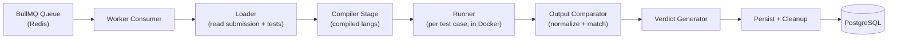

### 4.1 Stage Responsibilities

- **Queue (BullMQ/Redis):** holds pending jobs; delivers to workers respecting per-worker concurrency; manages retries and locks.
- **Worker Consumer:** the long-lived loop that pulls jobs, enforces overall per-submission timeout budget, and coordinates the stages.
- **Loader:** fetches authoritative submission, problem limits (time/memory), and the full test-case set from Postgres.
- **Compiler Stage:** only for compiled languages (C++). Produces a binary or a `Compilation Error`. Runs inside a container with its own time/memory cap so a malicious/huge compile can't hang the host.
- **Runner:** executes the program once per test case in a **fresh, disposable container** with strict limits, piping input in and capturing output, exit status, wall-clock time, and peak memory.
- **Output Comparator:** normalizes output (trim trailing whitespace/newlines per PRD `FR-JUDGE-11`) and compares against expected output. Exact-match with tolerance for the MVP; special/custom checkers are explicitly out of MVP scope.
- **Verdict Generator:** maps the pipeline signals to a single verdict per the precedence rules below, plus aggregate runtime/memory.
- **Persist + Cleanup:** writes results, refreshes caches/aggregates, destroys containers, wipes the workspace.

### 4.2 Verdict Precedence
Evaluated in order; first match wins:
1. **Compilation Error** — compile stage failed.
2. **Runtime Error** — abnormal exit / crash / non-zero code (and, later, MLE when distinguishable).
3. **Time Limit Exceeded** — wall/CPU time cap hit.
4. **Wrong Answer** — normalized output mismatch.
5. **Accepted** — all test cases pass within limits.

### 4.3 Concurrency Model
- Each worker process has a bounded **concurrency** (e.g., N simultaneous jobs) chosen relative to available CPU cores and memory, so containers don't oversubscribe the host.
- CPU-bound judging means concurrency is tuned to cores, not to thousands of green threads. Throughput scales by adding **worker processes/hosts**, not by cranking a single worker's concurrency past hardware limits.

---

## 5. Docker Architecture

Docker is the security cornerstone: every piece of untrusted code runs in a container that is **ephemeral, powerless, and disposable**.

### 5.1 Container Lifecycle (per compile / per run)

```
create (from prebuilt language image, locked-down flags)
   → start
   → feed stdin (test input)
   → execute with hard wall-clock timeout enforced by the worker
   → capture stdout, stderr, exit code, time, peak memory
   → kill (force) if timeout/limit exceeded
   → remove container + delete workspace  (always, even on error)
```

Containers are **never reused across submissions**. One submission's execution can never observe or affect another's, because the container (and its filesystem) is destroyed immediately after use.

### 5.2 Prebuilt Language Images
- Minimal base images per language (e.g., a small Python image, a small C++ toolchain image) are **built ahead of time**, so no network fetch or package install happens at judge time.
- Images contain only the compiler/interpreter and a non-root execution user.

### 5.3 Security Restrictions (enforced at container creation)
- **No network:** networking disabled entirely — user code cannot phone home, exfiltrate, or attack internal services.
- **Non-root user:** the process runs as an unprivileged user inside the container.
- **Dropped Linux capabilities:** drop all, add none — no privileged syscalls.
- **Read-only / ephemeral filesystem:** the root FS is read-only; a small writable scratch space (tmpfs-style, size-capped) is provided only where the program must write.
- **No privilege escalation:** new privileges are disabled so setuid tricks fail.
- **PID limit:** caps the number of processes/threads to defeat fork bombs.
- **Isolated workspace:** each job gets its own throwaway directory mounted in; deleted on completion.

### 5.4 Resource Limits
- **Wall-clock timeout:** the worker enforces a hard timeout and force-kills the container if the program (or a stuck compile) runs too long → `Time Limit Exceeded`.
- **CPU limit:** CPU quota/shares restrict how much CPU a container can consume, preventing a single submission from starving others on the host.
- **Memory limit:** a hard memory cap; exceeding it triggers an OOM kill → surfaced as `Runtime Error` (MVP) / `Memory Limit Exceeded` (future).
- **PID limit:** as above, bounds process count.

### 5.5 Why Force-Kill and Destroy Always
Because untrusted code may ignore signals, spin forever, or corrupt its own environment, the worker treats the container as **cattle, not a pet**: create for one purpose, tear down unconditionally in a `finally`-style guarantee so a crashed or hostile container can never pin resources or block the worker (PRD `NFR-REL-2`).

---

## 6. Redis & BullMQ

Redis plays three distinct roles: **queue backing store (via BullMQ)**, **cache**, and **rate-limit counter store**. These are logically separate concerns sharing one fast in-memory store.

### 6.1 Job Creation
- The API creates a job on the `judge` queue with a minimal payload (`submissionId`) after the submission is safely persisted in Postgres.
- Jobs can carry priorities later (e.g., contest submissions over practice), but the MVP uses a single FIFO-ish queue.

### 6.2 Job Retries
- Jobs are configured with a **capped retry count** and **exponential backoff**.
- Retries protect against *transient* failures (a worker died mid-job, a container failed to start, a brief DB hiccup). They are **not** used to mask real verdicts — a `Wrong Answer` is a successful job with a WA result, not a failure to retry.

### 6.3 Failure Recovery
- BullMQ uses a **lock / visibility timeout** on active jobs. If a worker crashes without completing, the lock expires and the job becomes eligible for another worker to pick up.
- Because of **persist-before-enqueue** and Postgres being authoritative, a re-run reads fresh truth and is idempotent.

### 6.4 Dead Jobs (Dead-Letter Handling)
- A job that exhausts its retries is moved to a **failed set** (dead-letter equivalent) rather than silently vanishing.
- The corresponding submission is marked with a terminal internal-error state (surfaced to the user as a retryable "judging failed" rather than a false verdict), and the failure is logged/observable for operators.

### 6.5 Worker Scaling
- Workers are **independent processes** that all connect to the same Redis. Adding capacity = starting more worker processes/hosts; they self-balance by pulling from the shared queue.
- Redis provides natural **backpressure**: when submissions outpace judging capacity, jobs accumulate in the `waiting` state and users simply see `Queued` longer — nothing is dropped (PRD `NFR-SCALE-2`).
- Queue depth (`waiting`, `active`, `completed`, `failed`) is the primary scaling signal (PRD `NFR-OBS-2`): sustained growth in `waiting` → add workers.

### 6.6 Cache & Rate Limit Roles
- **Cache:** problem lists and leaderboard results with TTLs; invalidated/refreshed on relevant writes (e.g., new problem, `Accepted` verdict).
- **Rate limiting:** per-user/IP counters with expiry windows guard auth, run, submit, and AI endpoints (PRD `NFR-SEC-6`).

---

## 7. Authentication Flow

### 7.1 JWT Lifecycle
1. **Issue:** on successful login (bcrypt verification), the API signs a JWT containing the user ID and role, with an expiry.
2. **Transmit:** the client sends it in the `Authorization: Bearer <token>` header.
3. **Verify:** protected routes verify the signature and expiry on every request — stateless, no DB lookup required for validity.
4. **Expire:** short lifetime limits the damage of a leaked token. Refresh tokens / rotation and logout invalidation are V1 items (PRD `FR-AUTH-5/9`); the MVP relies on short-lived access tokens.

### 7.2 Protected Routes
- A JWT-verification middleware guards all authenticated routes; unauthenticated/expired requests are rejected before reaching any controller.
- The verified identity (user ID, role) is attached to the request context for downstream service/repository use.

### 7.3 Role Handling (RBAC)
- Roles: **User** and **Admin** (PRD `FR-AUTH-6`).
- Admin-only routes (problem create/edit/delete, test-case management) sit behind an additional role-check middleware layered on top of JWT verification.
- Authorization is checked server-side on every admin action — never trusted from the client.

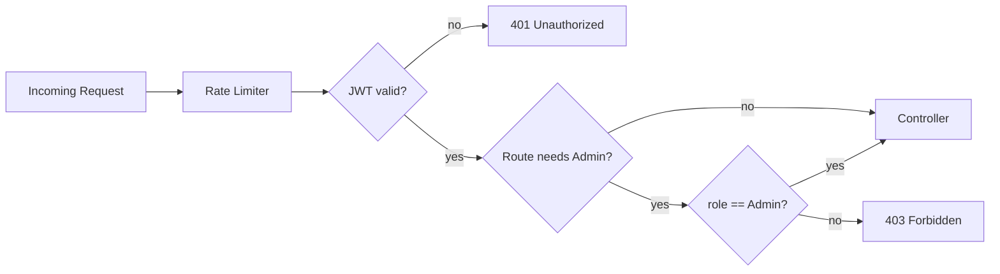

---

## 8. Database Interaction Flow

All database access goes through the **Repository layer**; services never write raw queries inline, and controllers never touch the DB directly. This keeps data access testable and swappable.

### 8.1 Logical Entities (by role, not schema)
- **Users** — identity, hashed password, role, stats.
- **Problems** — statement, constraints, limits, difficulty, tags.
- **Test Cases** — belong to a problem; flagged **public** or **hidden**.
- **Submissions** — user + problem + language + code + status + verdict + runtime + memory + timestamp.
- **(Future) Contests, Discussions** — out of MVP.

### 8.2 Which Service Accesses Which Data

| Service | Entities (read) | Entities (write) | Notes |
|---------|-----------------|------------------|-------|
| **Auth Service** | Users | Users (register) | Only component doing bcrypt verify/hash. |
| **Problem Service** | Problems, Test Cases (public only for users) | — | Read-through Redis cache. |
| **Admin Service** | Problems, Test Cases | Problems, Test Cases (public + hidden) | Admin-role gated; the only writer of hidden test cases. |
| **Submission Service (API)** | Submissions, Problems | Submissions (create `Queued`) | Persist-before-enqueue. |
| **Judge Worker** | Submissions, Problems, Test Cases (public + hidden) | Submissions (status + verdict + metrics) | The only reader of hidden tests at judge time. |
| **Leaderboard Service** | Users/Submissions aggregates | — | Reads aggregates, caches in Redis. |
| **AI Service (proxy)** | Submissions (the user's own compile error) | — | Sends only compiler error + minimal context outward. |

### 8.3 Access Rules
- **Hidden test cases** are readable only by the Admin service (management) and the Judge Worker (judging). No user-facing read path exists — enforced at the service layer, not just the UI.
- **Transactions** wrap multi-step writes (e.g., creating a problem with its test cases) to keep data consistent.
- **Indexing** supports the hot paths (problem listing/filtering, submission history by user/problem, leaderboard aggregates) — detailed in the future DB-design doc.

---

## 9. AI Architecture

**Hard rule (PRD guardrail):** the AI must **never** produce a complete or near-complete solution, nor copy-pasteable correct code. The architecture enforces this in *three independent layers* so a failure in one does not leak solutions.

### 9.1 Provider Abstraction (Provider Pattern)
- All AI calls go through a single **`AIService`**, which delegates to a pluggable **provider** implementing one common interface (`AIProvider` port):

```
AIService
   |
   +-- OllamaProvider  (default — local, free, no API key)
   |
   +-- OpenAIProvider  (optional — enabled via configuration)
```

- **Ollama is the default provider for the MVP** — it runs locally, requires no paid service or API key, so JudgeX can be built, run, and demonstrated entirely for free (PRD `FR-AI-3`, `A5`).
- **OpenAI is an optional provider** enabled purely through configuration (an environment variable selects the provider; the OpenAI key is only needed if OpenAI is explicitly chosen). Swapping providers requires **no change to any caller**.
- **The rest of the application never depends on a specific provider.** Modules call `AIService` only; they have no knowledge of Ollama vs OpenAI. This keeps the provider swappable and the codebase vendor-neutral.
- **Provider selection is config-driven:** `AI_PROVIDER` (e.g., `ollama` | `openai`, default `ollama`) resolves which adapter `AIService` constructs at bootstrap.
- The API acts as a **proxy**: the browser never talks to a provider directly, so any credentials stay server-side and every request passes through our guardrails and rate limits.

### 9.2 MVP: Compilation Error Explanation
- **Trigger:** only offered when a submission's verdict is `Compilation Error`.
- **Input scope (minimized):** the compiler's error output plus minimal context (language, and only what's needed to explain the error). We deliberately avoid sending the full problem's expected approach.
- **Output:** a plain-language explanation of *what the compiler error means and where to look* — not a corrected program.

### 9.3 The Guardrail Layers

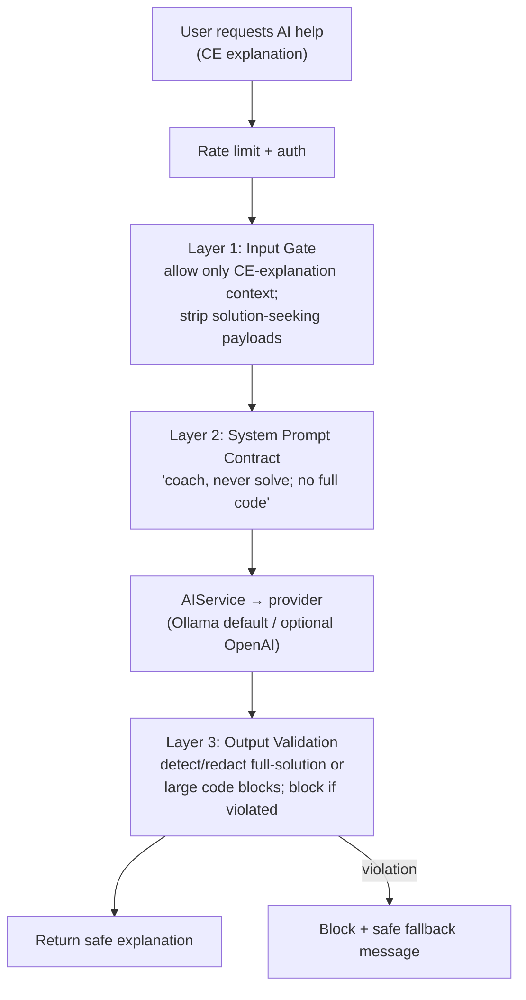

- **Layer 1 — Input Gate:** the server controls exactly what is sent. Users cannot inject "just give me the answer" into a privileged prompt because the prompt is assembled server-side around a fixed task (explain this compiler error).
- **Layer 2 — System Prompt Contract:** a strict system prompt instructs the model to explain and guide only, never to emit a working solution or large code blocks.
- **Layer 3 — Output Validation:** responses are scanned before returning; anything resembling a complete solution / large correct code block is **redacted or blocked**, replaced by a safe fallback. This is the backstop that does not trust the model.

### 9.4 Prompt Flow (conceptual)
```
[Server-fixed task template]
   + [minimal, sanitized context: compiler error, language]
   + [hard constraints: no solution, no full code, hints only]
   → provider → candidate response → output validator → user
```

### 9.5 Future AI Capabilities (same three-layer pattern)
- **Bug Detection** — point at likely faulty region in the user's *own* code; never rewrite it wholesale.
- **Complexity Analysis** — describe time/space of the user's approach.
- **Edge Case Suggestions** — name categories of missed cases.
- **Optimization Guidance / Hint Generation** — suggest *directions*, not implementations.

All reuse the provider abstraction, input gating, system-prompt contract, and output validation. Effectiveness is measured against a **red-team prompt set** targeting **0% full-solution leakage** (PRD `§7.3`).

### 9.6 Isolation from Core Judging
The AI service is **non-critical path**: if the provider is slow or down, judging and all core flows continue unaffected (PRD `NFR-REL-4`). AI is called only on explicit user request, never inline in the submission pipeline.

---

## 10. Security Architecture

Security is layered (defense in depth). Each layer assumes the others might fail.

### 10.1 Docker Isolation (untrusted code) — see §5
- No network, non-root, dropped capabilities, read-only FS, PID/CPU/memory caps, hard timeouts, one-shot disposable containers. This is the primary defense against the platform's most dangerous input: arbitrary user code.

### 10.2 Rate Limiting
- Redis-backed counters throttle auth, run, submit, and AI endpoints per user/IP to blunt brute-force, abuse, and cost-runaway on AI (PRD `NFR-SEC-6`).

### 10.3 Password Hashing
- Passwords are stored **only** as bcrypt hashes with a work factor; plaintext is never stored or logged; comparisons are done via the hashing library (PRD `NFR-SEC-5`).

### 10.4 JWT
- Signed, expiring tokens; verified on every protected request; secret provided via environment variables and never committed (PRD `NFR-SEC-4/8`).

### 10.5 Hidden Test Case Protection
- Hidden test data lives in Postgres and is **only** read by the Admin service and the Judge Worker.
- No user-facing endpoint ever serializes hidden inputs/outputs. On `Wrong Answer`, at most a **failing case index** is returned — never the hidden data itself (PRD `FR-SUB-5`).
- Because judging happens server-side in workers, users cannot observe hidden inputs even indirectly (the container has no network to leak them, and its output is compared server-side).

### 10.6 Additional
- **Input validation** at every API boundary; **least privilege** for DB roles and container permissions; **secrets via env**; internal services (Postgres, Redis, workers) not exposed publicly.

---

## 11. Scalability

The same architecture scales from 100 to 100,000 users by **adding instances of stateless/independent components** — no redesign, no Kubernetes, no microservices required.

### 11.1 The Scaling Levers
1. **API servers** — stateless → run more instances behind a load balancer.
2. **Judge workers** — independent consumers → add more processes/hosts; they self-balance via the shared queue.
3. **Redis** — vertical scale first; separate the cache instance from the queue instance if needed.
4. **PostgreSQL** — vertical scale + indexing first; add **read replicas** for read-heavy paths (problem lists, leaderboard) before considering anything exotic.
5. **Cache aggressively** — problem lists and leaderboards are read far more than they change.

### 11.2 Scaling Stages

| Scale | Bottleneck | Response (no architecture change) |
|-------|------------|-----------------------------------|
| **~100 users** | None | Single API instance, 1–2 workers, single Redis, single Postgres. Everything on modest hardware. |
| **~10,000 users** | Judge throughput + read load | Multiple API instances behind a load balancer; scale worker fleet to match submission rate; add Redis cache TTLs; add key DB indexes; possibly one Postgres read replica for leaderboard/problem reads. |
| **~100,000 users** | DB writes + judge fleet size + cache | Larger worker fleet across multiple hosts; Postgres read replicas + connection pooling; dedicated Redis for queue vs cache; CDN for the static frontend; queue-depth-driven autoscaling of workers. Contest spikes handled by temporarily adding workers. |

### 11.3 Why It Holds
- **Decoupling via the queue** means traffic spikes translate into longer queues, not failures — the system degrades gracefully.
- **Statelessness** means horizontal scaling is trivial for the API.
- **Workers scale linearly** with hardware because judging is embarrassingly parallel across submissions.
- The **modular monolith** keeps operational complexity low; modules can later be extracted into services *only if* a real bottleneck demands it (PRD `NFR-SCALE-4`) — deliberately deferred to avoid over-engineering.

---

## 12. Failure Handling

Every failure mode has a defined, non-catastrophic response. The guiding principle: **never return a false verdict, never lose a submission, never let one bad job pin the system.**

| Failure | Detection | System Response | User Experience |
|---------|-----------|-----------------|-----------------|
| **Redis down** | Connection errors on enqueue/cache | API can still authenticate and read (Postgres); **new submissions are rejected cleanly** (can't enqueue) with a retryable error; cache falls back to DB reads. No data corruption. | "Judging temporarily unavailable, try again." Existing data still viewable. |
| **Docker crash / container fails to start** | Worker detects non-start / runtime error from the daemon | Job **retried** with backoff; if persistent, job goes to dead-letter and submission marked internal-error (retryable), **not** a wrong verdict. | Submission shows "judging failed — resubmit," never a false WA/AC. |
| **Worker crash mid-job** | BullMQ job lock expires | Job becomes visible again and another worker **re-processes** it; idempotency + persist-before-enqueue guarantee correctness. | Slightly longer wait; correct verdict eventually. |
| **Compilation failure** | Compile stage returns non-zero | This is a **normal outcome**, not a system failure → verdict `Compilation Error` with stderr captured; AI explanation offered. | Sees CE and can request AI help. |
| **Timeout (infinite loop / slow code)** | Worker's hard wall-clock timer | Container **force-killed**; verdict `Time Limit Exceeded`; resources reclaimed. | Sees TLE. |
| **Memory exceeded** | Container OOM kill / memory cap | Container killed; verdict `Runtime Error` (MVP) / `Memory Limit Exceeded` (future). | Sees RE/MLE. |
| **AI provider down/slow** | Timeout on AI call | AI feature degrades gracefully; **core judging unaffected**. | "AI explanation unavailable right now"; verdicts still work. |
| **Postgres down** | Connection errors | System cannot serve authoritative data → returns 5xx with retry; no partial/incorrect writes. | Temporary outage; no data loss (durable store). |

Cross-cutting guarantees: **retries with capped attempts + exponential backoff**, **dead-letter for exhausted jobs**, **force-kill + unconditional cleanup** of containers, and **structured logs + health checks** for observability (PRD `NFR-REL-*`, `NFR-OBS-*`).

---

## 13. Sequence Diagrams

### 13.1 Login

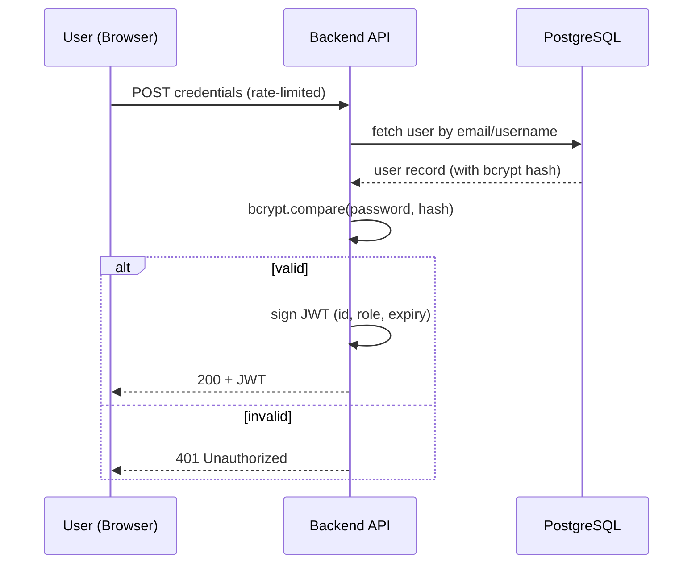

### 13.2 Run Code (fast feedback, not scored)

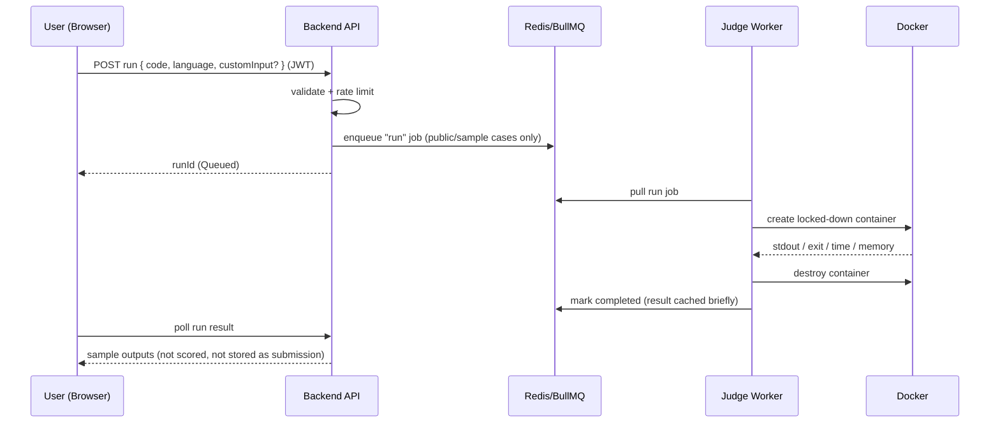

### 13.3 Submit Code

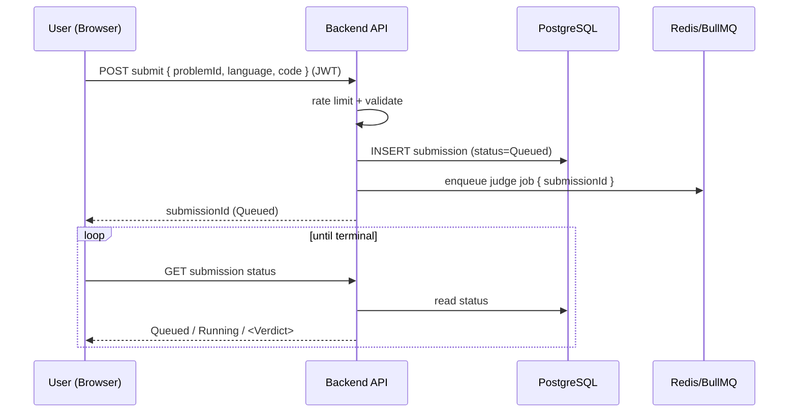

### 13.4 Judge Execution

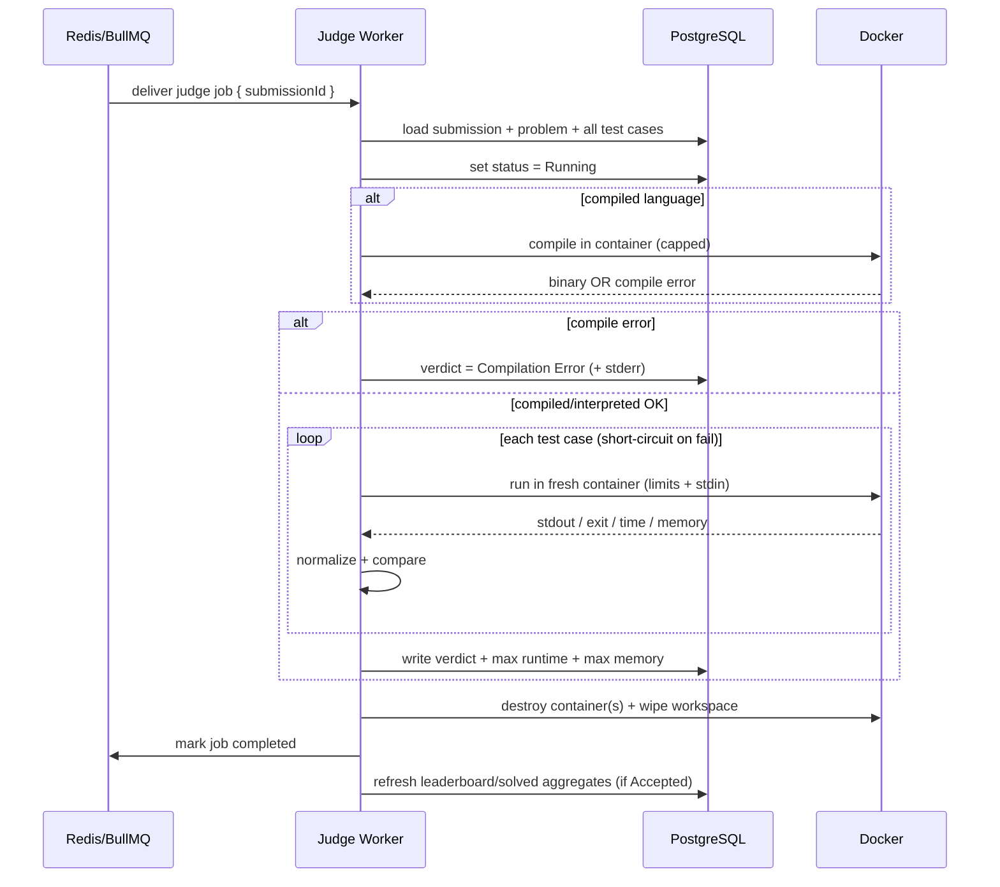

---

## 14. Component Diagrams

### 14.1 Backend Modular Monolith (internal modules)

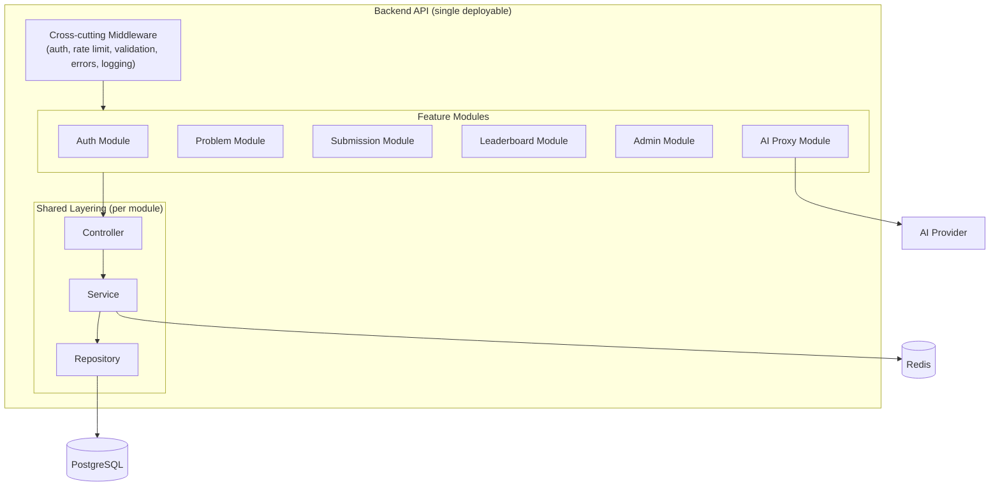

Each feature module follows the same **Controller → Service → Repository** layering (PRD `NFR-MAINT-2`). Modules are decoupled internally but ship as one deployable — the essence of a modular monolith.

### 14.2 Judge Worker (internal pipeline)

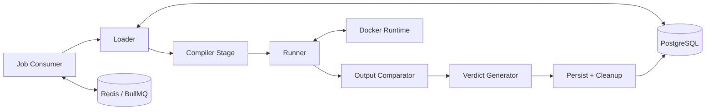

### 14.3 Deployment View (logical)

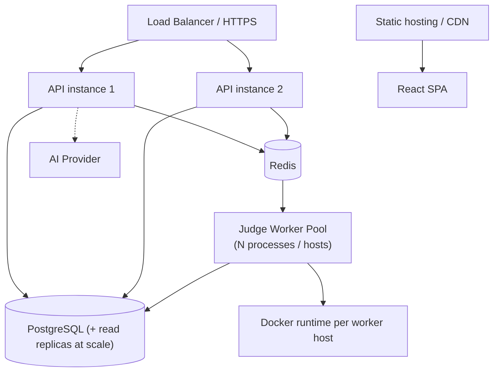

---

## 15. Design Decisions

For each core technology: the decision, the alternatives considered, and the rationale. Every choice is deliberately **modest and defensible** — the goal is a system that scales and impresses without over-engineering.

### Why PostgreSQL?
- **Decision:** relational DB as the single source of truth.
- **Alternatives:** MongoDB (document), MySQL.
- **Rationale:** JudgeX data is inherently **relational** — users ↔ submissions ↔ problems ↔ test cases, with aggregates for leaderboards and acceptance rates. Postgres gives **ACID transactions** (critical for persist-before-enqueue and multi-step admin writes), strong constraints, powerful indexing, and mature aggregate/analytics queries for leaderboards. It scales vertically and via read replicas well past our target. A document store would force us to hand-roll relational integrity we get for free here.

### Why Redis?
- **Decision:** Redis for queue backing, caching, and rate-limit counters.
- **Alternatives:** in-memory app cache, DB-based queue, Memcached.
- **Rationale:** it's a single, fast, battle-tested in-memory store that elegantly serves **three needs at once**. As the BullMQ backing store it enables durable-enough, observable job queues; as a cache it absorbs read-heavy problem/leaderboard traffic; as an atomic counter store it powers rate limiting. Using one proven component for these avoids sprawl.

### Why BullMQ?
- **Decision:** BullMQ (over Redis) as the job queue.
- **Alternatives:** raw Redis lists/pub-sub, RabbitMQ, **Kafka (explicitly rejected)**.
- **Rationale:** BullMQ gives us **retries, exponential backoff, job locks/visibility timeouts, concurrency control, and failed/dead-letter sets** out of the box — exactly the reliability primitives judging needs — with a Node-native API and no extra infrastructure beyond the Redis we already run. Kafka is a distributed *event streaming* platform: overkill for a task queue, operationally heavy, and explicitly out of scope. RabbitMQ would add a second stateful system for no benefit at our scale.

### Why Docker?
- **Decision:** Docker containers as the untrusted-code sandbox.
- **Alternatives:** run code directly on host (unsafe), VMs (heavy), language-level sandboxes (leaky).
- **Rationale:** we must run **arbitrary hostile code** safely. Docker provides fast, cheap, **disposable isolation** with fine-grained controls — no network, non-root, dropped capabilities, read-only FS, and CPU/memory/PID limits — created and destroyed per submission. VMs give stronger isolation but are far too slow/heavy for per-submission lifecycles; in-process sandboxes are notoriously escapable. Docker is the right balance of security, speed, and operational simplicity. (No Kubernetes: we scale workers by running more processes/hosts, not by adopting an orchestrator we don't need.)

### Why React?
- **Decision:** React SPA for the frontend.
- **Alternatives:** server-rendered templates, Angular, Vue.
- **Rationale:** the core UX is a **rich, interactive code-editing experience**. React integrates cleanly with the **Monaco editor**, has a vast ecosystem, and its component model suits a stateful SPA (editor, live verdict polling, dashboards). It delivers the SaaS-grade UX the PRD demands and is the industry-standard skill to showcase.

### Why Express?
- **Decision:** Node.js + Express for the backend.
- **Alternatives:** NestJS, Fastify, other-language frameworks.
- **Rationale:** **one language (JavaScript) across frontend, backend, and judge workers** reduces cognitive load and lets us share validation/types. Express is minimal and unopinionated, which lets us impose our **own clean Controller → Service → Repository layering** (great for demonstrating architecture skills). Node's async I/O fits an API that is mostly network/queue-bound, while the CPU-heavy judging is deliberately offloaded to separate worker processes so the event loop is never blocked. BullMQ being Node-native seals the fit.

### Cross-Cutting: Why a Modular Monolith?
- **Decision:** one deployable API (modular internally) + separate worker processes.
- **Rationale:** it gives **clean module boundaries and separation of concerns** without the operational tax of microservices (service discovery, network hops, distributed transactions, deployment sprawl). It's easier to build, test, reason about, and demo — yet the module seams mean any component can be extracted later *if a real bottleneck ever demands it*. This is the pragmatic Principal-Engineer choice: **architect for clarity and the scale we target, not for imaginary scale.** (Hence: no Kubernetes, no Kafka, no microservices, no event sourcing.)

---

*This architecture document explains how JudgeX works internally and derives entirely from `docs/PRD.md`. Any change in product scope should update the PRD first, then this document.*

---

## 16. Trade-offs and Alternatives Considered

Section 15 explained *why* each core technology was chosen. This section goes deeper into the **engineering trade-offs** — what we give up, when the alternative would actually win, and why the chosen option fits **JudgeX specifically** (a portfolio-grade, modular-monolith competitive-programming platform at moderate scale). The framing throughout: no technology is universally better; the right choice depends on JudgeX's constraints.

### 16.1 PostgreSQL vs MongoDB
- **Chosen:** PostgreSQL (relational).
- **Alternative(s):** MongoDB (document store).
- **What MongoDB would give us:** flexible, schema-light documents; easy horizontal sharding; convenient for deeply nested or rapidly evolving shapes.
- **The trade-off:** JudgeX's data is **highly relational and integrity-critical** — users ↔ submissions ↔ problems ↔ test cases, plus leaderboard/acceptance-rate **aggregations** across those relations. Postgres gives ACID transactions (essential for *persist-before-enqueue* and multi-step admin writes), foreign-key integrity, and rich aggregate queries for free. With MongoDB we'd hand-roll referential integrity in application code and stitch aggregations together, trading correctness guarantees for flexibility we don't need. Our schema is stable and well-understood, so schema-flexibility isn't a real advantage here.
- **When Mongo would win:** if problems/submissions were schemaless blobs with no cross-entity aggregation, or if we needed sharded write throughput beyond a single primary early on — neither is true for JudgeX.
- **Verdict:** Postgres fits because our value lives in the *relationships and aggregates*, not in document flexibility.

### 16.2 Redis + BullMQ vs RabbitMQ
- **Chosen:** Redis + BullMQ.
- **Alternative(s):** RabbitMQ (dedicated AMQP message broker).
- **What RabbitMQ would give us:** a purpose-built broker with sophisticated routing (exchanges, topics), strong delivery semantics, and mature flow control — excellent for complex multi-consumer messaging topologies.
- **The trade-off:** JudgeX needs a **task queue**, not a messaging fabric: enqueue a judge job, run it once, retry on transient failure, dead-letter if hopeless. BullMQ delivers exactly those primitives (retries, backoff, job locks, concurrency, failed sets) **on the Redis we already run for caching and rate limiting** — one fewer stateful system to operate. RabbitMQ would add a second piece of infrastructure and AMQP concepts we'd barely use, for routing sophistication JudgeX doesn't require. It also keeps everything Node-native, matching our single-language stack.
- **When RabbitMQ would win:** many heterogeneous services with complex fan-out/topic routing, or strict broker-grade delivery guarantees across teams — beyond a modular monolith's needs.
- **Verdict:** reusing Redis via BullMQ minimizes moving parts while covering 100% of our queueing requirements.

### 16.3 Docker vs Firecracker
- **Chosen:** Docker containers.
- **Alternative(s):** Firecracker microVMs (KVM-based lightweight virtualization).
- **What Firecracker would give us:** **stronger isolation** — a real virtualized kernel boundary per execution, closing the entire class of container-escape / shared-kernel risks, which is genuinely attractive for running hostile code.
- **The trade-off:** Firecracker demands **KVM/bare-metal or nested virtualization**, a more complex host setup, and more operational sophistication (guest images, VM lifecycle, device management). Docker gives *fast, cheap, disposable* per-submission isolation with layered defenses (no network, non-root, dropped capabilities, read-only FS, CPU/memory/PID caps, hard timeouts) that are **sufficient for our threat model and target scale**, and it runs anywhere including typical dev machines (WSL2). For a portfolio project, Docker's ubiquity and simplicity outweigh the marginal isolation gain, and our defense-in-depth already shrinks the practical attack surface substantially.
- **When Firecracker would win:** true multi-tenant execution at large scale where kernel-level isolation is a hard requirement (this is essentially what production judges/serverless platforms adopt as they grow) — a documented future upgrade path, not an MVP need.
- **Verdict:** Docker is the pragmatic balance of security, speed, portability, and operational simplicity now; Firecracker is the natural hardening step *if* JudgeX ever runs untrusted code at hostile-tenant scale.

### 16.4 React vs Next.js
- **Chosen:** React (client-side SPA).
- **Alternative(s):** Next.js (React meta-framework with SSR/SSG, routing, API routes).
- **What Next.js would give us:** server-side rendering for SEO and fast first paint, file-based routing, and built-in API routes / edge functions.
- **The trade-off:** JudgeX is an **authenticated, highly interactive application** centered on the Monaco editor and live verdict updates — not a content/marketing site that benefits from SSR-driven SEO. A plain React SPA keeps a **clean separation**: React owns the UI, Express owns the API. Next.js's API routes and SSR server would blur that boundary and partly duplicate the role of our Express backend, adding a rendering server and its deployment complexity for benefits (SEO, first-paint) that matter little behind a login wall.
- **When Next.js would win:** if public, crawlable problem/editorial pages and marketing SEO became a priority, or we wanted server components to reduce client bundle size — a reasonable future consideration.
- **Verdict:** a React SPA maximizes clarity of the frontend/backend contract for an app that's interactive-first and auth-gated; Next.js's strengths largely target problems JudgeX doesn't have yet.

### 16.5 Express vs NestJS
- **Chosen:** Express.
- **Alternative(s):** NestJS (opinionated, batteries-included Node framework with DI, decorators, modules).
- **What NestJS would give us:** built-in dependency injection, enforced modular structure, decorators, and strong conventions that scaffold large teams quickly.
- **The trade-off:** NestJS's structure is valuable — but it *imposes* its architecture. A core goal of JudgeX is to **demonstrate that we can design clean architecture ourselves**: our explicit Controller → Service → Repository layering is more instructive (and interview-defensible) when we build the seams deliberately rather than inherit them. Express is minimal and unopinionated, giving us that freedom with less framework magic to explain. The cost is that we hand-wire things NestJS provides automatically — acceptable at a modular monolith's size.
- **When NestJS would win:** larger teams needing enforced consistency, or a project that benefits from DI-heavy testing and out-of-the-box modularity without bespoke wiring.
- **Verdict:** Express fits a portfolio project where showing intentional architecture is a feature, not overhead.

### 16.6 Modular Monolith vs Microservices
- **Chosen:** modular monolith (single deployable API) + separate judge worker processes.
- **Alternative(s):** microservices (independently deployed auth/problem/submission/leaderboard services).
- **What microservices would give us:** independent deployment and scaling per service, team autonomy, and fault isolation at the service boundary.
- **The trade-off:** microservices introduce **distributed-systems tax** — network hops, service discovery, distributed transactions/consistency, versioned contracts, and multiplied deployment/observability overhead. At JudgeX's scale and single-maintainer context, that complexity buys little: the one component with genuinely different scaling/risk characteristics — **judging** — is *already* separated out as worker processes. The remaining API modules share a database and scale together comfortably. The modular monolith keeps clean internal boundaries (so extraction is possible later) without paying the distributed cost today.
- **When microservices would win:** many teams shipping independently, or subsystems with wildly divergent scaling/tech needs that must deploy on separate cadences.
- **Verdict:** we get most of the modularity benefit and none of the distributed-systems tax; extraction remains an option *if* a real bottleneck emerges (explicitly deferred to avoid over-engineering).

### 16.7 JWT vs Session Authentication
- **Chosen:** JWT (stateless access tokens) for the MVP.
- **Alternative(s):** server-side sessions (session ID cookie + session store).
- **What sessions would give us:** trivial server-side revocation (delete the session), no token-size overhead per request, and no risk of a still-valid leaked token until expiry.
- **The trade-off:** JWTs are **stateless** — verified by signature with no per-request store lookup — which suits our **horizontally scaled, stateless API** perfectly: any instance validates any token without shared session state. The classic JWT weakness is **revocation** (a token is valid until it expires); we mitigate with **short-lived access tokens** and defer refresh-token rotation / logout invalidation to V1 (already noted in the PRD). Sessions would reintroduce a shared, stateful lookup (usually in Redis) on every request — coupling auth to that store's availability and adding a hop we avoid.
- **When sessions would win:** when instant, reliable revocation is a hard requirement (e.g., sensitive admin actions, forced logout everywhere) — which is why we plan refresh/rotation as the auth matures.
- **Verdict:** stateless JWTs match a scale-out API and keep the hot path lookup-free; short expiry contains the revocation trade-off for the MVP.

### 16.8 Polling vs WebSockets for Submission Status
- **Chosen:** client polling of submission status (MVP), with push as a future upgrade.
- **Alternative(s):** WebSockets (or SSE) pushing verdict updates in real time.
- **What WebSockets would give us:** instant verdict delivery and no redundant requests — a snappier feel and lower latency between verdict-written and verdict-seen.
- **The trade-off:** WebSockets add **stateful, long-lived connections** to an otherwise stateless API — connection management, scaling sticky/pub-sub fan-out across instances, and reconnection handling. Judging is **asynchronous and typically short**, so lightweight polling (a few requests over a few seconds, backed by a cheap indexed status read and Redis) delivers a perfectly acceptable UX at a fraction of the complexity. This preserves the stateless-API property that makes horizontal scaling trivial (§11). Polling frequency and backoff keep the DB load modest.
- **When WebSockets would win:** live contest leaderboards, real-time collaboration, or very high submission volumes where polling overhead becomes significant — a clear future enhancement (already flagged as "push, future" in §2.4/§3).
- **Verdict:** polling is the low-complexity, scale-friendly choice for MVP async verdicts; WebSockets/SSE are the targeted upgrade for real-time contest features.

### 16.9 PostgreSQL File Metadata vs Storing Large Test Cases Directly in the Database
- **Chosen (evolution path):** store test-case *metadata/pointers* in PostgreSQL and keep **large test-case payloads in object/file storage** (with small cases inline as the simple MVP default).
- **Alternative(s):** store **all** test-case inputs/outputs, including large ones, directly as columns in PostgreSQL.
- **What all-in-DB gives us:** one system, transactional writes, dead-simple backups, and everything queryable in one place — genuinely the simplest choice while test cases are small (the MVP default).
- **The trade-off:** competitive-programming test cases can be **large** (many MB per case). Stuffing large blobs into Postgres bloats table/row storage, hurts cache efficiency and backup/restore times, and pushes big payloads through the DB connection on every judge read — degrading the DB for its real job (relational queries and aggregates). Keeping the **authoritative metadata in Postgres** (problem linkage, public/hidden flag, size, checksum, storage location) while parking heavy payloads in **object storage** lets each system do what it's best at: Postgres stays lean and relational; bulk bytes live where bulk bytes belong, streamed straight to the judge worker. It also keeps hidden-test protection intact — access still gated by the service layer.
- **When all-in-DB wins:** while test cases are uniformly small (early MVP), inlining is simpler and we avoid a second storage system — so we start there and graduate large cases to external storage as needed.
- **Verdict:** use Postgres for **truth and metadata**, external storage for **large binary payloads** — a size-driven split that protects DB performance without sacrificing integrity or the hidden-test security model.

---

*Trade-offs are revisited as scale and requirements evolve; a change here should remain consistent with the decisions in §15 and the scope in `docs/PRD.md`.*
