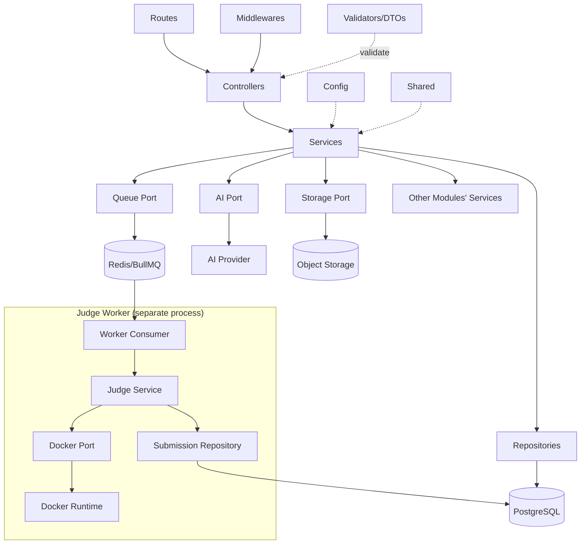
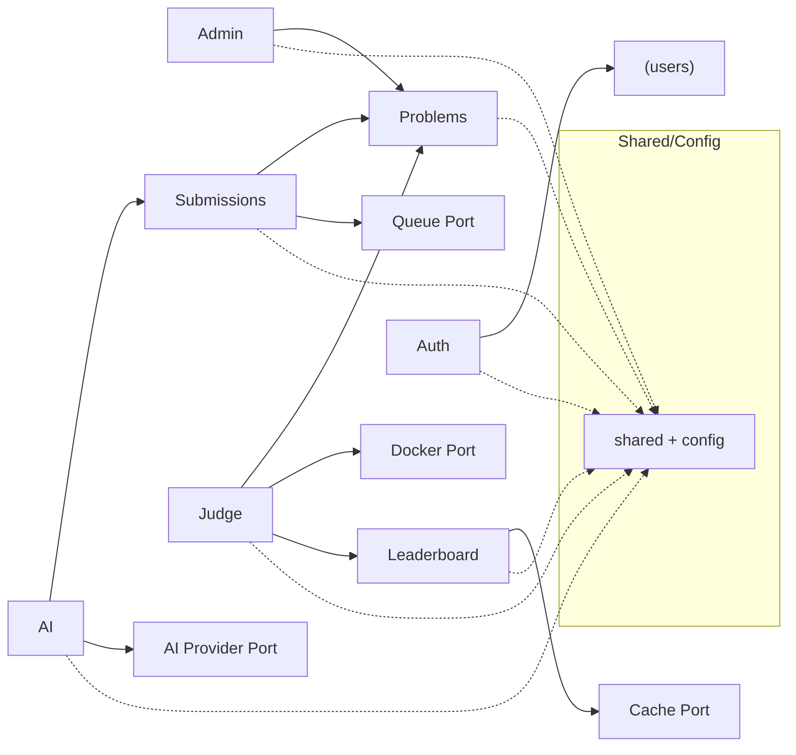

# JudgeX — Backend Architecture (Modular Monolith)

> **Companion to (only sources of truth):** `docs/PRD.md`, `docs/ARCHITECTURE.md`, `docs/DATABASE_DESIGN.md`
> **Document Type:** Backend Architecture / Structure (the "how the backend is organized")
> **Style:** Production-grade **Modular Monolith** + separate background workers
> **Status:** Draft v1.0
> **Last Updated:** 2026-07-08

> **Scope of this document:** organization and design only. It contains **no implementation code, no Express routes, no SQL, no API handlers, and no database models**. Names of files/classes are illustrative of *structure and responsibility*, not code to be copied.

> **Constraints (inherited):** modular monolith, single language (Node.js/JavaScript across API + workers), no Kubernetes, no Kafka, no microservices, no event sourcing. Simple enough for a solo developer, structured enough to last.

---

## Table of Contents

1. [Overall Backend Philosophy](#1-overall-backend-philosophy)
2. [Complete Folder Structure](#2-complete-folder-structure)
3. [Folder Responsibilities](#3-folder-responsibilities)
4. [Layered Architecture](#4-layered-architecture)
5. [Module Design](#5-module-design)
6. [Background Workers](#6-background-workers)
7. [Configuration Strategy](#7-configuration-strategy)
8. [Logging Strategy](#8-logging-strategy)
9. [Error Handling Strategy](#9-error-handling-strategy)
10. [Validation Strategy](#10-validation-strategy)
11. [Testing Strategy](#11-testing-strategy)
12. [Dependency Rules](#12-dependency-rules)
13. [Request Flow](#13-request-flow)
14. [Worker Flow](#14-worker-flow)
15. [Future Extensibility](#15-future-extensibility)
16. [Interview Questions](#16-interview-questions)

---

## 1. Overall Backend Philosophy

### 1.1 Why a Modular Monolith
JudgeX is one deployable API process plus a separately deployable worker process — organized *internally* as independent feature modules. This gives the **clarity and boundaries of microservices without the distributed-systems tax** (network hops, service discovery, distributed transactions, deployment sprawl) that the architecture doc explicitly rejects.

- **Right-sized for a solo developer:** one codebase, one deploy pipeline, one set of shared conventions — but strict module seams so the code doesn't rot into a "big ball of mud."
- **The one component with different scaling/risk characteristics — judging — is already physically separated** into worker processes (per `ARCHITECTURE.md` §1). Everything else shares a database and scales together comfortably.
- **Extraction remains possible later:** because modules communicate through explicit interfaces, any module *could* be pulled into its own service if a real bottleneck ever demanded it. We deliberately defer that.

### 1.2 Dependency Rules (the golden rule)
Dependencies flow **inward and downward only**, never sideways between module internals and never upward:

```
Route → Controller → Service → Repository → Database
                       │
                       └──→ Infrastructure adapters (Queue, Docker, AI, Storage)
```

- **Higher layers depend on lower layers, never the reverse.** A repository never imports a controller; a service never imports a route.
- **Cross-module calls go through a module's published service interface**, never by reaching into another module's repository or internals.
- **Infrastructure is depended upon through abstractions** (a queue port, an AI provider port, a storage port), so the concrete tech (BullMQ, Ollama/OpenAI, object storage) is swappable.

### 1.3 Separation of Concerns
Each layer has exactly one reason to change:
- **Routes** — HTTP wiring only.
- **Controllers** — translate HTTP ↔ application calls; no business logic.
- **Services** — business rules and orchestration; the heart of each module.
- **Repositories** — data access only; the only layer that talks to the database.
- **Validators/DTOs** — shape and validate data crossing boundaries.
- **Infrastructure (queue/judge/docker/ai/storage)** — talk to the outside world behind ports.

### 1.4 High Cohesion
Code that changes together lives together. The backend is organized **by feature module** (auth, problems, submissions, …) rather than by technical type at the top level, so a change to "problems" touches one folder tree, not five scattered ones. Within a module, the layered files (controller/service/repository/validator/dto) sit side by side.

### 1.5 Low Coupling
Modules know as little as possible about each other:
- They interact only via **published service interfaces** and shared **domain types**, never via each other's internals.
- Shared behavior lives in `shared/` (pure utilities, base errors, logger) — depended on by everyone, depending on no module.
- Infrastructure is behind **ports/adapters**, so business code doesn't couple to a vendor.

---

## 2. Complete Folder Structure

A single repository containing the API app, the worker app, and shared code. The API and workers **share the same modules and infrastructure** but have separate entry points.

```
judgex-backend/
├── src/
│   ├── app.js                      # API app assembly (middleware + module routers) — no server listen
│   ├── server.js                   # API entry point (HTTP listen, graceful shutdown)
│   │
│   ├── config/                     # Centralized configuration & env loading
│   │   ├── index.js                # Validated, typed config object (single import point)
│   │   ├── env.schema.js           # Env var schema + validation (fail-fast on boot)
│   │   └── feature-flags.js        # Feature flag definitions & resolution
│   │
│   ├── modules/                    # Feature modules (the core of the monolith)
│   │   ├── auth/
│   │   │   ├── auth.routes.js
│   │   │   ├── auth.controller.js
│   │   │   ├── auth.service.js
│   │   │   ├── auth.repository.js
│   │   │   ├── auth.validators.js
│   │   │   ├── auth.dto.js
│   │   │   └── auth.types.js        # Module's public interface/types
│   │   ├── problems/
│   │   │   ├── problems.routes.js
│   │   │   ├── problems.controller.js
│   │   │   ├── problems.service.js
│   │   │   ├── problems.repository.js
│   │   │   ├── problems.validators.js
│   │   │   ├── problems.dto.js
│   │   │   └── problems.types.js
│   │   ├── submissions/
│   │   │   ├── submissions.routes.js
│   │   │   ├── submissions.controller.js
│   │   │   ├── submissions.service.js
│   │   │   ├── submissions.repository.js
│   │   │   ├── submissions.validators.js
│   │   │   ├── submissions.dto.js
│   │   │   └── submissions.types.js
│   │   ├── judge/                   # Judging domain logic (used by the worker)
│   │   │   ├── judge.service.js     # Orchestrates compile→run→compare→verdict
│   │   │   ├── judge.pipeline.js    # Stage coordination
│   │   │   ├── compiler.js          # Compile stage (delegates to docker adapter)
│   │   │   ├── runner.js            # Run stage (delegates to docker adapter)
│   │   │   ├── comparator.js        # Output normalization & comparison
│   │   │   ├── verdict.js           # Verdict precedence mapping
│   │   │   └── judge.types.js
│   │   ├── leaderboard/
│   │   │   ├── leaderboard.routes.js
│   │   │   ├── leaderboard.controller.js
│   │   │   ├── leaderboard.service.js
│   │   │   ├── leaderboard.repository.js
│   │   │   └── leaderboard.types.js
│   │   ├── admin/
│   │   │   ├── admin.routes.js
│   │   │   ├── admin.controller.js
│   │   │   ├── admin.service.js      # Reuses problems/test-case services
│   │   │   ├── admin.validators.js
│   │   │   └── admin.types.js
│   │   └── ai/
│   │       ├── ai.routes.js
│   │       ├── ai.controller.js
│   │       ├── ai.service.js         # Guardrails: input gate, prompt, output validation
│   │       ├── ai.guardrails.js
│   │       ├── ai.validators.js
│   │       └── ai.types.js
│   │
│   ├── infrastructure/             # Ports + concrete adapters to the outside world
│   │   ├── database/
│   │   │   ├── pool.js             # Connection pool (the only DB connection owner)
│   │   │   └── transaction.js      # Transaction helper (unit-of-work)
│   │   ├── queue/
│   │   │   ├── queue.port.js       # Abstract enqueue/consume interface
│   │   │   ├── bullmq.adapter.js   # BullMQ implementation over Redis
│   │   │   └── queues.js           # Queue names/definitions (judge, cleanup)
│   │   ├── cache/
│   │   │   └── redis.cache.js      # Cache + rate-limit counter store
│   │   ├── docker/
│   │   │   ├── docker.port.js      # Abstract "run in sandbox" interface
│   │   │   └── docker.adapter.js   # Container create/exec/limits/destroy
│   │   ├── ai-provider/
│   │   │   ├── ai.port.js          # Provider-agnostic AIProvider interface
│   │   │   ├── ollama.adapter.js   # DEFAULT provider (local, free, no API key)
│   │   │   ├── openai.adapter.js   # Optional provider (enabled via config)
│   │   │   └── provider.factory.js # Selects provider from AI_PROVIDER env (default: ollama)
│   │   └── storage/
│   │       ├── storage.port.js     # Object storage interface (large test payloads)
│   │       └── storage.adapter.js
│   │
│   ├── workers/                    # Background worker entry points & processors
│   │   ├── judge.worker.js         # Consumes judge queue → judge.service
│   │   ├── cleanup.worker.js       # Reaps stale containers/workspaces, dead jobs
│   │   └── worker.bootstrap.js     # Shared worker startup (config, logger, signals)
│   │
│   ├── middlewares/                # Cross-cutting HTTP middleware
│   │   ├── authenticate.js         # JWT verification
│   │   ├── authorize.js            # Role-based access (RBAC)
│   │   ├── rate-limit.js           # Redis-backed rate limiting
│   │   ├── validate.js             # Runs a validator schema against the request
│   │   ├── correlation-id.js       # Assigns/propagates request correlation IDs
│   │   ├── error-handler.js        # Global error handler (last middleware)
│   │   └── not-found.js
│   │
│   ├── shared/                     # Framework-agnostic shared building blocks
│   │   ├── errors/
│   │   │   ├── base.error.js       # AppError base class
│   │   │   ├── http-errors.js      # NotFound, Unauthorized, Forbidden, Conflict…
│   │   │   └── domain-errors.js    # JudgeError, QueueError, DockerError…
│   │   ├── logger/
│   │   │   └── logger.js           # Structured logger (JSON), child-logger factory
│   │   ├── utils/                  # Pure helpers (no I/O, no side effects)
│   │   ├── constants/              # Enums mirrored from DB (verdict, status, roles)
│   │   └── http/
│   │       └── response.js         # Standard success/error response shape
│   │
│   └── bootstrap/
│       ├── module-registry.js      # Registers module routers into the app
│       └── graceful-shutdown.js    # Drain connections/queues on SIGTERM
│
├── tests/
│   ├── unit/                       # Pure logic (services, comparator, verdict, utils)
│   ├── integration/                # Module + DB/Redis (repositories, services)
│   ├── judge/                      # Judge pipeline against sample programs
│   ├── api/                        # HTTP contract tests (through the app)
│   └── e2e/                        # Full submit→verdict flow
│
├── docker/                         # Language sandbox images (python, cpp) + compose
│   ├── images/
│   └── docker-compose.yml          # Local Postgres + Redis + Ollama (default AI) + services — fully free, no keys
│
├── scripts/                        # Ops scripts (db migrate runner, seed, healthcheck)
├── docs/                           # PRD, ARCHITECTURE, DATABASE_DESIGN, this file
├── .env.example                    # Documented env template (no secrets)
├── package.json
└── README.md
```

**Note on migrations/models:** actual migration files and any data-mapping live under `infrastructure/database/` tooling in implementation; this document intentionally does not define them (DB shape is owned by `DATABASE_DESIGN.md`).

---

## 3. Folder Responsibilities

For each folder: **why it exists**, **what belongs**, **what must never go there**.

### `src/config/`
- **Why:** one validated, fail-fast source of configuration.
- **Belongs:** env schema + validation, the typed config object, feature-flag resolution.
- **Never:** business logic, secrets literals, direct reads of `process.env` from elsewhere (only `config/` reads env).

### `src/modules/`
- **Why:** the feature-oriented core; high cohesion per domain.
- **Belongs:** each module's routes/controller/service/repository/validators/dto/types.
- **Never:** cross-module imports of another module's *internals* (repository/controller); infrastructure vendor code; shared utilities.

### `src/modules/<module>/*.routes.js`
- **Why:** declare HTTP endpoints and attach middleware for the module.
- **Belongs:** path definitions, middleware chaining, controller binding.
- **Never:** business logic, DB access, validation logic (only *reference* validators).

### `src/modules/<module>/*.controller.js`
- **Why:** adapt HTTP to application calls.
- **Belongs:** read validated input, call one service method, map result → HTTP response.
- **Never:** business rules, DB/queue/Docker access, multi-service orchestration.

### `src/modules/<module>/*.service.js`
- **Why:** the module's business logic and orchestration.
- **Belongs:** rules, transactions coordination, calling repositories + infrastructure ports, cross-module calls via other services' interfaces.
- **Never:** HTTP objects (`req`/`res`), raw SQL, vendor SDK calls (go through ports).

### `src/modules/<module>/*.repository.js`
- **Why:** the *only* place that touches the database for that module's tables.
- **Belongs:** data reads/writes, query composition, mapping rows → domain types.
- **Never:** business rules, HTTP, calling services/controllers, cross-module table access.

### `src/modules/<module>/*.validators.js` & `*.dto.js`
- **Why:** define the shape of data crossing the boundary and validate it.
- **Belongs:** request schemas, DTO shapes, transformation to/from domain types.
- **Never:** DB access, business decisions beyond structural/format validation.

### `src/modules/judge/`
- **Why:** the judging domain logic, consumed by the judge worker.
- **Belongs:** pipeline orchestration, compiler/runner coordination (via docker port), comparator, verdict mapping.
- **Never:** HTTP layer, direct queue consumption (the worker owns that), direct DB writes outside the repository it's given.

### `src/infrastructure/`
- **Why:** isolate all external-world I/O behind ports + adapters.
- **Belongs:** DB pool, queue adapter, cache, docker adapter, AI provider adapters, storage adapter, and their abstract ports.
- **Never:** business rules, module-specific logic, HTTP concerns.

### `src/workers/`
- **Why:** background process entry points and job processors.
- **Belongs:** worker bootstrap, job consumers that call domain services (`judge.service`), cleanup logic.
- **Never:** HTTP routes/controllers, request/response handling.

### `src/middlewares/`
- **Why:** cross-cutting HTTP concerns applied uniformly.
- **Belongs:** auth, RBAC, rate limiting, validation runner, correlation IDs, global error handler.
- **Never:** business logic, DB access (except auth reading via a service/port), module-specific rules.

### `src/shared/`
- **Why:** framework-agnostic building blocks used everywhere.
- **Belongs:** error classes, logger, pure utils, constants/enums, standard response shape.
- **Never:** anything that imports a module, infrastructure vendor code, or has side effects on import.

### `src/bootstrap/`
- **Why:** wire modules into the app and manage lifecycle.
- **Belongs:** module registration, graceful shutdown.
- **Never:** business logic.

### `tests/`, `docker/`, `scripts/`, `docs/`
- **Why:** tests, sandbox images/compose, ops scripts, and documentation respectively.
- **Never:** production runtime code inside `tests/`; secrets inside `docker/` or `scripts/`.

---

## 4. Layered Architecture

### 4.1 The Layers (top → bottom)

| Layer | Role | May call | Must NOT call |
|-------|------|----------|---------------|
| **Routes** | Declare endpoints, attach middleware | Controllers, Middlewares, Validators | Services, Repositories, Infra |
| **Controllers** | HTTP ↔ app translation | one Service; DTOs | Repositories, Infra, other Controllers |
| **Validators / DTOs** | Shape + validate boundary data | (pure) Shared utils | Services, Repositories, Infra |
| **Middlewares** | Cross-cutting HTTP concerns | Shared, auth Service/port, cache/rate-limit port | Repositories directly (except via service/port) |
| **Services** | Business logic & orchestration | Repositories, Infra **ports**, other modules' **Services**, Shared | Routes, Controllers, HTTP objects, vendor SDKs directly |
| **Repositories** | Data access only | Database pool/transaction | Services, Controllers, other modules' repos, Infra beyond DB |
| **Queue (port/adapter)** | Enqueue/consume jobs | Redis (adapter) | Business rules |
| **Judge** | Compile/run/compare/verdict | Docker **port**, Shared, its repository | HTTP layer, queue consumption |
| **Docker (port/adapter)** | Sandbox execution | Container runtime | Business rules, DB |
| **AI (port/adapter + service)** | Guarded AI calls | AI provider **port**, Shared | Solutions leakage; DB writes (MVP) |
| **Storage (port/adapter)** | Large payload I/O | Object storage | Business rules |
| **Config** | Provide validated settings | env (only here) | Everything else (leaf dependency) |
| **Shared Utilities** | Pure helpers/errors/logger | (nothing app-specific) | Modules, Infra |

### 4.2 Communication Rules (who talks to whom)
- **Downward only:** each layer calls the layer directly beneath it (Controller→Service→Repository). Skipping downward is discouraged; skipping *upward* is forbidden.
- **Services are the integration point:** all cross-module interaction and all infrastructure access happen from the service layer, through interfaces/ports.
- **Repositories are terminal:** they only reach the database and return domain types; they never call anything above them.
- **Infrastructure is leaf + injected:** ports are depended upon by services/workers; adapters are wired at bootstrap (dependency injection by construction), keeping business code vendor-agnostic.
- **Shared and Config are pure leaves:** everyone may import them; they import no module.

### 4.3 Layer Interaction Diagram



---

## 5. Module Design

Each module is self-contained (controller/service/repository/validators/dto/types) and exposes a **public service interface** (`*.types.js` + the service's methods). Other modules depend only on that interface.

### 5.1 Auth Module
- **Responsibilities:** registration, login, JWT issuance/verification support, password hashing (bcrypt), role resolution.
- **Public interface:** `AuthService.register`, `login`, `verifyToken` (used by the authenticate middleware), `getUserForAuth`.
- **Internal components:** controller, service, repository (`users`), validators (credentials), DTOs.
- **Dependencies:** `users` repository, config (JWT secret/expiry), shared (errors, logger). Aligns with `ARCHITECTURE.md` §7 and `DATABASE_DESIGN.md` `users`.

### 5.2 Problems Module
- **Responsibilities:** browse/list/search/filter problems, problem detail (public test cases + examples + tags), caching reads.
- **Public interface:** `ProblemsService.list`, `getBySlug`, `getForJudge` (limits + all test cases — worker-facing), `existsAndPublished`.
- **Internal components:** controller, service, repository (`problems`, `problem_examples`, `test_cases`, `tags`, `problem_tags`), validators, DTOs.
- **Dependencies:** cache port (Redis), storage port (large test payloads), shared. Enforces hidden-test protection: only `getForJudge` returns hidden cases and is not exposed to user HTTP paths.

### 5.3 Submission Module
- **Responsibilities:** accept a Submit (validate, persist `queued`, enqueue judge job — persist-before-enqueue), submission status, submission history (user/problem/global).
- **Public interface:** `SubmissionService.create`, `getStatus`, `listForUser`, `listForUserProblem`, `listForProblem`.
- **Internal components:** controller, service, repository (`submissions`, `submission_test_results` reads), validators (language/size), DTOs.
- **Dependencies:** queue port (enqueue), problems service (validate problem/published), config (limits), shared. Implements the intake half of `ARCHITECTURE.md` §3.

### 5.4 Judge Module
- **Responsibilities:** the judging pipeline (load → compile → run → compare → verdict → persist), consumed by the judge worker. Not an HTTP module.
- **Public interface:** `JudgeService.judge(submissionId)`.
- **Internal components:** pipeline, compiler, runner, comparator, verdict mapper, judge types.
- **Dependencies:** docker port, problems service (`getForJudge`), submissions repository (status/verdict/results writes + counters/stats updates via a transaction), storage port (fetch large payloads), shared. Implements `ARCHITECTURE.md` §3–§4.

### 5.5 Leaderboard Module
- **Responsibilities:** serve rankings (problems solved, acceptance rate) from `user_statistics` / materialized view, fronted by cache.
- **Public interface:** `LeaderboardService.getTop`, `getUserRank`, `refresh` (invoked on `Accepted`/schedule).
- **Internal components:** controller, service, repository (`user_statistics`, leaderboard view), types.
- **Dependencies:** cache port, shared. Reads only aggregates (never scans `submissions`), per `DATABASE_DESIGN.md` §3.9/§5.6.

### 5.6 Admin Module
- **Responsibilities:** problem CRUD, public/hidden test-case management — all behind RBAC.
- **Public interface:** `AdminService.createProblem`, `updateProblem`, `deleteProblem` (soft), `setTestCases`.
- **Internal components:** controller, service (orchestrates transactional writes), validators, types.
- **Dependencies:** problems module internals via its service (or a dedicated admin repository for writes), storage port (large payloads), transaction helper, shared. Enforced by `authorize` middleware (Admin role).

### 5.7 AI Module
- **Responsibilities:** MVP compilation-error explanation with three-layer guardrails (input gate → system-prompt contract → output validation); proxy to the configured provider.
- **Provider Pattern:** `AIService` is the single entry point for all AI in the app and delegates to a pluggable provider selected at bootstrap from config:

```
AIService
   |
   +-- OllamaProvider  (default — local, free, no API key)
   |
   +-- OpenAIProvider  (optional — enabled via AI_PROVIDER=openai)
```

  - **Ollama is the default** so JudgeX builds/runs/demos with **no paid service or API key**.
  - **OpenAI is optional**, enabled only by configuration; its key is required *only if* OpenAI is selected.
  - **No other module ever imports a provider adapter** — everything goes through `AIService`, which depends on the abstract `AIProvider` port. Providers are interchangeable with zero caller changes (`ARCHITECTURE.md` §9.1).
- **Public interface:** `AIService.explainCompileError(submissionId)`.
- **Internal components:** controller, service, guardrails, validators, types (all provider-agnostic).
- **Dependencies:** AI provider **port** (concrete adapter chosen via `provider.factory` from `AI_PROVIDER`), submissions service (read the user's own `compile_output`), rate-limit port, config, shared. Non-critical path: failures never affect judging (`ARCHITECTURE.md` §9.6).

### 5.8 Module Dependency Graph



---

## 6. Background Workers

Workers are **separate processes** (own entry points under `src/workers/`) sharing the same modules/infrastructure. They are the only components that touch Docker.

### 6.1 Judge Worker
- **Responsibilities:** consume `judge` queue jobs → call `JudgeService.judge(submissionId)` → produce a verdict + metrics + per-case results, refresh stats/leaderboard on `Accepted`.
- **Lifecycle:**
  1. **Boot:** load config, build logger, connect DB pool + queue consumer, register signal handlers.
  2. **Consume:** pull a job (bounded concurrency tuned to CPU/memory), set submission `running`.
  3. **Execute:** run the judge pipeline inside disposable containers with enforced limits.
  4. **Persist:** write results transactionally; mark job completed.
  5. **Cleanup per job:** destroy containers, wipe workspace (guaranteed even on failure).
  6. **Shutdown (SIGTERM):** stop pulling new jobs, let in-flight jobs finish or requeue, close connections (graceful drain).
- **Scaling:** run more worker processes/hosts; they self-balance from the shared queue (`ARCHITECTURE.md` §6.5).

### 6.2 Queue Worker (queue management concern)
- **Responsibilities:** the queue infrastructure behaviors that the judge worker relies on — retry with capped attempts + exponential backoff, lock/visibility timeouts, moving exhausted jobs to the failed/dead-letter set, and (a small sweeper) **re-enqueueing `queued` submissions that missed enqueue** (the persist-before-enqueue safety net).
- **Design note:** this is not necessarily a third OS process; it is the queue adapter's configured behavior plus a lightweight periodic **reconciliation/sweeper** that can run inside the cleanup worker. Kept simple deliberately (no Kafka, no separate broker).
- **Lifecycle:** configured at queue creation (retry/backoff policy); the sweeper runs on an interval, scans for stuck `queued`/orphaned jobs, and re-enqueues or flags them.

### 6.3 Cleanup Worker
- **Responsibilities:** reclaim resources and keep the system healthy:
  - Reap **orphaned containers** and **stale temp workspaces** left by crashed judge runs.
  - Handle **dead jobs**: mark corresponding submissions with a retryable internal-error state (never a false verdict), emit observability signals.
  - Optional housekeeping: expire old cache entries, run the queue **sweeper** (§6.2), and later drive **partition/retention** tasks for the submission tables (`DATABASE_DESIGN.md` §10.3).
- **Lifecycle:** periodic (interval/cron-like within the process); idempotent passes so a missed run self-heals on the next; graceful shutdown on SIGTERM.

---

## 7. Configuration Strategy

### 7.1 Environment Variables
- **Single owner:** only `src/config/` reads `process.env`. Everywhere else imports the typed `config` object — no scattered `process.env` reads.
- **Fail-fast validation:** on boot, env is validated against `env.schema.js`; missing/invalid values abort startup with a clear message (never boot half-configured).
- **Categories:** server (port), database (URL/pool), Redis (URL), JWT (secret, expiry), AI (`AI_PROVIDER` default `ollama`; Ollama base URL + model; OpenAI key + model **only required if `AI_PROVIDER=openai`**), Docker (limits: time/memory/PID, image names), storage (bucket/keys), logging (level).

### 7.2 Secrets
- **Never committed.** Provided via environment (`.env` locally, secret manager in deployment). `.env.example` documents *names only*, no values.
- **Never logged.** The logger redacts known secret keys; secrets never appear in error messages or traces.
- **Least privilege:** DB/storage credentials scoped to what the app needs (aligns with `ARCHITECTURE.md` §10, `PRD` `NFR-SEC-8/9`).

### 7.3 Configuration Loading
- Loaded once at startup into an immutable, typed object; injected where needed. Both API (`server.js`) and workers (`worker.bootstrap.js`) load the same config module so behavior is consistent across processes.

### 7.4 Feature Flags
- `config/feature-flags.js` gates optional/rolling features (e.g., `AI_COMPILE_EXPLANATION`, future `AI_ADVANCED`, `CONTESTS`). The **AI provider** is selected via the `AI_PROVIDER` env var (default `ollama`, optional `openai`) — a configuration choice resolved by `provider.factory`, not a feature flag.
- **Purpose:** ship code dark, enable per environment, and keep the AI/advanced features toggleable without redeploys of core judging. Flags resolve from config/env; defaults are safe (off for not-yet-ready features).

---

## 8. Logging Strategy

### 8.1 Structured Logging
- **JSON structured logs** everywhere (API + workers) so logs are queryable/aggregatable. One logger in `shared/logger`, with **child loggers** carrying context (module, correlation ID, submission ID).
- **No `console.log`** in app code — the logger is the single channel (`ARCHITECTURE.md` `NFR-OBS-1`).

### 8.2 Log Levels
- **error** — failures needing attention (unhandled exceptions, Docker/queue failures, DB errors).
- **warn** — recoverable/degraded conditions (retry attempted, AI provider unavailable, cache miss storms).
- **info** — lifecycle & key business events (server up, job started/completed, verdict produced).
- **debug** — detailed diagnostics (pipeline stage timings), enabled non-prod.
- Level is config-driven per environment.

### 8.3 Correlation IDs
- `correlation-id` middleware assigns a unique ID per HTTP request (or accepts an inbound one), attaches it to the request-scoped child logger, and returns it in responses.
- The ID is **propagated into the enqueued job** so worker logs for that submission share the same correlation thread across process boundaries.

### 8.4 Submission Tracing
- Every judging log line carries `submissionId` (and correlation ID), so the full lifecycle — intake → queued → running → each stage → verdict → persist → cleanup — is traceable end-to-end across API and worker (`ARCHITECTURE.md` §8, §3).

### 8.5 Error Logging
- Errors are logged **once**, at the boundary that handles them (global error handler for HTTP; worker job wrapper for jobs), with stack, error type/code, correlation + submission IDs, and safe context. Secrets and user code payloads are excluded/redacted. Avoid duplicate logging of the same error as it bubbles.

---

## 9. Error Handling Strategy

### 9.1 Global Error Handling
- **HTTP:** a single terminal `error-handler` middleware catches everything thrown/rejected in the request lifecycle, maps it to a **standard error response shape** (code, message, correlationId), logs it once, and never leaks internals/stack to clients.
- **Workers:** each job runs inside a wrapper that catches errors, classifies them (transient vs terminal), decides retry vs dead-letter, updates submission state safely, and logs with context.

### 9.2 Custom Error Classes (`shared/errors`)
- **`AppError` (base):** carries an HTTP status (for HTTP contexts), a stable machine code, and an `isOperational` flag (expected vs programmer error).
- **HTTP errors:** `NotFoundError`, `UnauthorizedError`, `ForbiddenError`, `ConflictError`, `ValidationError`.
- **Domain errors:** `JudgeError`, `DockerError`, `QueueError`, `StorageError`, `AIError`. Services throw these; the boundary translates them.

### 9.3 Validation Errors
- Thrown as `ValidationError` from the `validate` middleware / validators, mapped to a 400 with field-level detail. Never reach the service layer as raw input.

### 9.4 Judge Failures
- **Distinguish outcomes from failures:** a `Compilation Error`/`Wrong Answer`/`TLE`/`RE` is a **normal verdict**, not an error — it's persisted, not retried.
- A genuine **judge/system failure** (pipeline bug, unexpected exception) raises `JudgeError` → retried (transient) or dead-lettered → submission flagged internal-error (retryable), never a false verdict (`ARCHITECTURE.md` §12).

### 9.5 Docker Failures
- `DockerError` for container-start failures, daemon issues, or forced-kill anomalies. Handling: force-cleanup the container/workspace, classify as transient (retry) vs persistent (dead-letter). Timeouts/OOM are mapped to **verdicts** (TLE / RE-MLE), not system errors.

### 9.6 Queue Failures
- `QueueError` for enqueue/consume/connection problems. Enqueue failure after DB commit is caught and left for the **sweeper** to re-enqueue from `queued` rows (no lost work). Redis-down degrades gracefully: new submissions are rejected cleanly with a retryable error (`ARCHITECTURE.md` §12).

---

## 10. Validation Strategy

Validation happens in **four escalating layers**, each catching what the previous cannot (defense in depth; the DB is the last line — `DATABASE_DESIGN.md` §8.4).

### 10.1 Request Validation (HTTP boundary)
- The `validate` middleware runs a module validator schema against the incoming request (params/query/body): types, required fields, sizes (e.g., source-code length), allowed enums (language ∈ {python, cpp}). Rejects with 400 before controllers run.

### 10.2 DTO Validation (shape crossing boundaries)
- DTOs define the exact shape entering services and leaving controllers, stripping unknown fields (prevents mass-assignment) and normalizing formats. Guarantees the service receives clean, typed input.

### 10.3 Business Validation (service layer)
- Rules that need domain knowledge/state: problem exists and is published, user owns the submission being queried, admin-only operations, AI explanation only offered for a `compile_error` verdict, contest windows (future). These require data and belong in services, not middleware.

### 10.4 Database Validation (last line)
- Constraints enforced by Postgres regardless of app correctness: NOT NULL, unique (email/username/slug/`(submission_id, test_index)`), checks (positive limits, `total_accepted ≤ total_submissions`), FK integrity, enums. Guarantees invariants even if application validation is bypassed or buggy.

---

## 11. Testing Strategy

A pyramid: many fast unit tests, fewer integration tests, few end-to-end tests.

### 11.1 Unit Tests (`tests/unit`)
- **Target:** pure logic in isolation — services (with mocked repositories/ports), the **comparator** (output normalization), **verdict** precedence mapping, guardrail logic, utilities.
- **Fast, no I/O.** The bulk of the suite.

### 11.2 Integration Tests (`tests/integration`)
- **Target:** repositories and services against **real Postgres + Redis** (ephemeral/containerized): queries, transactions (persist-before-enqueue, worker result persistence), cache behavior, rate limiting.

### 11.3 Judge Tests (`tests/judge`)
- **Target:** the judge pipeline against **sample programs** producing each verdict (AC/WA/TLE/RE/CE) inside real sandbox containers; verifies limits (timeout kill, memory), output comparison, idempotency, and cleanup.

### 11.4 API Tests (`tests/api`)
- **Target:** HTTP contract through the assembled app (without listening on a port): status codes, auth/RBAC enforcement, validation errors, response shapes — the endpoint behavior consumers rely on.

### 11.5 End-to-End Tests (`tests/e2e`)
- **Target:** the full **submit → queue → worker → verdict** flow across API + worker + DB + Redis + Docker, asserting the user-visible lifecycle (`ARCHITECTURE.md` §13.3, MVP Definition of Done in `PRD` §8).

---

## 12. Dependency Rules

Explicit, enforceable boundaries. These are the guardrails that keep the monolith modular.

### 12.1 Allowed Dependencies
- Routes → Controllers, Middlewares, Validators.
- Controllers → their own Service, DTOs, Shared.
- Services → own Repository, Infrastructure **ports**, other modules' **Services**, Shared, Config.
- Repositories → Database pool/transaction, Shared (types), Config.
- Workers → domain Services (esp. `JudgeService`), Infrastructure ports, Shared, Config.
- Everyone → `shared/` and `config/` (pure leaves).
- Infrastructure adapters → their vendor SDK + Config + Shared.

### 12.2 Forbidden Dependencies
- **Controllers cannot access PostgreSQL directly** — must go through a Service → Repository.
- **Repositories cannot call Controllers or Services** — data access is terminal, no upward calls.
- **Judge Worker cannot access the HTTP layer** — no routes/controllers/`req`/`res`; it calls domain services only.
- **Modules cannot import another module's internals** (repository/controller) — only its published Service interface.
- **Services cannot import HTTP objects** (`req`/`res`) or vendor SDKs directly — infrastructure via ports.
- **Business code cannot read `process.env`** — only `config/`.
- **`shared/` cannot import a module or infrastructure** — it is a pure leaf (no cycles).
- **No circular dependencies** between modules — cross-module calls flow one direction; if two modules need each other, extract shared logic into `shared/` or a lower module.

### 12.3 How Rules Are Enforced
- Folder boundaries + a documented import policy; optionally an import-lint rule (dependency-cruiser-style) in CI to fail builds that violate the graph. Ports/adapters wired at bootstrap keep vendor coupling out of business code.

---

## 13. Request Flow

### 13.1 Login

```
Client → POST /auth/login
  → [correlation-id] → [rate-limit] → [validate: credentials]
    → AuthController.login
      → AuthService.login
        → UsersRepository.findByEmail        (Repository → DB)
        → bcrypt.compare
        → sign JWT (config secret/expiry)
      ← { token, user }
  ← 200 (standard response)   |   401 via error-handler if invalid
```

### 13.2 Problem Fetch (detail)

```
Client → GET /problems/:slug
  → [correlation-id] → [rate-limit]
    → ProblemsController.getBySlug
      → ProblemsService.getBySlug
        → cache.get(slug)                    (Cache port)
          ├─ hit → return cached
          └─ miss → ProblemsRepository.load  (problem + examples + PUBLIC test cases + tags)
                    → cache.set(slug, TTL)
      ← problem detail (hidden cases excluded)
  ← 200
```

### 13.3 Submission (Submit intake)

```
Client → POST /submissions   (JWT)
  → [correlation-id] → [rate-limit] → [authenticate] → [validate: language,size]
    → SubmissionsController.create
      → SubmissionsService.create
        → ProblemsService.existsAndPublished (cross-module Service call)
        → BEGIN tx → SubmissionsRepository.insert(status=queued) → COMMIT
        → QueuePort.enqueue(judge, { submissionId, correlationId })   (after commit)
      ← { submissionId, status: queued }
  ← 202 Accepted
--- later ---
Client → GET /submissions/:id/status → SubmissionsService.getStatus → Repository.read → verdict/metrics
```

### 13.4 Leaderboard

```
Client → GET /leaderboard
  → [correlation-id] → [rate-limit]
    → LeaderboardController.getTop
      → LeaderboardService.getTop
        → cache.get(leaderboard)             (Cache port)
          ├─ hit → return
          └─ miss → LeaderboardRepository.readRanking (user_statistics / matview)
                    → cache.set(TTL)
  ← 200 (rankings, problems solved, acceptance rate)
```

---

## 14. Worker Flow

### 14.1 Submission Queue (producer → broker)

```
SubmissionsService.create
  → (submission row committed: status=queued)
  → QueuePort.enqueue("judge", { submissionId, correlationId })
      → BullMQ adapter → Redis  (job waiting)
  [backpressure: jobs accumulate as "waiting" if workers saturated — nothing dropped]
```

### 14.2 Judge Worker (consumer)

```
judge.worker (separate process)
  → QueuePort.consume("judge")  (bounded concurrency)
    → job { submissionId, correlationId }
      → child logger { submissionId, correlationId }
      → JudgeService.judge(submissionId)
          → ProblemsService.getForJudge      (limits + ALL test cases)
          → SubmissionsRepository.setRunning
          → pipeline: compile → run(each case) → compare → verdict
          → BEGIN tx → write verdict+metrics + per-case results
                     + update problems counters + user_statistics → COMMIT
          → LeaderboardService.refresh (if Accepted)
      → mark job completed
    [error → classify → retry(backoff) | dead-letter → submission internal-error]
```

### 14.3 Docker Execution (inside the pipeline)

```
runner (per test case)
  → DockerPort.run({ image(lang), input, limits: time/memory/PID, network:none, non-root, ro-fs })
      → docker adapter: create → start → stdin → execute
        → capture stdout/exit/time/memory
        → force-kill on timeout/limit
      → ALWAYS: destroy container + wipe workspace (finally)
  ← { stdout, exitCode, timeMs, memoryKb }
  → comparator.normalizeAndCompare(expected, stdout) → per-case status
  [short-circuit on first failing case]
```

### 14.4 Cleanup Worker

```
cleanup.worker (periodic, idempotent)
  → reap orphaned containers (older than max lifetime)
  → delete stale temp workspaces
  → sweeper: re-enqueue "queued" submissions missing a job  (persist-before-enqueue safety net)
  → handle dead-lettered jobs → mark submissions internal-error (retryable) + emit metrics
  → (future) drive partition/retention on submission tables
  → graceful shutdown on SIGTERM
```

---

## 15. Future Extensibility

The design supports the PRD's Future Scope via **addition, not modification** (Open/Closed at the module level).

### 15.1 Adding a New Module (the recipe)
1. Create `src/modules/<new>/` with the standard layered files.
2. Depend on existing modules only through their **published Service interfaces**.
3. Register its router in `bootstrap/module-registry.js` (the single wiring point) — **no existing module changes**.
4. Add its tables via additive migrations (owned by `DATABASE_DESIGN.md` §9), reusing existing entities by FK.

### 15.2 Concrete Future Modules
- **Contests:** new `contests` module + tables; a nullable `contest_id` on submissions; contest standings reuse the leaderboard rollup pattern. Submission/judge flow is untouched.
- **Discussion Forums:** new `discussions` module hanging off `problems`/`users`; no change to judging.
- **Advanced AI (bug detection, complexity, edge cases, optimization):** new methods behind the **same AI provider port** and guardrail layers; gated by feature flags; core judging unaffected. Provider-agnostic, so they work on the default **Ollama** or optional **OpenAI** with no change.
- **Additional AI providers:** implement the `AIProvider` port in a new adapter and register it in `provider.factory` (selected via `AI_PROVIDER`); no business-code change. Ollama (default) and OpenAI (optional) already ship.
- **Google OAuth / refresh tokens:** extend the Auth module + additive `users` columns / `user_identities` table; existing local login keeps working.
- **More languages (Java/JS):** add sandbox images + language enum values + runner config; the pipeline is language-agnostic by design.

### 15.3 Why This Holds
- **Ports/adapters** let infrastructure change without touching services.
- **Published module interfaces** let modules be added/replaced without reaching into internals.
- **A single registration point** (`module-registry`) means new features plug in without editing existing modules.
- **Additive DB seams** (documented in `DATABASE_DESIGN.md` §9) mean no destructive migrations.

---

## 16. Interview Questions

### "Questions an interviewer may ask about this backend architecture"

1. **Why a modular monolith instead of microservices?**
   It gives clean module boundaries and separation of concerns without the distributed-systems tax (network hops, service discovery, distributed transactions, deploy sprawl). The only component with different scaling/risk — judging — is already separated as worker processes. Modules can be extracted later if a real bottleneck appears.

2. **How do you keep a monolith from becoming a "big ball of mud"?**
   Organize by feature module with strict layered boundaries, communicate across modules only via published service interfaces, forbid cross-module internal imports and cycles, and enforce the dependency graph in CI (import-linting).

3. **What is your dependency rule in one sentence?**
   Dependencies flow inward/downward only — Route → Controller → Service → Repository → DB, with infrastructure behind ports — and never upward or into another module's internals.

4. **Why can't controllers touch the database directly?**
   Separation of concerns and testability: controllers only translate HTTP; business logic and data access live in services/repositories so they can be unit-tested and reused (e.g., by workers) without HTTP.

5. **How does the judge worker reuse business logic without the HTTP layer?**
   It imports the same `JudgeService`/domain services the API would, but is a separate process entry point. Services are framework-agnostic (no `req`/`res`), so both API and workers call them.

6. **Why ports and adapters for queue/Docker/AI/storage?**
   To keep business code vendor-agnostic and swappable (BullMQ, Ollama/OpenAI, storage backends) and to make services testable with mock ports. Adapters are wired at bootstrap. The AI provider uses this pattern so **Ollama is the free default and OpenAI is an optional config-selected swap** with no caller changes.

7. **How do you guarantee a submission is never lost?**
   Persist-before-enqueue: commit the `queued` row before enqueuing; enqueue after commit; a cleanup/sweeper re-enqueues any `queued` rows that missed enqueue. Postgres is authoritative; jobs carry only an ID.

8. **Why is enqueue outside the DB transaction?**
   Redis isn't part of the Postgres transaction. Committing first avoids a phantom job referencing an uncommitted row; the sweeper covers the rare post-commit enqueue failure.

9. **How do you distinguish a verdict from a system failure?**
   Verdicts (CE/WA/TLE/RE/AC) are normal outcomes — persisted, not retried. System failures (unexpected exceptions, Docker/queue errors) raise domain errors → retried or dead-lettered, and the submission is flagged internal-error, never a false verdict.

10. **How are Docker failures and timeouts handled differently?**
    Timeouts/OOM map to verdicts (TLE / RE-MLE). Container-start/daemon anomalies raise `DockerError` → force cleanup, then classify transient (retry) vs persistent (dead-letter).

11. **What's your configuration strategy?**
    A single `config/` module reads and validates env at boot (fail-fast), exposes an immutable typed object; only `config/` reads `process.env`. Both API and workers load the same module.

12. **How do you handle secrets?**
    Env-provided, never committed (`.env.example` documents names only), never logged (redaction), least-privilege credentials.

13. **What do feature flags buy you here?**
    Ship code dark and toggle features (AI, advanced AI, contests) per environment without redeploying core judging; safe defaults keep unfinished features off. (The AI *provider* is a config choice via `AI_PROVIDER`, defaulting to free local Ollama — not a flag.)

14. **How do you trace one submission end-to-end across processes?**
    A correlation ID is created at the HTTP boundary, attached to a child logger, propagated into the job payload, and reused by the worker; every log line carries `submissionId` + correlationId, so intake→verdict is one traceable thread.

15. **Why structured JSON logging and single-point error logging?**
    JSON logs are queryable/aggregatable; logging each error once at the handling boundary (with context) avoids duplicate noise and keeps stacks/secrets out of client responses.

16. **What are your custom error classes and why?**
    An `AppError` base (status, machine code, isOperational) plus HTTP errors (NotFound/Unauthorized/…) and domain errors (Judge/Docker/Queue/Storage/AI). Services throw domain/HTTP errors; the boundary maps them to safe responses.

17. **Describe your validation layers.**
    Request (middleware schema), DTO (shape/strip unknowns), business (service, needs state), database (constraints as last line). Defense in depth; the DB guarantees invariants regardless of app bugs.

18. **How is RBAC enforced for admin operations?**
    `authenticate` verifies JWT, then `authorize` checks the Admin role on admin routes; authorization is server-side on every admin action, never trusted from the client.

19. **How do you protect hidden test cases in the backend?**
    Only `ProblemsService.getForJudge` (worker-facing) returns hidden cases; no user HTTP path exposes them; per-case results store outcomes/indexes only. Enforced at the service layer, not just the UI.

20. **What's your testing pyramid?**
    Many unit tests (services/comparator/verdict/guardrails), fewer integration tests (repos/services on real PG+Redis), focused judge tests (pipeline in real sandboxes), API contract tests, and a few E2E submit→verdict flows.

21. **How do workers shut down without losing jobs?**
    Graceful shutdown on SIGTERM: stop pulling new jobs, let in-flight jobs finish or let their locks expire for re-processing, then close connections. Idempotency + persist-before-enqueue make re-processing safe.

22. **How does the architecture scale from 100 to 100k users without redesign?**
    Stateless API scales horizontally behind a load balancer; judge workers scale by adding processes/hosts (self-balancing via the shared queue); Redis caching + Postgres read replicas absorb reads. All additive (`ARCHITECTURE.md` §11).

23. **How would you add contests without touching existing modules?**
    Add a `contests` module using published interfaces, register it in the single module-registry, add tables via additive migrations with a nullable `contest_id` on submissions; the submit/judge flow is unchanged.

24. **Why keep queue behavior simple instead of adding Kafka/a broker?**
    Judging is a task-queue problem (enqueue, run once, retry, dead-letter) — BullMQ over the Redis we already run covers it with no extra infrastructure. Kafka is event-streaming, operationally heavy, and out of scope.

25. **Where does the AI guardrail live and why can it fail safely?**
    In the AI module/service (input gate → system-prompt contract → output validation), behind a provider port. It's a non-critical path invoked only on request; if the provider is down, judging and all core flows are unaffected.

---

*This backend architecture derives entirely from `docs/PRD.md`, `docs/ARCHITECTURE.md`, and `docs/DATABASE_DESIGN.md`. It designs a production-grade modular monolith that a solo developer can build and maintain, with clean seams for future growth — no Kubernetes, Kafka, microservices, or event sourcing.*
