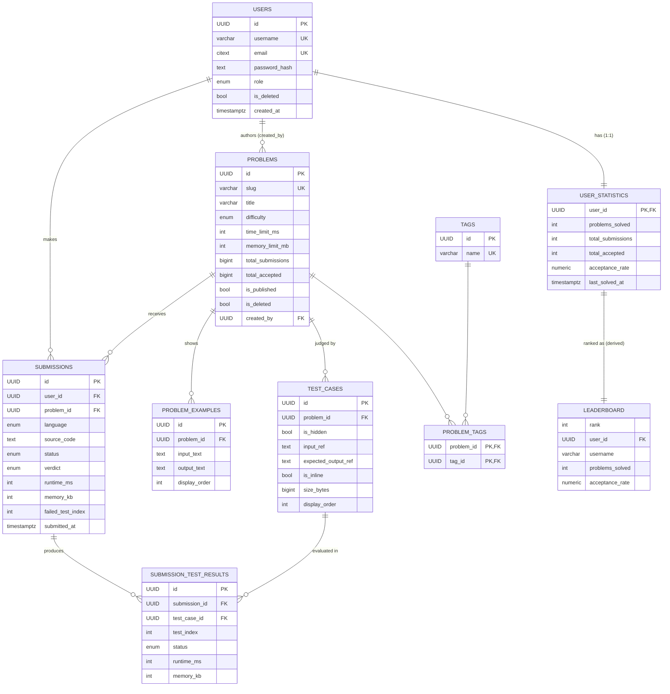

# JudgeX — PostgreSQL Database Design

> **Companion to:** `docs/PRD.md` and `docs/ARCHITECTURE.md` (the only sources of truth)
> **Document Type:** Database Design (the "data model")
> **Database:** PostgreSQL
> **Architecture:** Modular Monolith + separate Judge Workers
> **Status:** Draft v1.0
> **Last Updated:** 2026-07-08

> **Scope of this document:** a production-grade *design* only. It contains **no SQL, no ORM models (Prisma/Sequelize), no migrations, and no implementation code**. Column "data types" are named in the abstract (e.g., `UUID`, `TEXT`, `TIMESTAMPTZ`) to communicate intent, not to prescribe DDL.

> **Design ethos (Principal Engineer):** normalize for correctness, index for the read paths that matter, keep large blobs out of hot tables, and leave clean seams for future features — **without over-engineering**. Design for the MVP scope in the PRD (Auth, Problems, Test Cases, Submissions, Leaderboard, initial AI) and the modular monolith in the architecture doc.

---

## Table of Contents

1. [Database Design Philosophy](#1-database-design-philosophy)
2. [Complete Entity List](#2-complete-entity-list)
3. [Table Design](#3-table-design)
4. [ER Diagram](#4-er-diagram)
5. [Query Patterns](#5-query-patterns)
6. [Indexing Strategy](#6-indexing-strategy)
7. [Transactions](#7-transactions)
8. [Data Integrity](#8-data-integrity)
9. [Future Expansion](#9-future-expansion)
10. [Performance](#10-performance)
11. [Design Trade-offs](#11-design-trade-offs)
12. [Interview Notes](#12-interview-notes)

---

## 1. Database Design Philosophy

### 1.1 Why PostgreSQL
JudgeX data is **highly relational and integrity-critical**: users own submissions, submissions belong to problems, problems own test cases and examples, and leaderboards are *aggregations* over all of it. PostgreSQL gives us:
- **ACID transactions** — essential for the *persist-before-enqueue* invariant (a submission must exist durably before a judge job references it) and for multi-step admin writes (a problem + its test cases created atomically).
- **Strong constraints** — foreign keys, unique/check constraints, and enums push invariants into the database so bad data cannot exist regardless of application bugs.
- **Powerful indexing** — B-tree, partial, composite, and GIN indexes cover our filter/search/aggregate paths.
- **Mature aggregation & analytics** — window functions and grouped aggregates power leaderboards and acceptance-rate stats.
- **Scales past our target** — vertical scaling + read replicas + partitioning cover 100 → 100,000 users (per architecture §11) without a paradigm change.

### 1.2 Normalization Strategy
- **Design to 3NF as the default.** Every non-key attribute depends on the key, the whole key, and nothing but the key. Tags, examples, and per-test-case results each get their own tables rather than being crammed into arrays/JSON on a parent row.
- **Deliberate, bounded denormalization** where read cost dominates and the derived value is expensive to compute live:
  - `user_statistics` (problems solved, acceptance rate) is a **maintained rollup**, refreshed on relevant events, so the leaderboard doesn't scan the entire submissions table per request.
  - `problems` may carry cached counters (e.g., `total_submissions`, `total_accepted`) for cheap acceptance-rate display, kept consistent transactionally / via the worker.
- These denormalizations are **derived data with a clear owner and refresh rule** — never a substitute for the normalized source of truth (`submissions`).

### 1.3 Naming Conventions
- **Tables:** `snake_case`, **plural** nouns (`users`, `problems`, `test_cases`, `submission_test_results`).
- **Columns:** `snake_case`, singular (`created_at`, `time_limit_ms`).
- **Primary key:** `id` on every table.
- **Foreign keys:** `<referenced_singular>_id` (`user_id`, `problem_id`, `submission_id`).
- **Booleans:** `is_` / `has_` prefix (`is_hidden`, `is_deleted`).
- **Timestamps:** `_at` suffix (`created_at`, `updated_at`, `deleted_at`).
- **Enumerated types:** named Postgres enums (`submission_status`, `verdict`, `difficulty`, `user_role`, `language`) for a fixed, documented set of values.
- **Join tables:** `<a>_<b>` (`problem_tags`), holding the pair of foreign keys.
- **Indexes (documentation names):** `idx_<table>_<cols>`; uniques `uq_<table>_<cols>`.

### 1.4 UUID Strategy (UUID v7 default)
- **Decision:** **UUID v7 primary keys as the default strategy for all generated entity IDs** (`users`, `problems`, `tags`, `problem_examples`, `test_cases`, `submissions`, `submission_test_results`), generated server-side. Composite/derived keys are the only exceptions by design: `problem_tags` uses a composite `(problem_id, tag_id)` PK and `user_statistics` uses `user_id` (itself a UUID v7 from `users`).
- **Why UUID v7 specifically:**
  - **Time-ordered inserts** — v7 embeds a millisecond timestamp prefix, so newly generated IDs are monotonically increasing. Inserts land at the "right edge" of the primary-key B-tree rather than at random positions.
  - **Better B-tree locality** — ordered inserts mean far less page splitting/random I/O and tighter index packing than random v4, which matters most on the highest-insert tables (`submissions`, `submission_test_results`).
  - **Globally unique** — like all UUIDs, generatable anywhere without a central sequence round-trip; safe for multiple API instances and judge workers writing concurrently.
  - **Future distributed-system friendly** — no coordination needed for ID generation across processes/hosts; safe for future sharding, multi-writer, and cross-environment data moves without collisions.
  - **Non-enumerable enough** — the random component still prevents trivial ID-walking/IDOR probing (a sequential `/submissions/1024` would leak counts and invite scraping; UUIDs do not).
- **Trade-off acknowledged:** UUIDs are 16 bytes vs 4/8 for integers. We accept the size cost because v7 recovers the insert-locality advantage that previously favored integers, giving us global uniqueness *and* ordered-insert performance — the best fit for a stateless, horizontally scaled API + worker fleet.

### 1.5 Soft Delete Strategy
- **Selective soft deletes**, not blanket.
- **`problems`** and **`users`** use **soft delete** (`is_deleted` + `deleted_at`): a deleted problem must not vanish from historical submissions, and a deleted user's submissions/leaderboard history should degrade gracefully rather than cascade away. Default queries filter `is_deleted = false` (supported by **partial indexes**).
- **Child/append-only data** (`submissions`, `submission_test_results`) is **never deleted** — it's an immutable audit trail (architecture §3.2: terminal states are final/immutable).
- **Pure join/reference data** (`problem_tags`, `problem_examples`, `test_cases`) uses **hard delete** when its parent is edited by an admin, inside a transaction — there's no historical value in a stale example.
- **Rationale:** soft delete preserves referential history and enables restore/audit where it matters, while avoiding the query-complexity tax everywhere it doesn't.

### 1.6 Timestamp Strategy
- Every table has **`created_at`** (default: now) and, where rows mutate, **`updated_at`** (maintained on write).
- **All timestamps are `TIMESTAMPTZ` (UTC).** Store in UTC, convert at the edge (frontend). This avoids timezone ambiguity across regions and contests.
- Soft-deletable tables add **`deleted_at`** (nullable; set when `is_deleted` flips true).
- Time-based facts that are domain data (e.g., `submitted_at`) are explicit columns distinct from bookkeeping `created_at`, even if usually equal, to keep semantics clear.

---

## 2. Complete Entity List

MVP entities (from PRD scope + architecture entities):

| # | Entity | Kind | Purpose |
|---|--------|------|---------|
| 1 | **users** | Core | Accounts, credentials, role. |
| 2 | **problems** | Core | Problem statements, constraints, limits, difficulty. |
| 3 | **tags** | Reference | Canonical tag vocabulary (e.g., `arrays`, `dp`). |
| 4 | **problem_tags** | Join (M:N) | Associates problems ↔ tags. |
| 5 | **problem_examples** | Child (1:N) | Sample I/O + explanation shown on the problem page. |
| 6 | **test_cases** | Child (1:N) | Public + hidden judging data for a problem. |
| 7 | **submissions** | Core / append-only | Each Submit: code, language, status, verdict, metrics. |
| 8 | **submission_test_results** | Child (1:N) | Per-test-case outcome for a submission (diagnostics). |
| 9 | **user_statistics** | Rollup (1:1) | Maintained aggregates per user (solved, acceptance rate). |
| 10 | **leaderboard** | Materialized view / cache-source | Ranked view derived from `user_statistics`. |

Supporting notes:
- **Run Code** (fast feedback, not scored) is **not persisted as a submission** (architecture §2.3/§13.2). It leaves no durable rows by design; only *Submit* writes to `submissions`.
- **AI Compilation-Error Explanation** (MVP) operates on an existing submission's captured compiler output and does not *require* its own table for the MVP (an optional `ai_feedback` table is described in §9 for when AI usage is tracked/audited).

---

## 3. Table Design

> Legend: **PK** primary key · **FK** foreign key · **U** unique · **NN** not null · **CK** check.
> Data types are named abstractly (Postgres equivalents): `UUID`, `TEXT`, `VARCHAR(n)`, `INT`, `BIGINT`, `BOOLEAN`, `TIMESTAMPTZ`, `ENUM`, plus counters.

### 3.1 `users`
**Purpose:** authentication identity, role, and account state.

| Column | Type | Null | Default | Constraints |
|--------|------|------|---------|-------------|
| id | UUID | NN | generated | **PK** |
| username | VARCHAR(30) | NN | — | **U**; CK length ≥ 3, allowed charset |
| email | CITEXT/VARCHAR(255) | NN | — | **U** (case-insensitive); CK basic format |
| password_hash | TEXT | NN | — | bcrypt hash only (never plaintext) |
| role | ENUM `user_role` | NN | `'user'` | values: `user`, `admin` |
| is_deleted | BOOLEAN | NN | `false` | soft delete flag |
| deleted_at | TIMESTAMPTZ | Y | NULL | set when soft-deleted |
| created_at | TIMESTAMPTZ | NN | now | |
| updated_at | TIMESTAMPTZ | NN | now | maintained on update |

- **Unique constraints:** `uq_users_username`, `uq_users_email`.
- **Indexes:** unique indexes above (email lookup on login); partial index `idx_users_active` on `id WHERE is_deleted = false` for common active-user scans.
- **Relationships:** 1:N → `submissions`; 1:1 → `user_statistics`.
- **Expected growth:** moderate — one row per registered user (100 → 100k). Small, hot for auth.

### 3.2 `problems`
**Purpose:** the problem catalog: statement, constraints, limits, difficulty, plus cached counters for cheap acceptance-rate display.

| Column | Type | Null | Default | Constraints |
|--------|------|------|---------|-------------|
| id | UUID | NN | generated | **PK** |
| slug | VARCHAR(120) | NN | — | **U**; URL-safe identifier |
| title | VARCHAR(200) | NN | — | CK non-empty |
| statement | TEXT | NN | — | markdown body |
| constraints_text | TEXT | Y | NULL | human-readable constraints |
| difficulty | ENUM `difficulty` | NN | — | `easy`, `medium`, `hard` |
| time_limit_ms | INT | NN | `2000` | CK > 0 |
| memory_limit_mb | INT | NN | `256` | CK > 0 |
| total_submissions | BIGINT | NN | `0` | cached counter |
| total_accepted | BIGINT | NN | `0` | cached counter (acceptance rate = accepted/submissions) |
| is_published | BOOLEAN | NN | `false` | draft vs visible |
| is_deleted | BOOLEAN | NN | `false` | soft delete |
| deleted_at | TIMESTAMPTZ | Y | NULL | |
| created_by | UUID | Y | NULL | **FK** → users(id) (author/admin) |
| created_at | TIMESTAMPTZ | NN | now | |
| updated_at | TIMESTAMPTZ | NN | now | |

- **FKs:** `created_by` → `users(id)` `ON DELETE SET NULL` (keep the problem if author removed).
- **Unique:** `uq_problems_slug`.
- **Check:** `time_limit_ms > 0`, `memory_limit_mb > 0`, `total_accepted <= total_submissions`.
- **Indexes:** `uq_problems_slug`; `idx_problems_difficulty` (filter); partial `idx_problems_published` on `WHERE is_published AND NOT is_deleted` for the public list; GIN trigram on `title` for search (see §6); `idx_problems_created_by` on `created_by` (FK index — supports "problems authored by user" and keeps the `ON DELETE SET NULL` on author removal from scanning the table).
- **Relationships:** 1:N → `problem_examples`, `test_cases`, `submissions`; M:N → `tags` via `problem_tags`.
- **Expected growth:** small/slow — hundreds to low thousands of problems. Read-heavy → prime cache target.

### 3.3 `tags`
**Purpose:** canonical, deduplicated tag vocabulary.

| Column | Type | Null | Default | Constraints |
|--------|------|------|---------|-------------|
| id | UUID | NN | generated | **PK** |
| name | VARCHAR(50) | NN | — | **U** (case-insensitive) |
| created_at | TIMESTAMPTZ | NN | now | |

- **Unique:** `uq_tags_name`.
- **Indexes:** unique on `name`.
- **Relationships:** M:N → `problems` via `problem_tags`.
- **Expected growth:** tiny — dozens to low hundreds. Effectively reference data (cacheable indefinitely).

### 3.4 `problem_tags` (join, M:N)
**Purpose:** associate problems with tags.

| Column | Type | Null | Default | Constraints |
|--------|------|------|---------|-------------|
| problem_id | UUID | NN | — | **FK** → problems(id) |
| tag_id | UUID | NN | — | **FK** → tags(id) |
| created_at | TIMESTAMPTZ | NN | now | |

- **PK:** composite `(problem_id, tag_id)` — inherently unique, prevents duplicates.
- **FKs:** both `ON DELETE CASCADE` (removing a problem or tag cleans associations).
- **Indexes:** PK covers `problem_id`-first lookups (tags of a problem); add `idx_problem_tags_tag` on `(tag_id, problem_id)` for "problems with tag X".
- **Expected growth:** ~ problems × avg tags-per-problem — small.

### 3.5 `problem_examples`
**Purpose:** human-facing sample I/O and explanation rendered on the problem page (distinct from judging `test_cases`).

| Column | Type | Null | Default | Constraints |
|--------|------|------|---------|-------------|
| id | UUID | NN | generated | **PK** |
| problem_id | UUID | NN | — | **FK** → problems(id) |
| input_text | TEXT | NN | — | sample input |
| output_text | TEXT | NN | — | expected sample output |
| explanation | TEXT | Y | NULL | optional prose |
| display_order | INT | NN | `0` | ordering on the page |
| created_at | TIMESTAMPTZ | NN | now | |

- **FK:** `problem_id` → `problems(id)` `ON DELETE CASCADE`.
- **Indexes:** `idx_problem_examples_problem` on `(problem_id, display_order)`.
- **Constraints:** CK `display_order >= 0`.
- **Relationships:** N:1 → `problems`.
- **Expected growth:** ~ problems × 2–3. Small.

### 3.6 `test_cases`
**Purpose:** the authoritative judging data — **public** (visible/sample-run) and **hidden** (grading only). Read only by Admin service and Judge Worker (architecture §8.3, §10.5).

| Column | Type | Null | Default | Constraints |
|--------|------|------|---------|-------------|
| id | UUID | NN | generated | **PK** |
| problem_id | UUID | NN | — | **FK** → problems(id) |
| is_hidden | BOOLEAN | NN | `true` | hidden vs public |
| input_ref | TEXT | NN | — | inline text (small) **or** storage pointer (large) |
| expected_output_ref | TEXT | NN | — | inline text **or** storage pointer |
| is_inline | BOOLEAN | NN | `true` | true = value stored in-row; false = `*_ref` is an object-storage key |
| size_bytes | BIGINT | NN | `0` | payload size (routing/inline decision) |
| checksum | VARCHAR(64) | Y | NULL | integrity check for external payloads |
| display_order | INT | NN | `0` | evaluation order |
| created_at | TIMESTAMPTZ | NN | now | |

- **FK:** `problem_id` → `problems(id)` `ON DELETE CASCADE`.
- **Indexes:** `idx_test_cases_problem` on `(problem_id, display_order)`; partial `idx_test_cases_public` on `WHERE is_hidden = false` for fast sample loads / Run Code.
- **Constraints:** CK `size_bytes >= 0`; CK `display_order >= 0`.
- **Design note (large payloads):** per architecture §16.9, small cases live inline (`is_inline = true`, value in `*_ref`); large cases set `is_inline = false` and store an **object-storage key** in `*_ref`, keeping the DB lean. Metadata (linkage, hidden flag, size, checksum) always stays in Postgres.
- **Relationships:** N:1 → `problems`.
- **Expected growth:** ~ problems × 10–50 cases. Payload bytes offloaded when large.

### 3.7 `submissions`
**Purpose:** the append-only record of every *Submit* — the authoritative artifact the worker re-reads (architecture §3.3). One row per submission; **never mutated after reaching a terminal verdict** except status/verdict/metric fields written once by the worker.

| Column | Type | Null | Default | Constraints |
|--------|------|------|---------|-------------|
| id | UUID | NN | generated | **PK** |
| user_id | UUID | NN | — | **FK** → users(id) |
| problem_id | UUID | NN | — | **FK** → problems(id) |
| language | ENUM `language` | NN | — | MVP: `python`, `cpp` |
| source_code | TEXT | NN | — | submitted code |
| status | ENUM `submission_status` | NN | `'queued'` | `queued`, `running`, `completed`, `error` |
| verdict | ENUM `verdict` | Y | NULL | `accepted`, `wrong_answer`, `tle`, `runtime_error`, `compile_error` (NULL until judged) |
| compile_output | TEXT | Y | NULL | compiler stderr (for CE + AI explanation) |
| runtime_ms | INT | Y | NULL | max across cases |
| memory_kb | INT | Y | NULL | max across cases |
| failed_test_index | INT | Y | NULL | first failing case (WA/RE), diagnostics |
| submitted_at | TIMESTAMPTZ | NN | now | domain event time |
| judged_at | TIMESTAMPTZ | Y | NULL | when terminal verdict written |
| created_at | TIMESTAMPTZ | NN | now | |
| updated_at | TIMESTAMPTZ | NN | now | |

- **FKs:** `user_id` → `users(id)` `ON DELETE` **RESTRICT/SET NULL policy** (see §8 — we prefer preserving history); `problem_id` → `problems(id)` `ON DELETE RESTRICT` (soft delete problems instead).
- **Constraints:** CK "verdict is NULL unless status ∈ {completed, error-derived}"; CK `runtime_ms >= 0`, `memory_kb >= 0`.
- **Indexes:** `idx_submissions_user_created` on `(user_id, submitted_at DESC)` (global user history); `idx_submissions_user_problem_created` on `(user_id, problem_id, submitted_at DESC)` (a user's submissions for a specific problem — the problem-page "your submissions" feed); `idx_submissions_problem_created` on `(problem_id, submitted_at DESC)`; partial `idx_submissions_accepted` on `(user_id, problem_id) WHERE verdict = 'accepted'` (distinct-solved calc); `idx_submissions_status` on `status` for operational/pending scans.
- **Relationships:** N:1 → `users`, `problems`; 1:N → `submission_test_results`.
- **Expected growth:** **largest, fastest-growing table** (many submissions per user per problem). Primary partitioning/retention candidate (§10).

### 3.8 `submission_test_results`
**Purpose:** per-test-case outcome for a submission — diagnostics and future detailed feedback. Append-only.

| Column | Type | Null | Default | Constraints |
|--------|------|------|---------|-------------|
| id | UUID | NN | generated | **PK** |
| submission_id | UUID | NN | — | **FK** → submissions(id) |
| test_case_id | UUID | Y | — | **FK** → test_cases(id) (nullable if case later removed) |
| test_index | INT | NN | — | order within the run |
| status | ENUM `verdict` | NN | — | per-case outcome |
| runtime_ms | INT | Y | NULL | per case |
| memory_kb | INT | Y | NULL | per case |
| created_at | TIMESTAMPTZ | NN | now | |

- **FKs:** `submission_id` → `submissions(id)` `ON DELETE CASCADE`; `test_case_id` → `test_cases(id)` `ON DELETE SET NULL`.
- **Constraints:** **U** `uq_result_submission_index` on `(submission_id, test_index)` (idempotency: re-processed job can't duplicate rows — supports architecture's idempotency invariant).
- **Indexes:** the unique constraint `uq_result_submission_index` **already provides** the underlying B-tree on `(submission_id, test_index)` that serves "load a submission's per-case results" — so no separate `submission_id` index is added (that would be redundant). `idx_results_test_case` on `test_case_id` (FK index — keeps the `ON DELETE SET NULL` on test-case removal from sequentially scanning this very large table).
- **Important:** stores **outcomes/metrics only — never hidden inputs/outputs** (hidden-test protection, PRD/architecture §10.5). At most a `test_index`.
- **Relationships:** N:1 → `submissions`, `test_cases`.
- **Expected growth:** submissions × cases-per-problem → **very large** (largest child). Short-circuit judging means failed submissions have fewer rows.

### 3.9 `user_statistics`
**Purpose:** maintained per-user rollup so the leaderboard and profile pages avoid scanning `submissions` live (denormalization with a clear owner).

| Column | Type | Null | Default | Constraints |
|--------|------|------|---------|-------------|
| user_id | UUID | NN | — | **PK, FK** → users(id) (1:1) |
| problems_solved | INT | NN | `0` | distinct accepted problems |
| total_submissions | INT | NN | `0` | all submissions |
| total_accepted | INT | NN | `0` | accepted submissions |
| acceptance_rate | NUMERIC(5,2) | NN | `0` | derived: accepted/total (maintained) |
| last_solved_at | TIMESTAMPTZ | Y | NULL | tie-break / recency |
| updated_at | TIMESTAMPTZ | NN | now | |

- **PK/FK:** `user_id` is both PK and FK → `users(id)` `ON DELETE CASCADE` (stats meaningless without user).
- **Constraints:** CK `total_accepted <= total_submissions`; CK `acceptance_rate BETWEEN 0 AND 100`.
- **Indexes:** `idx_user_stats_ranking` on `(problems_solved DESC, acceptance_rate DESC, last_solved_at ASC)` — the leaderboard ordering.
- **Refresh rule:** updated transactionally/by the worker on `Accepted` and on each submission (architecture §3.1 step 15). Reconcilable from `submissions` if ever drifted.
- **Expected growth:** exactly one row per user — small, hot.

### 3.10 `leaderboard`
**Purpose:** the ranked presentation of `user_statistics`. **Not a base table** — implemented as a **materialized view** (or a Redis-cached computed set per architecture §2.5) refreshed periodically / on accepted verdicts.

- **Source:** `user_statistics` joined to `users` (for display name), ordered by the ranking index.
- **Columns (derived):** `rank`, `user_id`, `username`, `problems_solved`, `acceptance_rate`, `last_solved_at`.
- **Refresh:** scheduled refresh + event-driven invalidation of the Redis cache on `Accepted` (architecture §2.5, §6.6). The **materialized view** gives a consistent snapshot for pagination; Redis fronts it for read volume.
- **Indexes:** unique index on `user_id` (concurrent refresh support) and an index on `rank` for paginated reads.
- **Expected growth:** one row per ranked user — small; cost is in *refresh*, not storage.

---

## 4. ER Diagram

### 4.1 Relationship Cardinality Summary
- **One-to-one (1:1):** `users` ↔ `user_statistics` (each user has exactly one stats row; PK = FK).
- **One-to-many (1:N):**
  - `users` → `submissions`
  - `problems` → `problem_examples`, `test_cases`, `submissions`
  - `submissions` → `submission_test_results`
- **Many-to-many (M:N):** `problems` ↔ `tags` via `problem_tags` (composite-PK join table).
- **Derived (not FK-enforced base data):** `leaderboard` is a materialized view over `user_statistics` + `users`.

---

## 5. Query Patterns

For each hot query: what it does, and which index serves it.

### 5.1 Load Problem (detail page)
- **Reads:** one `problems` row by `slug` + its `problem_examples` + **public** `test_cases` + its `tags`.
- **Indexes used:** `uq_problems_slug` (point lookup); `idx_problem_examples_problem`; `idx_test_cases_public` (partial, hidden excluded); `problem_tags` PK + `tags` PK.
- **Notes:** hidden test cases are excluded at the **service layer and by the partial index path**; result is cache-friendly (Redis, architecture §2.2).

### 5.2 List/Search/Filter Problems
- **Reads:** paginated `problems` filtered by `difficulty`, `tags`, keyword, `is_published AND NOT is_deleted`.
- **Indexes used:** partial `idx_problems_published`; `idx_problems_difficulty`; GIN trigram on `title` for search; `idx_problem_tags_tag` for tag filter.
- **Notes:** heavily cached; recomputed on catalog changes.

### 5.3 Create Submission (Submit)
- **Writes:** insert one `submissions` row (`status = queued`) — the *persist-before-enqueue* step (architecture §3.1).
- **Indexes affected:** inserts touch `idx_submissions_user_created`, `_problem_created`, `_status`.
- **Notes:** single fast insert; the heavy work is async in the worker. Enqueue to BullMQ happens *after* commit.

### 5.4 Judge Worker Read + Result Write
- **Reads:** `submissions` by id + `problems` limits + **all** `test_cases` (public + hidden) for the problem.
- **Writes:** update `submissions` (status→running, then verdict+metrics); bulk insert `submission_test_results`; update counters (`problems.total_*`) and `user_statistics`.
- **Indexes used:** PK lookups; `idx_test_cases_problem`; `uq_result_submission_index` (idempotency).

### 5.5 Submission History (per user, per problem, global)
- **Reads:** `submissions` for a `user_id` (optionally + `problem_id`), newest first, paginated.
- **Indexes used:** `idx_submissions_user_created` for **global** user history; `idx_submissions_user_problem_created` on `(user_id, problem_id, submitted_at DESC)` for the common **"all submissions of a user for a specific problem"** query (problem-page feed); `idx_submissions_problem_created` for a problem's overall submission feed.

### 5.6 Leaderboard
- **Reads:** top-N ranked users by `problems_solved`, then `acceptance_rate`, then recency.
- **Indexes used:** `idx_user_stats_ranking` (base) and the `leaderboard` materialized view's `rank` index; fronted by Redis cache.
- **Notes:** avoids scanning `submissions`; that's the entire reason `user_statistics` exists.

### 5.7 Admin Dashboard
- **Reads:** counts of users/problems/submissions and verdict distribution (future analytics, PRD `FR-ADMIN-7`).
- **Indexes used:** `idx_submissions_status` and verdict-oriented aggregate scans; for large-scale distribution, precomputed rollups (§10) rather than live full scans.
- **Writes:** problem create/edit/delete + test-case management (transactional, §7).

### 5.8 Login / Auth
- **Reads:** `users` by `email` (case-insensitive) → bcrypt compare.
- **Indexes used:** `uq_users_email`.
- **Notes:** hottest auth path; tiny table, near-constant time.

---

## 6. Indexing Strategy

Every index earns its place by serving a named query; each adds write cost, so we index the **read paths that matter** and no more.

| Index | Table | Type | Serves | Trade-off |
|-------|-------|------|--------|-----------|
| `uq_users_email` | users | Unique B-tree | Login lookup by email | Tiny; mandatory for correctness + speed. |
| `uq_users_username` | users | Unique B-tree | Uniqueness + profile lookup | Negligible. |
| `idx_users_active` | users | Partial B-tree (`WHERE NOT is_deleted`) | Active-user scans | Smaller than full index; only active rows. |
| `uq_problems_slug` | problems | Unique B-tree | Problem detail by slug | Mandatory. |
| `idx_problems_difficulty` | problems | B-tree | Difficulty filter | Low cardinality; cheap, aids filter+sort. |
| `idx_problems_published` | problems | Partial B-tree | Public catalog list | Excludes drafts/deleted → small, fast. |
| `idx_problems_title_trgm` | problems | GIN (trigram) | Keyword/substring search | Larger index + slower writes; problems change rarely, so worth it. |
| `idx_problems_created_by` | problems | B-tree `created_by` | "Problems authored by user"; FK-backing | Small (low-write table); avoids seq scan on `ON DELETE SET NULL` when an author is removed. |
| `idx_problem_tags_tag` | problem_tags | B-tree `(tag_id, problem_id)` | "Problems with tag X" | Complements composite PK (problem-first). |
| `idx_problem_examples_problem` | problem_examples | B-tree `(problem_id, display_order)` | Ordered examples on detail | Small. |
| `idx_test_cases_problem` | test_cases | B-tree `(problem_id, display_order)` | Worker loads all cases in order | Small; critical for judge. |
| `idx_test_cases_public` | test_cases | Partial B-tree (`WHERE NOT is_hidden`) | Sample loads / Run Code | Very small (few public cases). |
| `idx_submissions_user_created` | submissions | B-tree `(user_id, submitted_at DESC)` | Global user submission history | On the biggest table → most valuable; write cost accepted. |
| `idx_submissions_user_problem_created` | submissions | B-tree `(user_id, problem_id, submitted_at DESC)` | "Show all submissions of a user for a specific problem" (problem-page feed) | Directly serves a hot per-problem history path that the `(user_id, …)` index only prefix-covers; write cost accepted on this key path. |
| `idx_submissions_problem_created` | submissions | B-tree `(problem_id, submitted_at DESC)` | Problem submission feed | Adds write cost on hot table; justified by read frequency. |
| `idx_submissions_accepted` | submissions | Partial `(user_id, problem_id) WHERE verdict='accepted'` | Distinct-solved / stats reconcile | Small (only accepted rows). |
| `idx_submissions_status` | submissions | B-tree `status` | Operational pending/error scans | Low cardinality; consider partial on non-terminal only. |
| `uq_result_submission_index` | submission_test_results | Unique `(submission_id, test_index)` | Idempotency of per-case rows **and** loading a submission's per-case results | The unique constraint's underlying B-tree already serves `submission_id`-prefixed reads, so no separate `submission_id` index is needed. |
| `idx_results_test_case` | submission_test_results | B-tree `test_case_id` | FK-backing for `ON DELETE SET NULL` | Required so removing a test case doesn't seq-scan this very large table; write cost accepted. |
| `idx_user_stats_ranking` | user_statistics | B-tree `(problems_solved DESC, acceptance_rate DESC, last_solved_at)` | Leaderboard ordering | One row/user → cheap, high payoff. |

**General trade-off principles:**
- Indexes speed reads but **slow writes and consume space** — most acute on `submissions` and `submission_test_results` (highest insert rate). We keep their index set minimal and composite (one index serving multiple filters via left-prefix).
- **Partial indexes** (published problems, public test cases, active users, accepted submissions) shrink index size and cost by covering only the rows queries actually target.
- **GIN trigram** is comparatively expensive to maintain; acceptable because `problems` is low-write.
- **UUID v7 PKs** are time-ordered, so inserts on high-volume tables (`submissions`, `submission_test_results`) land at the right edge of the primary-key B-tree — preserving insert locality that random UUIDs would otherwise sacrifice.

---

## 7. Transactions

Transactions enforce the architecture's core invariants (persist-before-enqueue, atomic admin writes, idempotent result persistence).

### 7.1 Create Submission (Submit)
- **Steps:** insert `submissions` (`queued`) → **commit** → *then* enqueue BullMQ job.
- **Why transactional:** the row must be durably committed **before** the job is enqueued so a crash never leaves a job referencing a non-existent submission (architecture §3.3 invariant). Enqueue is intentionally **outside** the DB transaction (Redis isn't part of the DB); if enqueue fails after commit, a sweeper/retry re-enqueues from `queued` rows — no lost work.

### 7.2 Delete Problem (admin)
- **Steps (single transaction):** soft-delete `problems` (set `is_deleted`, `deleted_at`, `is_published=false`); hard-delete dependent `problem_tags`, `problem_examples`, `test_cases` (or leave test_cases if we want re-publish — policy choice); **do not** delete `submissions` (history preserved).
- **Why transactional:** partial deletion (tags gone but examples remain, or a "deleted" problem still visible) would corrupt the catalog. All-or-nothing.

### 7.3 Create/Update Test Cases (admin)
- **Steps (single transaction):** insert/replace the set of `test_cases` for a problem (public + hidden), plus any large-payload storage keys.
- **Why transactional:** judging correctness depends on a **complete, consistent** case set. A half-written set could yield wrong verdicts. Commit only when the whole set is valid.

### 7.4 Worker Result Persistence
- **Steps (single transaction):** update `submissions` (verdict + metrics + `judged_at`); insert `submission_test_results`; increment `problems.total_submissions/total_accepted`; upsert `user_statistics`.
- **Why transactional:** the verdict, its per-case detail, and the derived counters must move together. Idempotency guard (`uq_result_submission_index` + status check) makes a retried job safe.

### 7.5 Register User
- **Steps:** insert `users` + initialize `user_statistics` (1:1) in one transaction.
- **Why transactional:** every user must have exactly one stats row; the two inserts are atomic.

---

## 8. Data Integrity

### 8.1 Foreign Keys (relationships enforced in-DB)
Every relationship in §4 is backed by a real FK constraint so orphan rows are impossible regardless of application code. Key FKs: `submissions.user_id/problem_id`, `test_cases.problem_id`, `problem_examples.problem_id`, `problem_tags.(problem_id,tag_id)`, `submission_test_results.(submission_id,test_case_id)`, `user_statistics.user_id`.

### 8.2 Cascade Rules (chosen per semantic)
| Relationship | On parent delete | Rationale |
|--------------|------------------|-----------|
| problem → problem_examples | **CASCADE** | examples are meaningless without the problem. |
| problem → test_cases | **CASCADE** | judging data belongs to the problem. |
| problem → problem_tags | **CASCADE** | associations are disposable. |
| tag → problem_tags | **CASCADE** | remove associations when a tag is deleted. |
| problem → submissions | **RESTRICT** (soft-delete problem instead) | submissions are historical/audit; never cascade-destroy. |
| user → submissions | **RESTRICT / SET NULL policy** | preserve history; prefer soft-deleting users. |
| submission → submission_test_results | **CASCADE** | per-case detail is owned by the submission. |
| test_case → submission_test_results | **SET NULL** | keep historical result even if a case is later removed. |
| user → user_statistics | **CASCADE** | stats are worthless without the user. |

### 8.3 Delete Restrictions
- **Problems and users are soft-deleted**, not hard-deleted, precisely so `submissions` (with `ON DELETE RESTRICT`) remain valid. Attempting a hard delete of a referenced problem/user is blocked by the FK — a deliberate safety net.
- **Submissions and results are never deleted** in normal operation (append-only audit trail; retention/archival handled separately in §10).

### 8.4 Validation Rules (pushed into the DB)
- **Uniqueness:** email, username, slug, tag name; `(problem_id, tag_id)`; `(submission_id, test_index)`.
- **Checks:** positive time/memory limits; `total_accepted <= total_submissions`; `acceptance_rate ∈ [0,100]`; non-negative metrics; `verdict` only present for terminal statuses; enums constrain `role`, `difficulty`, `language`, `status`, `verdict` to known values.
- **Not-null** on every column that is semantically required (see §3).
- **Principle:** the database is the **last line of defense** — application validation is convenience; DB constraints are the guarantee.

---

## 9. Future Expansion

The schema leaves clean seams so PRD "Future Scope" items slot in **without redesigning existing tables** (additive migrations only).

### 9.1 Contests
- **New tables:** `contests` (window, title, rules), `contest_problems` (M:N contest↔problem with per-contest points), `contest_participants` (M:N user↔contest with registration time), `contest_submissions` *or* a nullable `contest_id` FK on `submissions`.
- **No redesign:** `submissions` already models the act of submitting; adding a nullable `contest_id` links a submission to a contest without touching existing rows. Contest leaderboards reuse the `user_statistics` pattern (a `contest_standings` rollup).

### 9.2 Discussion Forums
- **New tables:** `discussion_threads` (FK → problems), `discussion_comments` (self-referencing `parent_comment_id` for threading, FK → users), `comment_votes`.
- **No redesign:** purely additive; hangs off existing `problems` and `users`.

### 9.3 Company Question Sets
- **New tables:** `companies`, `company_problem_sets`, `company_problems` (M:N set↔problem) — mirrors the `tags`/`problem_tags` pattern.
- **No redesign:** problems remain the shared core; sets are another M:N grouping.

### 9.4 AI Feedback
- **New table:** `ai_feedback` (FK → submissions, FK → users, `feedback_type` enum {compile_explanation, bug_hint, complexity, edge_cases, optimization}, `prompt_snapshot`, `response_text`, `was_blocked` flag, `provider` (e.g., `ollama` | `openai` — for auditing which provider produced the response), `created_at`).
- **Provider-neutral by design:** the schema stores only prompts/responses/outcomes and never depends on which AI provider is used. Per `ARCHITECTURE.md` §9.1, the default provider is **local Ollama (free, no key)** with **OpenAI optional via config**; the optional `provider` column merely records which one served a request. Switching providers requires **no schema change**.
- **MVP note:** the MVP compile-error explanation reads `submissions.compile_output` and needs no table; `ai_feedback` is introduced when we **audit/track** AI usage (rate-limit accounting, guardrail hit-rate for the 0%-leakage metric). Additive only.

### 9.5 Google OAuth
- **Change:** make `users.password_hash` nullable and add `auth_provider` enum {`local`, `google`} + `provider_user_id` (unique per provider). Optionally an `user_identities` table for multiple linked providers per user.
- **No redesign:** existing local users keep working; OAuth is an alternate credential path on the same `users` identity.

### 9.6 Other easy adds
- **Refresh tokens / logout invalidation (V1):** `refresh_tokens` table (user_id, token hash, expiry, revoked) — additive, aligns with architecture §7.1.
- **MLE verdict (V1):** add a value to the `verdict` enum — no structural change.
- **More languages (Java/JS):** add values to the `language` enum — no structural change.

---

## 10. Performance

### 10.1 Expected Bottlenecks
1. **`submissions` + `submission_test_results` write/read volume** — by far the largest, fastest-growing tables; every Submit writes here and history reads hit them.
2. **Leaderboard computation** — naive live aggregation over `submissions` would be catastrophic; solved by the `user_statistics` rollup + materialized view + Redis cache.
3. **Problem list/search reads** — high frequency; solved by caching + partial/trigram indexes.
4. **Auth lookups** — high frequency but trivial (tiny indexed table).

### 10.2 Table Growth (relative)
| Table | Growth rate | Long-term size |
|-------|-------------|----------------|
| submission_test_results | Highest (submissions × cases) | Very large |
| submissions | High (per Submit) | Large |
| ai_feedback (future) | Medium | Medium |
| users, user_statistics | Linear w/ signups | Small |
| problems, test_cases, examples, tags | Slow (admin-authored) | Small |

### 10.3 Partitioning Considerations
- **`submissions`:** the prime candidate for **range partitioning by time** (e.g., monthly on `submitted_at`) once volume warrants. Benefits: fast pruning for recent-history queries, cheap archival/drop of old partitions, smaller per-partition indexes.
- **`submission_test_results`:** partition alongside `submissions` (by submission time / matching key) since it grows in lockstep.
- **When:** defer until table size actually pressures index/vacuum performance — **avoid premature partitioning** (over-engineering). The FK/index design above is partition-compatible so this is an additive change.

### 10.4 Caching Opportunities (align with architecture §2, §6.6)
- **Problem lists & detail** → Redis with TTL, invalidated on catalog change.
- **Leaderboard** → Redis-fronted materialized view, refreshed on `Accepted` + on schedule.
- **Tags** → effectively static reference data; cache aggressively.
- **Per-problem counters** (`total_submissions/accepted`) → cached column avoids live COUNT over `submissions`.

### 10.5 Other performance practices
- **Connection pooling** in front of Postgres (many stateless API instances + workers → bounded connections).
- **Read replicas** for read-heavy paths (problem lists, leaderboard) at the 10k→100k stage (architecture §11).
- **Keep large test payloads out of Postgres** (§3.6, architecture §16.9) to protect buffer cache and backup times.
- **VACUUM/autovacuum awareness** for the append-heavy submission tables (dead-tuple/bloat management), and monitoring bloat as a first-class ops metric.

---

## 11. Design Trade-offs

### 11.1 UUID v7 vs Auto-increment (SERIAL/IDENTITY) PKs
- **Chosen:** UUID v7.
- **Alternative:** integer identity.
- **Why JudgeX:** non-enumerable IDs prevent scraping/IDOR on public entities, and distributed, coordination-free generation suits stateless API/workers. Crucially, **v7's time-ordered prefix restores the insert locality** that once favored integers — so we get global uniqueness *and* right-edge B-tree inserts. We accept the 16-byte key size for that combination. Integers would be smaller but leak counts, invite ID-walking, and require central sequence coordination.

### 11.2 Normalized tags vs `TEXT[]`/JSON tags on `problems`
- **Chosen:** normalized `tags` + `problem_tags`.
- **Alternative:** an array/JSON column of tag strings on `problems`.
- **Why JudgeX:** a canonical vocabulary prevents duplicates/typos, enables efficient "problems with tag X" via a join index, and keeps tag rename a one-row change. Arrays are simpler but denormalized and harder to keep clean at scale. (For read speed we still cache tag data heavily.)

### 11.3 `user_statistics` rollup vs computing leaderboard live
- **Chosen:** maintained rollup + materialized view + cache.
- **Alternative:** aggregate `submissions` on every leaderboard request.
- **Why JudgeX:** live aggregation over the biggest table per request doesn't scale; a rollup turns leaderboard reads into a tiny indexed scan. Cost is maintaining the rollup transactionally (and reconciling if it drifts) — a worthwhile, bounded complexity.

### 11.4 Storing per-test-case results (`submission_test_results`) vs summary-only on `submissions`
- **Chosen:** dedicated per-case table.
- **Alternative:** only store the final verdict + failing index on `submissions`.
- **Why JudgeX:** per-case detail powers richer diagnostics (PRD `FR-SUB-5`) and future analytics, and keeps `submissions` rows lean. The cost is the largest child table — controlled via short-circuit judging, minimal columns, and partitioning later. If diagnostics were never needed, summary-only would be leaner — a conscious trade for product value.

### 11.5 Test-case payloads: inline in DB vs object storage with metadata
- **Chosen:** hybrid — inline small, offload large (metadata always in DB).
- **Alternative:** everything inline in Postgres.
- **Why JudgeX:** mirrors architecture §16.9 — protects DB cache/backups from multi-MB blobs while keeping integrity and hidden-test gating in Postgres. All-inline is simplest at tiny scale (our MVP default) but degrades the DB as cases grow; the hybrid lets us start simple and graduate large cases without redesign.

### 11.6 Soft delete (problems/users) vs hard delete
- **Chosen:** soft delete for problems/users; hard delete for disposable children; never delete submissions.
- **Alternative:** hard delete everywhere with cascades.
- **Why JudgeX:** hard-cascading a problem/user would destroy submission history and corrupt leaderboards/audit. Soft delete preserves history and enables restore; the tax (filtering `is_deleted`) is contained via partial indexes and default query scopes.

### 11.7 Enums vs lookup tables for status/verdict/difficulty/language
- **Chosen:** Postgres enums.
- **Alternative:** small reference/lookup tables with FKs.
- **Why JudgeX:** these value sets are **small, stable, and code-coupled** (the worker maps to exactly these verdicts). Enums are compact, self-documenting, and constrain values without a join. Adding a value (MLE, Java) is a simple additive change. Lookup tables shine when values are user-managed with metadata — not our case here.

### 11.8 Leaderboard as materialized view + cache vs plain table maintained by triggers
- **Chosen:** materialized view over `user_statistics`, fronted by Redis.
- **Alternative:** a physical `leaderboard` table kept in sync by triggers on every submission.
- **Why JudgeX:** trigger-maintained ranking on the hottest write path adds contention and complexity; a periodically/-event refreshed matview + cache decouples ranking cost from the submit path (architecture §2.5). Slight staleness is acceptable for a leaderboard.

---

## 12. Interview Notes

### "Questions an interviewer may ask about this database"

1. **Why UUIDs (v7) over auto-increment integers?**
   Non-enumerable public IDs (no scraping/IDOR on submissions/problems) and distributed, lookup-free generation for stateless API/workers. We use **UUID v7** as the default so its time-ordered prefix gives right-edge, locality-friendly B-tree inserts — recovering the one advantage integers held — while keeping global uniqueness. Trade-off accepted: 16-byte keys.

2. **Why is the leaderboard not computed directly from `submissions`?**
   Aggregating the largest table on every request doesn't scale. We keep a maintained `user_statistics` rollup, expose it via a materialized view, and cache it in Redis — turning ranking into a tiny indexed read.

3. **How do you guarantee a submission is never lost if Redis or a worker dies?**
   Persist-before-enqueue: the `submissions` row is committed *before* the BullMQ job is created, and Postgres is authoritative. A dropped job is re-derivable from `queued` rows; the job carries only an ID.

4. **How do you make re-processing a judge job idempotent?**
   `uq_result_submission_index (submission_id, test_index)` blocks duplicate per-case rows, and the worker checks/sets `submissions.status`, so a retried job can't double-write verdicts or counters.

5. **How are hidden test cases protected at the data layer?**
   They live in `test_cases` with `is_hidden = true`, read only by the Admin service and the Judge Worker. No user-facing query path returns them; `submission_test_results` stores outcomes/indexes only — never hidden I/O.

6. **Why separate `problem_examples` from `test_cases`?**
   They serve different consumers: examples are human-facing UI content; test_cases are the judging dataset (incl. hidden). Different access rules, sizes, and lifecycles justify separate tables.

7. **Why store per-test-case results instead of just the final verdict?**
   Enables diagnostics (failing index, per-case timing) and future analytics while keeping `submissions` lean. Cost is the largest child table, controlled via short-circuit judging and future partitioning.

8. **Which operations must be transactional and why?**
   Submit insert (before enqueue), problem delete (all-or-nothing across children), test-case set writes (judging needs a complete set), and worker result persistence (verdict + per-case + counters + stats move together).

9. **Why is enqueue to BullMQ outside the DB transaction?**
   Redis isn't part of the Postgres transaction; committing the row first and enqueuing after avoids a phantom job referencing an uncommitted row. A sweeper re-enqueues any `queued` rows that missed enqueue.

10. **How do you handle deleting a problem that has submissions?**
    Soft delete the problem (`is_deleted`), keep submissions via `ON DELETE RESTRICT`. History and leaderboards stay intact; the problem disappears from the catalog via default `is_published/is_deleted` filters.

11. **What's your indexing philosophy on the write-heavy `submissions` table?**
    Minimal, composite, left-prefix-reusable indexes only for real read paths (user history, problem feed, accepted-partial). Every index is weighed against insert cost on the hottest table.

12. **What are partial indexes doing for you here?**
    Shrinking index size/cost by covering only queried rows: published-non-deleted problems, public test cases, active users, accepted submissions. Faster and smaller than full-column indexes.

13. **How would you scale reads from 10k to 100k users without redesign?**
    Add Postgres read replicas for problem/leaderboard reads, front hot reads with Redis, add API instances and judge workers, and pool connections. All additive per architecture §11.

14. **When and how would you partition?**
    Range-partition `submissions` (and its results) by `submitted_at` (monthly) once size pressures vacuum/index performance. The schema is partition-compatible; it's an additive change, deliberately deferred to avoid premature optimization.

15. **Why enums instead of lookup tables for verdict/status/difficulty/language?**
    Small, stable, code-coupled value sets — enums are compact, constrain values, and self-document without joins. Adding MLE or Java is a one-line additive change. Lookup tables suit user-managed values with metadata, which these aren't.

16. **How do you keep denormalized counters (`total_submissions/accepted`, `user_statistics`) correct?**
    Update them transactionally in the worker's result-persistence step; they're derivable from `submissions`, so a reconciliation job can rebuild them if drift ever occurs. Denormalization with a clear owner and a rebuild path.

17. **Why `TIMESTAMPTZ` everywhere and UTC?**
    Timezone-safe storage; convert at the edge. Critical for contests and cross-region correctness; avoids off-by-timezone bugs.

18. **How does the schema support contests without redesign?**
    Add `contests`, `contest_problems` (M:N), `contest_participants`, and a nullable `submissions.contest_id`. Existing rows untouched; contest standings reuse the rollup pattern.

19. **How do you add Google OAuth later?**
    Make `password_hash` nullable, add `auth_provider` + `provider_user_id` (or a `user_identities` table). Same `users` identity, alternate credential path — additive.

20. **How do you prevent orphaned data and enforce invariants regardless of app bugs?**
    Real FK constraints on every relationship, semantic cascade rules, and check/unique/not-null constraints. The DB is the last line of defense; app validation is convenience, DB constraints are the guarantee.

21. **Why store large test-case payloads outside Postgres?**
    Multi-MB blobs bloat the buffer cache, backups, and per-read bandwidth, degrading the DB's real job. We keep authoritative metadata (linkage, hidden flag, size, checksum, storage key) in Postgres and stream large bytes from object storage — hybrid, size-driven.

22. **How do you avoid the leaderboard write path becoming a hotspot?**
    Don't maintain ranking with triggers on every submit; refresh a materialized view periodically/on `Accepted` and cache in Redis. Ranking cost is decoupled from the submit path; slight staleness is acceptable.

23. **What stops one user from reading another's in-progress or hidden data?**
    Authorization at the service layer plus the data model: submissions are scoped by `user_id`; hidden test I/O is never returned by any user-facing query; results expose only indexes/metrics.

24. **How do you reconcile stats if the rollup drifts?**
    Recompute from the source of truth: distinct accepted problems and submission counts from `submissions` (aided by `idx_submissions_accepted`) refill `user_statistics`. Because `submissions` is append-only and authoritative, reconciliation is deterministic.

---

*This database design derives entirely from `docs/PRD.md` and `docs/ARCHITECTURE.md`. Any scope change should update those first, then this document. It intentionally designs for the MVP and modular monolith, leaving additive seams for future scope rather than over-engineering upfront.*
